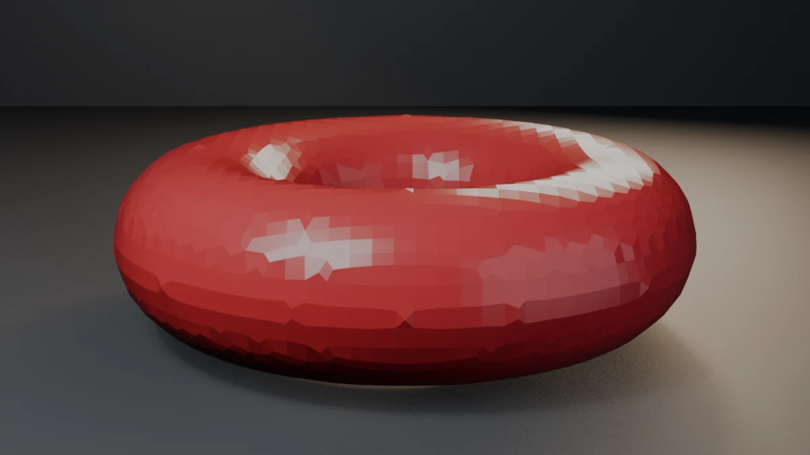
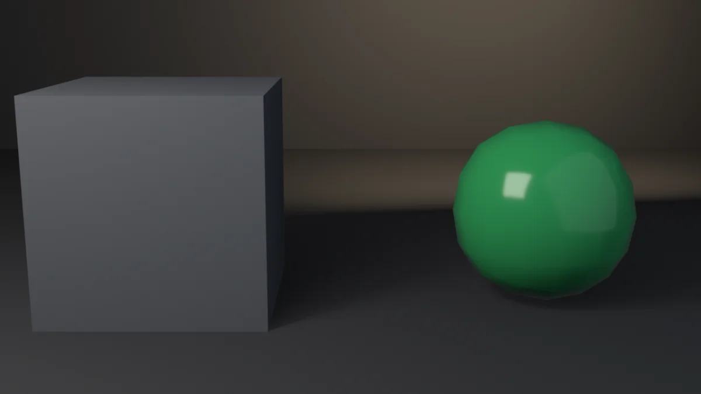
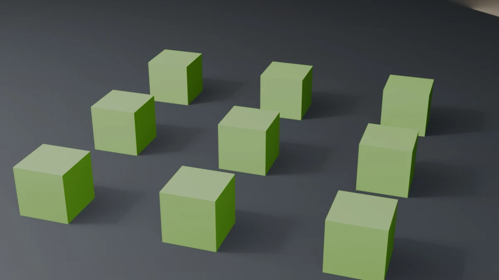
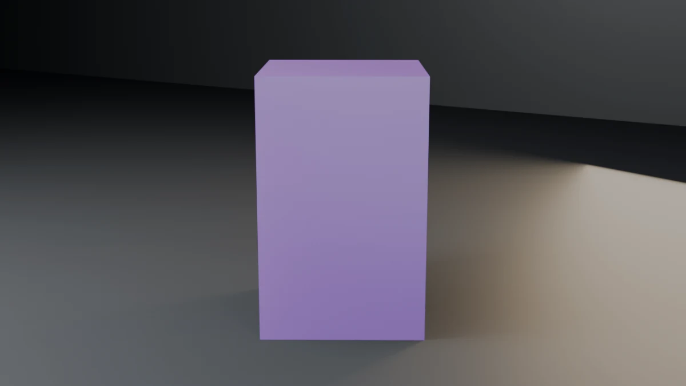
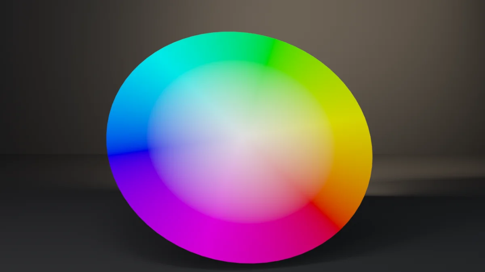
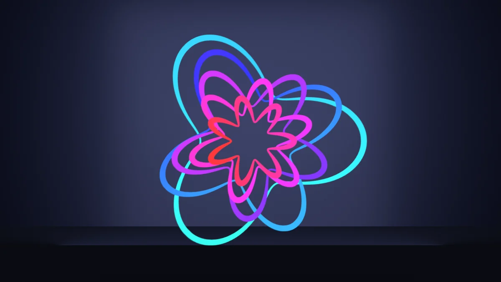
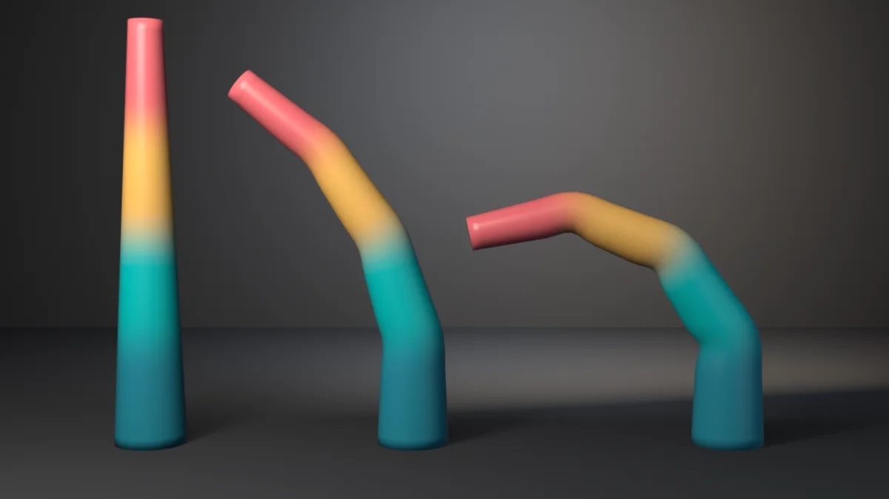

<h1 align="center">Blender Developer Tools</h1>

---

<p align="center">
  <strong>Skills, rules, snippets, templates, and runnable examples for Blender Python development</strong>
</p>

<p align="center">
  <a href="https://github.com/TMHSDigital/Blender-Developer-Tools/releases"></a>
  <a href="LICENSE"></a>
</p>

<p align="center">
  <a href="https://github.com/TMHSDigital/Blender-Developer-Tools/actions/workflows/validate.yml"></a>
  <a href="https://github.com/TMHSDigital/Blender-Developer-Tools/actions/workflows/drift-check.yml"></a>
</p>

<p align="center">
  <strong>12 skills</strong> &nbsp;&bull;&nbsp; <strong>6 rules</strong> &nbsp;&bull;&nbsp; <strong>2 templates</strong> &nbsp;&bull;&nbsp; <strong>17 snippets</strong> &nbsp;&bull;&nbsp; <strong>18 examples</strong>
</p>

---

## Overview

This repository ships **12 skills, 6 rules, 2 templates, 17 snippets, and 18 runnable examples** for Blender Python development targeting Blender 5.1 (current stable) with Blender 4.5 LTS fallback support.

The content is consumed by AI coding agents (Cursor, Claude Code, any MCP-capable client) when working on Blender add-ons, geometry nodes scripts, batch pipelines, or animation tooling. There is no build step. Edit the markdown and Python files directly.

| Layer | Role |
| --- | --- |
| **Skills** | Guided workflows: scaffolding, operators, panels, properties, mesh and bmesh, headless batch, slotted actions, geometry nodes, procedural materials, depsgraph queries, drivers and handlers, `bl_info` migration |
| **Rules** | Guardrails for the most common AI mistakes: ops-in-loops, bmesh leaks, legacy `bl_info` only, prop assignments, deprecated context-copy override, per-element loops over bulk mesh data |
| **Templates** | A working Extensions Platform add-on starter and a headless batch script starter |
| **Snippets** | 17 small standalone Python files demonstrating canonical patterns |

## Supported Blender versions

| Version | Status |
| --- | --- |
| Blender 5.1.x | Primary target (all examples assume 5.1) |
| Blender 4.5 LTS | Fallback supported (skills show both code paths where 4.x and 5.x APIs diverge) |
| Blender 5.2 LTS | Sweep planned for July 2026 (see [ROADMAP.md](ROADMAP.md)) |

## Examples

Runnable, smoke-gated demos live in [`examples/`](examples/) — each is executed headless on
both Blender 4.5 LTS and 5.1 by the `blender-smoke` workflow, so the screenshots reflect code
that actually runs. Browse them in the
**[examples gallery](https://tmhsdigital.github.io/Blender-Developer-Tools/gallery/)**.

<table>
<tr>
<td width="46%" valign="middle">
<a href="examples/swatch-grid/"></a>
</td>
<td valign="middle">

### [swatch-grid](examples/swatch-grid/)

A procedural-materials swatch grid — Principled metal and dielectric, the emission pattern,
and the cross-version `set_specular` shim. Doubles as a live proof of the EEVEE engine-id
mapping (`BLENDER_EEVEE` on 5.x, `BLENDER_EEVEE_NEXT` on 4.2-4.5).

</td>
</tr>
<tr>
<td width="46%" valign="middle">
<a href="examples/turntable/"></a>
</td>
<td valign="middle">

### [turntable](examples/turntable/)

A slotted-actions Z-rotation turntable keyed through the cross-version channelbag path
(`get_channelbag_for_slot`). Witnesses the slotted-actions fix: ensure-helper channelbag on
5.x, `strip.channelbag` on 4.4/4.5.

</td>
</tr>
<tr>
<td width="46%" valign="middle">
<a href="examples/gn-sdf-remesh/"></a>
</td>
<td valign="middle">

### [gn-sdf-remesh](examples/gn-sdf-remesh/)

A Geometry Nodes SDF remesh (`MeshToSDFGrid` → `GridToMesh` at the SDF zero-level).
Witnesses the fix that an SDF grid is meshed with **Grid to Mesh**, not Volume to Mesh,
and that a `Set Material` node carries the material through the remesh.

</td>
</tr>
<tr>
<td width="46%" valign="middle">
<a href="examples/depsgraph-export/"></a>
</td>
<td valign="middle">

### [depsgraph-export](examples/depsgraph-export/)

A depsgraph-evaluated export — builds a cube with `SUBSURF`, measures the evaluated mesh via
`evaluated_get().to_mesh()` / `to_mesh_clear()`, and asserts `wm.obj_export` ships the
modifier-applied geometry (exported vertex count == evaluated > base).

</td>
</tr>
<tr>
<td width="46%" valign="middle">
<a href="examples/wave-displace/"></a>
</td>
<td valign="middle">

### [wave-displace](examples/wave-displace/)

Bulk vertex IO at real scale — 9,409 vertices displaced into a standing wave with **one
`foreach_get` and one `foreach_set`**, no per-vertex access. Asserts the count is unchanged,
the Z span matches the amplitude, and a probe vertex matches the closed-form wave.

</td>
</tr>
<tr>
<td width="46%" valign="middle">
<a href="examples/driver-wave/"></a>
</td>
<td valign="middle">

### [driver-wave](examples/driver-wave/)

A `driver_namespace` function driving sixteen column heights through SCRIPTED drivers.
Witnesses the evaluation contract: driven values appear after a view-layer update on the
evaluated copy **and** the flushed-back original, and both must match the closed form.

</td>
</tr>
<tr>
<td width="46%" valign="middle">
<a href="examples/bmesh-gear/"></a>
</td>
<td valign="middle">

### [bmesh-gear](examples/bmesh-gear/)

A 14-tooth gear built entirely with bmesh — with `bm.free()` in a `try`/`finally`, as the
ownership contract demands. Asserts the closed-form vert/edge/face counts and that the
result is watertight (every edge borders exactly two faces).

</td>
</tr>
<tr>
<td width="46%" valign="middle">
<a href="examples/shader-node-group/"></a>
</td>
<td valign="middle">

### [shader-node-group](examples/shader-node-group/)

One reusable `TintedGloss` group declared via `tree.interface.new_socket`, instanced in two
materials with different Tint values. Witnesses the grouping contract: shared datablock
(`users == 2`), parameters on the group **node** — two spheres, one group, two colors.

</td>
</tr>
<tr>
<td width="46%" valign="middle">
<a href="examples/temp-override-join/"></a>
</td>
<td valign="middle">

### [temp-override-join](examples/temp-override-join/)

Three unit cubes joined into a staircase under `bpy.context.temp_override` — the supported
replacement for the removed `context.copy()` dict-pass form. Asserts one mesh remains,
sources are gone, and local Z spans all three steps.

</td>
</tr>
<tr>
<td width="46%" valign="middle">
<a href="examples/gn-instance-grid/"></a>
</td>
<td valign="middle">

### [gn-instance-grid](examples/gn-instance-grid/)

A generative Geometry Nodes tree — Mesh Grid → Instance on Points → Realize Instances —
attached as a `NODES` modifier with no Group Input. Asserts evaluated topology is
verts = 72, faces = 54, and `Set Material` carries the lime accent.

</td>
</tr>
<tr>
<td width="46%" valign="middle">
<a href="examples/shape-key-blend/"></a>
</td>
<td valign="middle">

### [shape-key-blend](examples/shape-key-blend/)

A relative Tall shape key that lifts and flares the top face — authored through
`shape_key_add` / `key_blocks` / `.value`. Witnesses that shape keys do not rewrite
`mesh.vertices`: every evaluated vert matches `basis + value × (key − basis)`.

</td>
</tr>
<tr>
<td width="46%" valign="middle">
<a href="examples/curve-bevel-arc/"></a>
</td>
<td valign="middle">

### [curve-bevel-arc](examples/curve-bevel-arc/)

A beveled Bezier semicircle authored on `bpy.types.Curve` — `splines.new('BEZIER')`,
`bezier_points`, `bevel_depth`, `use_fill_caps` — so the curve renders as a solid tube
without a prior mesh conversion. Asserts eight points, `bevel_depth == 0.15`, and
evaluated topology 1044 verts / 1028 faces.

</td>
</tr>
<tr>
<td width="46%" valign="middle">
<a href="examples/compositor-glare/"></a>
</td>
<td valign="middle">

### [compositor-glare](examples/compositor-glare/)

Bloom through the compositor on both sides of the 5.0 rewrite — a `Glare` (Fog Glow)
node fed by `Render Layers`, wired via `scene.compositing_node_group` on 5.x and
`scene.node_tree` on 4.x. Witnesses with pixels that the halo falls off strictly with
the compositor on and is exactly zero with it off — and that EEVEE has no `use_bloom`.

</td>
</tr>
<tr>
<td width="46%" valign="middle">
<a href="examples/damped-track-aim/"></a>
</td>
<td valign="middle">

### [damped-track-aim](examples/damped-track-aim/)

Aim constraints via the data API — `Object.constraints.new('DAMPED_TRACK')` with
`target` and `TRACK_Z`, not `bpy.ops.object.constraint_add` in a headless loop.
Asserts twelve unmuted Damped Track constraints and evaluated local `+Z` alignment
toward the core (dot ≥ 0.998).

</td>
</tr>
<tr>
<td width="46%" valign="middle">
<a href="examples/color-attribute-wheel/"></a>
</td>
<td valign="middle">

### [color-attribute-wheel](examples/color-attribute-wheel/)

The modern color-attributes API — `mesh.color_attributes.new()` on the `CORNER`
domain, not the deprecated `vertex_colors` alias, filled by expanding per-vertex
HSV across face corners with `foreach_get`/`foreach_set`. Asserts the attribute
is sized to loop count (not vertex count), is `active_color`, and that the
shader `Attribute` node is actually linked to Base Color.

</td>
</tr>
<tr>
<td width="46%" valign="middle">
<a href="examples/parent-inverse-orrery/"></a>
</td>
<td valign="middle">

### [parent-inverse-orrery](examples/parent-inverse-orrery/)

A brass orrery parented entirely through the data API — the keep-world idiom
`child.parent = pivot; child.matrix_parent_inverse = pivot.matrix_world.inverted()`
carries arms, planets, and a two-level moon through spinning pivots. Asserts bare
`.parent =` really teleports, `matrix_world` is stale until `view_layer.update()`,
and every orbit lands on its closed form.

</td>
</tr>
<tr>
<td width="46%" valign="middle">
<a href="examples/grease-pencil-rosette/"></a>
</td>
<td valign="middle">

### [grease-pencil-rosette](examples/grease-pencil-rosette/)

Five nested rose curves drawn with the Grease Pencil v3 attribute API — layer →
`frames.new().drawing` → `add_strokes` → per-point position, radius, opacity, and
vertex color. Asserts the GPv3 address break: on 4.5 GPv3 is `grease_pencils_v3`
while `grease_pencils` is still legacy; on 5.x legacy is gone and GPv3 owns the
name. Point writes lazily materialize attribute layers, and every position
round-trips through the raw `POINT` buffer.

</td>
</tr>
<tr>
<td width="46%" valign="middle">
<a href="examples/armature-bend/"></a>
</td>
<td valign="middle">

### [armature-bend](examples/armature-bend/)

A four-bone chain built with `edit_bones` skins a tapered tube through name-bound
vertex groups, posed into a curl and read back through the depsgraph. Asserts that
`edit_bones` is empty outside edit mode, and that the armature modifier is exactly
linear blend skinning — every evaluated vertex equals
Σ wᵢ · (`pose_bone.matrix` @ `bone.matrix_local.inverted()`) @ rest, with the root
ring pinned and the tip deflected. A straight tube is a failure.

</td>
</tr>
</table>

## How content is organized

```
skills/<name>/SKILL.md   - 12 skill files, YAML frontmatter, one canonical pattern each
rules/<name>.mdc         - 6 rule files, anti-pattern + correction
templates/<name>/        - 2 template directories (extension-addon-template, headless-batch-script-template)
snippets/<name>.py       - 17 standalone Python snippets, 5 to 50 lines each
```

## Using rules in Cursor

The `.mdc` files in `rules/` apply automatically when Cursor opens a Blender Python project, scoped by the `globs` in each rule's frontmatter. The six rules are:

- `prefer-data-over-ops-in-loops`: flags `bpy.ops.*` calls inside object iteration
- `always-free-bmesh`: flags `bmesh.new()` without paired `bm.free()` in `try`/`finally`
- `target-extensions-platform-format`: flags add-ons missing `blender_manifest.toml`
- `type-annotate-props-and-defend-context`: flags `bpy.props` assignment form and unguarded `context.active_object`
- `prefer-temp-override-over-context-copy`: flags `bpy.context.copy()` passed to operators (deprecated 4.x, removed 5.x)
- `use-foreach-set-for-bulk-data`: flags Python loops over `mesh.vertices` setting `co`, normals, or other per-element bulk data

Symlink or clone this repo, then point Cursor at it as a skills/rules source.

## Using the templates

`templates/extension-addon-template/` is a working Blender extension. Copy the directory, edit `blender_manifest.toml` (id, version, name, maintainer), and install via Edit > Preferences > Get Extensions > Install From Disk. The template registers an Operator, a Panel, and a PropertyGroup, and demonstrates the `register_classes_factory` pattern with symmetric `register()` and `unregister()`.

`templates/headless-batch-script-template/` is a working starter for unattended Blender batch jobs. It opens a `.blend`, optionally adds and applies a modifier to every mesh, and exports to glTF, with explicit exit codes for CI integration. Run with `blender --background <input.blend> --python script.py -- --output ...`.

## Snippets

Each snippet is a standalone Python file under `snippets/`. They are not loaded as a package. Open one, copy the relevant lines into your script, and adapt the names. Each file's header comment cites the Blender doc URL or research section the pattern came from.

## Canonical references

| Resource | Use it for |
| --- | --- |
| [Blender 5.1 Python API](https://docs.blender.org/api/current/) | Authoritative reference for current stable APIs |
| [Blender 4.5 LTS Python API](https://docs.blender.org/api/4.5/) | LTS reference when targeting 4.5 |
| [Extensions Platform manual](https://docs.blender.org/manual/en/latest/advanced/extensions/index.html) | `blender_manifest.toml` schema, hosting, install flow |
| [developer.blender.org](https://developer.blender.org/) | Release notes, breaking change tracking, design docs |

When community content (Stack Overflow, older add-on source) conflicts with the official docs, prefer the docs. The 2.x to 4.x to 5.x churn around Actions, Extensions, and property handling has invalidated a lot of older material.

## Roadmap

See [ROADMAP.md](ROADMAP.md). v0.2.0 shipped procedural materials, depsgraph queries, drivers and app handlers, `bl_info` to manifest migration, two new rules, and the headless batch script template. v0.3.0 candidates include modal operators, USD pipelines, and `mathutils` patterns.

## License

Copyright (c) 2026 TM Hospitality Strategies. Licensed under [CC-BY-NC-ND-4.0](LICENSE).
