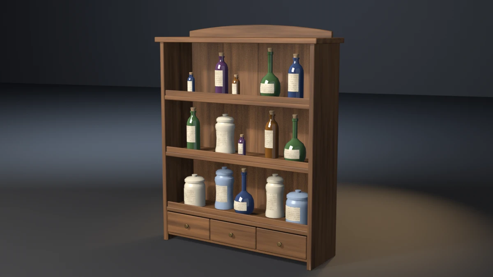

# apothecary-shelf



An apothecary shelf: a stained carcass with three shelves housed in its
sides, a gallery rail along each shelf, lapped back boards, a bank of three
drawers with brass knobs and an arched crest, stocked with fifteen vessels
in five forms (bottle, flask, jar, albarello, vial). Every vessel is corked
or lidded and carries a paper label. **A showcase piece, not an example**
— it witnesses no API contract. It asserts that generated geometry meets
declared asset budgets, recomputed from the finished mesh.

## What it composes

| Shipped content | Used for |
| --- | --- |
| `skills/mesh-editing-and-bmesh` | chamfered boards, arched crest, lathed vessels, closures and knobs, labels on the bodies' rings, all in one `bmesh` |
| `skills/custom-properties` | face attributes (`PlankTone`, `GrainDir`, `Tint`) read by the shaders |
| `skills/procedural-materials-and-shaders` | grained stain, tinted glass, glaze, cork, inked paper, aged brass |
| `skills/bake-high-to-low` | Cycles tangent-space normal bake, high onto low |
| `skills/engine-export-presets` | Unity glTF (`export_yup=True`) |
| `skills/depsgraph-and-evaluated-data` | evaluated triangle counts for the LOD ratios |
| `snippets/decimate_to_budget.py` | LOD1 / LOD2 COLLAPSE chain |
| `snippets/convex_hull_collider.py` | one hull over the carcass and knobs |
| `snippets/lod_chain.py` | LOD naming and ratio pattern |
| `examples/mesh-hygiene-audit` | hygiene combinatorics (copied, not imported) |

## The budget that matters

A stocked shelf fails invisibly when a vessel does not fit between its
shelf and the one above. A flask a few centimetres too tall runs its neck
up into the next shelf, and nothing else notices:

- the flask still stands on its shelf, so the seat budget passes;
- the shelf above is still in its dado, so the joint budget passes;
- the neck stops inside the shelf, so the bounding box does not move;
- the triangle count is the same, because only the height changed.

The piece reads each vessel's top (body or closure, whichever is higher)
and the underside of the lowest horizontal member above it off the
finished mesh, and asserts a headroom floor of 20 mm. The tightest vessel
clears by 24.05 mm.

`--tall-flask` is the falsifier built for exactly this. It stretches the
flask on the middle shelf by 1.20. It then runs 5.5 mm into the shelf above
and exits 20, while every seat, every joint and the envelope still pass.

## Budgets

Declared in the script as named constants, recomputed from the generated
mesh. Measured values are from Blender 5.2.1; every one is byte-identical
on 4.5.11 and 5.1.2 (only the glTF file size differs, by up to 8 bytes,
which is exporter metadata and not a budget).

| Budget | Band | Measured |
| --- | --- | --- |
| Base triangles | 9800–11100 | 10456 |
| LOD1 ratio | 0.32–0.62 | 0.5000 |
| LOD2 ratio | 0.10–0.35 | 0.2200 |
| Material slots | exactly 6, distinct | 6 |
| Wood / glass / glaze faces | ≥ 450 / 1800 / 1300 | 525 / 2080 / 1520 |
| Cork / paper / brass faces | ≥ 850 / 380 / 300 | 960 / 420 / 336 |
| UV bounds | inside 0..1 | (0.0009, 0.0010)–(0.9991, 0.9990) |
| UV AABB overlap | ≤ 1e-5 | 0.000000 |
| Outer AABB | 0.876 × 0.274 × 1.076 m ± 0.020 | 0.8760 × 0.2740 × 1.0760 |
| Collider triangles | ≤ 200 | 138 |
| Normal bake | `{'FINISHED'}` with image data | `{'FINISHED'}`, `has_data=True` |
| glTF export | file written, non-empty | ~449 kB |
| Hygiene | all zero | loose 0/0, non-manifold 0, zero-area 0, doubles 0, n-gons 0, coplanar cross-shell pairs 0 |
| Grounded AABB | \|zmin\| ≤ 1e-4 | 0.00000 |
| Named sides | 2 sides, each zmin ≤ 1e-4 | 2 at 0.00000 |
| Dado | 7 cross members, each ≥ 5 mm into both sides and ≥ 6 mm clear of the far face | 8.00 mm in, 14.00 mm clear |
| Closure bite | every cork and lid 2–10 mm into its body | 5.00 mm |
| Knob bite | 3 knobs, each 2–10 mm into its drawer front | 4.00 mm |
| Vessel seat | 15 vessels, each 0.5–3.0 mm into its shelf | 1.00–1.80 mm |
| Drawer seat | 3 drawer fronts, each 1–4 mm into the base | 2.00 mm |
| Label seat | inner face 0.1–0.8 mm inside the body, outer face ≥ 0.4 mm proud | 0.30 mm in, 0.80 mm proud |
| Headroom | every vessel ≥ 20 mm under the member above | 24.05 mm |
| Vessel overlaps | 0, vessel against vessel and against the carcass | 0 |
| Form spread | widest / narrowest body ≥ 2.0; tallest / shortest ≥ 1.5 | 3.146 / 2.202 |
| Edge treatment | right-angle wood edges | 0 |

Real-world size: 0.88 m wide, 1.08 m to the top of the crest and 0.27 m
deep. It is a wall shelf for a shop counter or a study, and each
compartment is 260 mm clear.

## Construction

- **Carcass.** Two full-height sides carry everything and are the only
  named supports. The base, the three shelves and the three gallery rails
  are each housed `DADO` (8 mm) into both sides and stop 14 mm short of the
  outer faces. The top board is seated over the sides and the back boards
  (`TOP_SEAT`). The crest is an extruded outline whose top is a shallow
  arc, seated `CREST_BITE` into the top board. Every board is chamfered at
  2.5 mm with `material=` pinned to wood, edges sorted by index. The
  crest's caps are single n-gons, chamfered and then triangulated.
- **Back boards.** Four vertical boards, lapped 2 mm into one another
  rather than butted. An open seam showed daylight through the back in the
  first close-up. A lap on one plane is a coplanar pair, so every other
  board steps forward 1.5 mm. The shelves and base bite into them.
- **Drawers.** Three fronts stand `DRAWER_BITE` into the base, with a
  4 mm reveal all round. Each has a turned brass knob lathed along −Y,
  its shank `KNOB_BITE` into the front.
- **Vessels.** Each vessel is a closed lathe of exactly twelve rings between
  two poles, so every form costs the same triangles. Every foot is
  chamfered. The five forms:
  - bottle: shoulder, neck and lip
  - flask: a bulb on a small flat base, with a long neck
  - jar: squat and wide-mouthed
  - albarello: waisted
  - vial: small

  Sizes vary by a closed-form ±5 % per vessel. Each shelf shares its clear
  width out evenly. Vessels step front and back alternately inside the
  depth left between the rail and the back boards.
- **Closures.** A cork is narrower than the mouth and flares above it. Its
  flare stops short of the neck's own radius, because a cork wall on the
  neck's cylinder is a coplanar pair with it. A lid is wider than the rim:
  a skirt, a dome and a knob. Both sit `CLOSURE_BITE` into the body.
- **Labels.** Each label is built on the host's arc with the host's segment
  count. Every label vertex sits at a body vertex's own angle and ring
  height, so the paper follows a waist or a bulb exactly. The inner face
  is 0.3 mm inside the body and the outer face 0.8 mm proud. The label is
  centred on the front and turned with the vessel's yaw.
- **Seats vary by vessel.** Each vessel on a shelf sinks by a different
  step (1.0–1.8 mm). Sunk to one depth, two bottom caps on a shelf lie in
  one plane, a coplanar cross-shell pair.

## Findings the budgets forced

- **Coplanar corks.** The first corks flared to 1.10 × their radius, which
  put a cork wall 0.1 mm off the neck cylinder of the same bottle: 32
  coplanar pairs on two bottles. The flare is now 1.20 × and the count is 0.
- **Matching parts to vessels.** Closures and labels were first matched to
  the body with the nearest axis in plan. The three shelves stack vessels in
  near-identical plan positions, so 12 of 15 labels went to a vessel on
  another shelf, and the label seat read −23 mm. They are now matched only
  among bodies at the part's own height.
- **Glass.** EEVEE transmission rendered every bottle as grainy speckle.
  It stayed with and without raytracing, and at 256 samples. The glass
  now carries its depth in a facing ramp and a clear coat: dark through
  the middle, lighter at the silhouette.
- **Daylight through the back.** A 2 mm butt seam between back boards
  showed the background as a bright line down the middle of the upper
  compartment. The boards are now lapped with an alternating step.

## Conventions walked

Every convention in `showcase/README.md`, and whether it applies here.

| Convention | Applies | How |
| --- | --- | --- |
| Deterministic, budgets declared, assertions recompute | yes | no RNG; every value above is read off the mesh |
| Falsifier fails the budget it targets | yes | table below, proven on all three binaries |
| Hygiene incl. cross-shell coplanar | yes | exit 15; seats, lap steps and cork flares chosen to keep it at 0 |
| Named supports | yes | the two sides (`--float-side`) |
| Joint-fit budgets | yes | dado bite and far-face clearance per cross member (`--short-shelves`) |
| A member is tenoned into its seat | yes | sides into the top, crest into the top, back boards into base and top |
| A platform bears on something | yes | every shelf housed in both sides and biting the back boards |
| Carried parts bite their bearers | yes | vessels in shelves (`--float-jars`), drawer fronts in the base (`--lift-drawers`) |
| A joint bites; touching is not joining | yes | closures (`--pop-corks`) and knobs (`--pull-knobs`) as banded bites |
| Bands on a curved host are built on the host's arc | yes | labels on the body's own rings and angles (`--float-labels`) |
| Scattered parts do not interpenetrate | yes | exit 21 (`--crowd-jars`) |
| Scatter varies in size | yes | form spread, exit 22 (`--uniform-vessels`) |
| Edge treatment: no right angles | yes | exit 23 (`--sharp-rail`), wood only; lathed feet are chamfered by construction |
| Aim an edge falsifier at one member | yes | one rail left square: 12 edges, −32 triangles |
| Chamfer n-gon caps, then triangulate | yes | crest caps |
| Sort bmesh operator inputs | yes | bevel edges sorted by index |
| A plank wall is boards | yes | four lapped back boards |
| Identical boards read as CG | yes | per-board `PlankTone` and `GrainDir` |
| Shading is part of the model | yes | vessels, closures and knobs smooth (blown, turned); every edge over 35° hard, so boards read flat with crisp chamfers |
| One substance, one slot | yes | wood, glass, glaze, cork, paper, brass; glass and glaze colour per vessel from `Tint` |
| Iron is not chrome | n/a | brass knobs: metallic 0.9, roughness 0.42, darkened by noise |
| Bake texels per UV cell | measured, not a budget | 512 px over a 32-cell grid, about 15 px per cell |
| The bake cage is narrower than the nearest neighbour | yes | `CAGE_EXTRUSION` 0.01 m |
| Level on the stage; stage 60 m | yes | turned about Z only; 60 m floor and wall |
| Keep a falsifier's envelope still | yes | every falsifier leaves the AABB unchanged except `--pull-knobs` (+6 mm in Y, inside `BBOX_TOL`) |
| Mirror symmetry, plumb, rope, masonry, roofs, rings, scatter on terrain, vessels with liquid | no | the piece has none of these |

## Falsifiers

Each breaks one pipeline stage so a **named** budget fails. All fourteen
were run on 4.5.11, 5.1.2 and 5.2.1 and exited the same declared code on
all three.

| Flag | Target budget | Breaks | Exit |
| --- | --- | --- | --- |
| `--skip-decimate` | LOD1 ratio | drops the DECIMATE modifiers, LOD1 ratio goes to 1.0000 | 9 |
| `--stray-vert` | mesh hygiene | adds one loose vertex inside the carcass | 15 |
| `--lift-z` | grounded zmin | lifts the whole mesh 50 mm | 16 |
| `--float-side` | named sides | lifts the left side 5 mm; the right side still grounds the AABB | 16 |
| `--short-shelves` | dado bite | stops the three shelves 4 mm short of the sides; −4.0 mm | 17 |
| `--pop-corks` | closure bite | lifts every cork and lid 10 mm; −5.0 mm | 17 |
| `--pull-knobs` | knob bite | pulls every knob 8 mm out of its front; −4.0 mm | 17 |
| `--float-jars` | vessel seat | lifts every vessel 6 mm off its shelf; −5.0 to −4.2 mm | 18 |
| `--lift-drawers` | drawer seat | lifts the drawer fronts 3 mm; −1.0 mm | 18 |
| `--float-labels` | label seat | builds every label 1.1 mm off its body; −1.1 mm | 18 |
| `--tall-flask` | headroom | stretches the middle-shelf flask 1.20 into the shelf above; −5.5 mm | 20 |
| `--crowd-jars` | vessel overlaps | draws the bottom shelf's jars to 0.55 of their spacing; 3 overlaps | 21 |
| `--uniform-vessels` | form spread | one radius and height for every vessel; 1.000 / 1.000 | 22 |
| `--sharp-rail` | edge treatment | leaves the top rail unchamfered; 12 right-angle edges | 23 |

## Exit codes

File-local and sequential. `9` is a valid check code. `1` is the FATAL
wrapper — a crash, never a named check. `19` (plumb and real-world size)
is reserved across pieces and unused here.

| Code | Meaning |
| --- | --- |
| 0 | Success |
| 1 | Uncaught exception (FATAL wrapper) |
| 2 | argparse / usage |
| 3 | Mesh did not build, or has no UV layer |
| 4 | Base triangle count outside band |
| 5 | Material slots, or a material's face floor |
| 6 | UVs outside 0..1 |
| 7 | UV AABB overlap above tolerance |
| 8 | Outer AABB off declared size |
| 9 | LOD1 or LOD2 ratio outside band (`--skip-decimate`) |
| 10 | Framing gate (`examples/gallery_framing.py`, render path only) |
| 11 | Collider triangles above ceiling |
| 12 | Normal bake failed or produced no image data |
| 13 | glTF export missing or empty |
| 14 | `--output` produced no file |
| 15 | Mesh hygiene (`--stray-vert`) |
| 16 | Grounded zmin, or a side floating (`--lift-z`, `--float-side`) |
| 17 | Dado, closure or knob bite (`--short-shelves`, `--pop-corks`, `--pull-knobs`) |
| 18 | Vessel, drawer or label seat (`--float-jars`, `--lift-drawers`, `--float-labels`) |
| 20 | Headroom under the member above (`--tall-flask`) |
| 21 | Vessels overlap each other or the carcass (`--crowd-jars`) |
| 22 | Form spread below floor (`--uniform-vessels`) |
| 23 | Right-angle wood edges (`--sharp-rail`) |

## Run it

```bash
# Budget check, no render. ~4.5 s on 5.1 and 5.2.
blender --background --python apothecary_shelf.py --

# Falsifier: the middle-shelf flask runs into the shelf above. Must exit 20.
blender --background --python apothecary_shelf.py -- --tall-flask

# Falsifier: the shelves stop short of their dados. Must exit 17.
blender --background --python apothecary_shelf.py -- --short-shelves

# Render the gallery still (EEVEE; --engine cycles on a GPU-less host).
blender --background --python apothecary_shelf.py -- --output apothecary_shelf.webp
```

Smoke runs the check-only path. It does not pass `--output` or any falsifier.

## Cross-version measurements

| Value | 4.5.11 | 5.1.2 | 5.2.1 |
| --- | --- | --- | --- |
| Base triangles | 10456 | 10456 | 10456 |
| LOD1 / LOD2 tris | 5228 / 2300 | same | same |
| Face counts (wood / glass / glaze / cork / paper / brass) | 525 / 2080 / 1520 / 960 / 420 / 336 | same | same |
| Outer AABB | 0.8760 × 0.2740 × 1.0760 | same | same |
| Collider tris | 138 | 138 | 138 |
| Headroom / form spread | 24.05 mm / 3.146, 2.202 | same | same |
| glTF bytes | 448604 | 448600 | 448596 |
