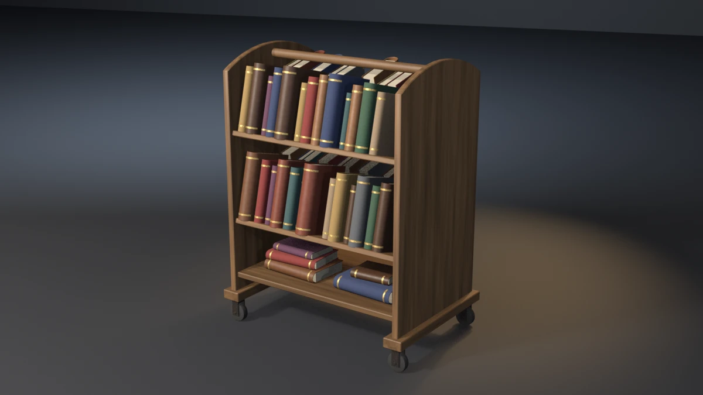

# book-trolley



A library book truck: two arched end panels standing in skids on four
swivel casters, a flat bottom deck, and on each side two sloped troughs
under a turned push rail. Each trough is a shelf tilted 14° back toward the
centre and a backrest square to it, both housed in the end panels.
Forty-seven hardbacks stand in the troughs spines out, leaning back into the
corner; five more lie in two loose stacks on the deck. Every book is a
rounded-spine cover in cloth or leather, a page block glued into it, and two
gilt bands tooled round the spine. **A showcase piece, not an example** — it
witnesses no API contract. It asserts that generated geometry meets
declared asset budgets, recomputed from the finished mesh.

## What it composes

| Shipped content | Used for |
| --- | --- |
| `skills/mesh-editing-and-bmesh` | chamfered boards in trough frames, n-gon-capped prisms (arched end panels, caster forks, wheels), U-section covers, all in `bmesh` |
| `skills/custom-properties` | face attributes (`PlankTone`, `GrainDir`, `Tint`) read by the shaders |
| `skills/procedural-materials-and-shaders` | grained stain, cloth, leather, ruled page edges, gilt, caster iron, rubber |
| `skills/bake-high-to-low` | Cycles tangent-space normal bake, high onto low |
| `skills/engine-export-presets` | Unity glTF (`export_yup=True`) |
| `skills/depsgraph-and-evaluated-data` | evaluated triangle counts for the LOD ratios |
| `snippets/decimate_to_budget.py` | LOD1 / LOD2 COLLAPSE chain |
| `snippets/convex_hull_collider.py` | one hull over the carcass and casters |
| `snippets/lod_chain.py` | LOD naming and ratio pattern |
| `examples/mesh-hygiene-audit` | hygiene combinatorics (copied, not imported) |
| `showcase/bookshelf` | the book builder, the seat, band and overlap audits (copied, not imported) |

## The budget that matters

A book on a flat shelf stands on one support. A book in a sloped trough is
carried at two: its tail on the shelf and its fore-edge against the
backrest. Seated on the shelf and standing off the backrest, it would
topple forward on a real trolley, and nothing else sees it:

- the book still sits its seat into the shelf, so the seat budget passes;
- it stays inside the carcass, so the bounding box does not move;
- the triangle count is the same, because only a position changed;
- the book-overlap budget has to exempt both designed contacts, the shelf
  and the backrest, so it cannot see how deep either goes.

The piece pairs each tilted shelf with the one backrest whose shell
overlaps it, finds each standing book's shelf by the top plane its lowest
vertex sits nearest (read off the mesh, on the book's own side of the
trolley), and takes the plane of that backrest's face that looks at the
book. It asserts how far the book's deepest cover vertex sits behind that
plane, as a band of 0.3–2.0 mm, next to the shelf seat's own band. All
forty-seven sit at 0.80 mm.

A plane, not the backrest solid, for the same reason as `bookshelf`'s lean
contact: a fore-edge driven through the 18 mm board would come out behind
it and read as no contact.

`--off-back` and `--deep-back` are the falsifiers built for exactly this.
One stands every trough book 3 mm off its backrest, the other drives it
4.5 mm in, both along the slope so the shelf seat is untouched. Both exit
21 while every seat, the envelope and the book-overlap budget still pass.

## Budgets

Declared in the script as named constants, recomputed from the generated
mesh. Measured values are from Blender 5.2.1; see the cross-version table
below.

| Budget | Band | Measured |
| --- | --- | --- |
| Base triangles | 16800–18600 | 17704 |
| LOD1 ratio | 0.32–0.62 | 0.5000 |
| LOD2 ratio | 0.10–0.35 | 0.2200 |
| Material slots | exactly 7, distinct | 7 |
| Wood / cloth / leather faces | ≥ 510 / 2500 / 1320 | 568 / 2788 / 1476 |
| Paper / gilt faces | ≥ 280 / 2430 | 312 / 2704 |
| Iron / rubber faces | ≥ 840 / 590 | 932 / 656 |
| UV bounds | inside 0..1 | (0.0003, 0.0003)–(0.9997, 0.9997) |
| UV AABB overlap | ≤ 1e-5 | 0.000000 |
| Outer AABB | 0.768 × 0.530 × 1.000 m ± 0.020 | 0.7680 × 0.5300 × 1.0000 |
| Collider triangles | ≤ 360 | 308 |
| Normal bake | `{'FINISHED'}` with image data | `{'FINISHED'}`, `has_data=True` |
| glTF export | file written, non-empty | ~1.30 MB |
| Hygiene | all zero | loose 0/0, non-manifold 0, zero-area 0, doubles 0, n-gons 0, coplanar cross-shell pairs 0 |
| Grounded AABB | \|zmin\| ≤ 1e-4 | 0.00000 |
| Named wheels | 4 wheels, each zmin ≤ 1e-4 | 4 at 0.00000 |
| Dado | 2 end panels; 10 cross members (deck, 4 shelves, 4 backrests, rail), each ≥ 5 mm into both panels and ≥ 6 mm clear of the far face | 8.00 mm in, 10.00 mm clear |
| Page block | 52 books, one block and two bands each; every block corner 0.3–1.2 mm inside its boards | 0.60 mm |
| Book seat | 52 books, each 0.5–3.6 mm into its shelf (along the shelf normal), the deck or the book below | 1.00–3.16 mm |
| Band seat | inner face 0.1–0.8 mm inside the spine, outer face ≥ 0.4 mm proud | 0.29 mm in, 0.80 mm proud |
| Caster plates | 4 plates, each top 0.5–2.0 mm into the skid above | 1.00 mm |
| Mirror symmetry | carcass and casters, every vertex's X and Y mirror image on the mesh within 1e-4 m | 0.0000000 |
| Size spread | thickest / thinnest ≥ 2.5; tallest / shortest ≥ 1.5 | 2.750 / 1.640 |
| Backrest contact | 47 trough and 5 lying books; 4 troughs each with one backrest; every trough book 0.3–2.0 mm into its backrest | 0.80 mm |
| Book overlaps | 0, book against book and against the carcass, designed contacts exempt | 0 |
| Edge treatment | right-angle wood edges | 0 |

Real-world size: 0.77 m long over the skids, 0.53 m deep and 1.00 m tall
over the arched ends, on 70 mm casters. Each trough is 170 mm deep and its
backrest 170 mm tall; the books run from a 150 mm pocket book to a 245 mm
octavo.

## Construction

- **End panels and skids.** Each end is one prism: a flat-sided outline
  whose top is a 16-segment arc, extruded 22 mm and chamfered 2.5 mm,
  standing 12 mm deep in a 70 × 35 mm skid that runs 15 mm past it front
  and back. The panels are the carcass's only bearers; the casters are the
  named supports.
- **Cross members.** The deck and the four tilted shelves and backrests
  are each housed `DADO` (8 mm) into both ends and stop 14 mm short of the
  outer faces. The push rail is a 16-sided dowel whose ends sit 12 mm blind
  in both panels, 10 mm short of the outer faces.
- **Troughs.** Built in a trough frame: `s` runs down the slope into the
  backrest, `t` up the shelf normal, the corner at the origin. The shelf
  runs from 170 mm in front of the corner to 6 mm past the backrest's back
  face, so the two backs never share a plane; the backrest stands 6 mm into
  the shelf. The two sides are mirror images, and the two tiers of a side
  stand 320 mm apart, so each tier's books clear the shelf above.
- **Casters.** Stacked by a named bite at each joint: a 56 mm plate 1 mm
  into the skid, a swivel race 1 mm into the plate, a fork (one U-section
  prism, chamfered 0.8 mm) 1 mm into the race, an axle through both fork
  legs and a 70 mm rubber wheel whose lowest vertex is the floor. The
  wheel's rim is rounded with a two-segment bevel and shaded smooth; the
  iron is near-black with a little rust in the noise, not chrome.
- **Books.** Copied from `bookshelf`: one U-section cover per book with a
  rounded spine, a page block 0.6 mm into both boards, two gilt bands on
  the spine's own chain.
- **Trough books.** Built in their own frame, turned so the height runs up
  the shelf normal and the fore-edge down the slope, and yawed about the
  shelf normal in a four-step cycle (−2.4°, −0.8°, 0.8°, 2.4°) so no two
  neighbours share a plane. Each is then slid up the normal to a stepped
  1.0–3.2 mm seat into the shelf, down the slope until its deepest vertex
  is `BACK_BITE` (0.8 mm) into the backrest, and along the trough with a
  2.5–4.5 mm gap. A trough that overflows its span is a build error.
- **Loose stacks.** Books laid flat on the deck, spine out, yawed ±3°
  alternately and shifted a few millimetres; each book above the first
  takes its own 1.0–1.4 mm seat into the board below it.

## Findings the budgets forced

- **A 45° plane shared by accident.** Dropping the caster plates 2 mm for
  the plate-seat falsifier put each plate's lower chamfer and the fork's
  upper chamfer on the same 45° plane — the plate's half-width minus the
  fork's is 13 mm, and so was the drop between them — and the run exited
  15 on eight coplanar pairs instead of 18. The drop is 2.5 mm.
- **An edge falsifier the mirror budget saw first.** Leaving one front
  backrest square broke the carcass's front/back symmetry, so the run
  exited 19 before the edge budget. The falsifier now leaves the deck
  square: one centred member, symmetric in both axes, 12 right-angle
  edges.
- **The bake cage reached the books.** At 10 mm the cage from each end
  panel's inner face reached the high-poly covers 6 mm away, and the books'
  edges baked onto the panel as pale streaks. Cutting the cage to 3 mm
  cleared the panels but not the deck: the loose stacks sit 1.0–1.4 mm into
  it, so rays from round each stack still found the spines and baked every
  footprint in as a dished groove. Only the wood takes a baked map, so the
  high-poly bake source is now the carcass and casters alone; the cage
  stays at 3 mm.

## Conventions walked

Every convention in `showcase/README.md`, and whether it applies here.

| Convention | Applies | How |
| --- | --- | --- |
| Deterministic, budgets declared, assertions recompute | yes | no RNG; every value above is read off the mesh |
| Falsifier fails the budget it targets | yes | table below, proven on all three binaries |
| Hygiene incl. cross-shell coplanar | yes | exit 15; stepped seats, the yaw cycle and the shelf tail keep it at 0 |
| Named supports | yes | the four wheels (`--float-caster`); the plates, forks and skids stop above the floor |
| Joint-fit budgets | yes | dado bite and far-face clearance per cross member (`--short-shelves`) |
| A member is tenoned into its seat | yes | panels in skids, backrests in shelves, rail blind in the panels, each caster part into the one above |
| A platform bears on something | yes | deck and every shelf housed in both end panels |
| Carried parts bite their bearers | yes | books into shelves, the deck and the book below (`--float-books`); caster plates into the skids (`--drop-plates`) |
| A joint bites; touching is not joining | yes | page blocks into their boards (`--loose-pages`); the backrest contact as a band |
| Bands on a curved host are built on the host's arc | yes | gilt bands on the spine's own chain (`--float-bands`) |
| A leaning prop rests on something | yes | every trough book against its backrest, exit 21 (`--off-back`, `--deep-back`) |
| Mirrored assemblies | yes | carcass and casters mirror in X and Y, exit 19 (`--skew-caster`, 6 mm inside the 20 mm AABB tolerance) |
| Scattered parts do not interpenetrate | yes | exit 22 (`--crowd-books`), designed contacts exempt |
| Scatter varies in size | yes | thickness and height spread, exit 20 (`--uniform-books`) |
| Edge treatment: no right angles | yes | exit 23 (`--sharp-deck`), wood only; iron chamfered 0.8 mm, rubber rounded |
| Aim an edge falsifier at one member | yes | the deck left square: 12 edges |
| Chamfer n-gon caps, then triangulate | yes | end panels, forks, races, axles, wheels and the rail are n-gon-capped prisms, bevelled then triangulated |
| Sort bmesh operator inputs | yes | bevel edges sorted by index, carcass, iron, rubber and covers |
| Identical boards read as CG | yes | per-board `PlankTone` and `GrainDir`; per-book `Tint` |
| Variation goes into surface, never into function | yes | sizes, tints, gaps and yaw vary; tier pitch, slope and seats are budgets |
| Shading is part of the model | yes | spines, rail and wheels smooth (round); every edge over 35° hard, so boards and chamfers read crisp |
| One substance, one slot | yes | wood, cloth, leather, paper, gilt, iron, rubber |
| Iron is not chrome | yes | near-black, roughness 0.52–0.78 |
| Bake texels per UV cell | measured, not a budget | 1024 px over a 98-cell grid, about 10 px per cell |
| The bake cage is narrower than the nearest neighbour | yes | `CAGE_EXTRUSION` 3 mm, and the bake source leaves the books out, since they sit inside any cage of the deck and shelves |
| Level on the stage; stage 60 m | yes | turned about Z only; 60 m floor and wall |
| Keep a falsifier's envelope still | yes | every falsifier except `--lift-z` keeps the AABB within tolerance |
| Plumb, rope, masonry, roofs, rings, terrain, vessels | no | the piece has none of these |

## Falsifiers

Each breaks one pipeline stage so a **named** budget fails. All fifteen
were run on 4.5.11, 5.1.2 and 5.2.1 and exited the same declared code on
all three.

| Flag | Target budget | Breaks | Exit |
| --- | --- | --- | --- |
| `--skip-decimate` | LOD1 ratio | drops the DECIMATE modifiers, LOD1 ratio goes to 1.0000 | 9 |
| `--stray-vert` | mesh hygiene | adds one loose vertex inside the deck | 15 |
| `--lift-z` | grounded zmin | lifts the whole mesh 50 mm | 16 |
| `--float-caster` | named wheels | lifts one caster 5 mm; the other three still ground the AABB | 16 |
| `--short-shelves` | dado bite | stops the four shelves 4 mm short of the ends; −4.0 mm | 17 |
| `--loose-pages` | page-block bite | builds every page block 0.9 mm clear of its boards; −0.9 mm | 17 |
| `--float-books` | book seat | lifts every book 6 mm off its shelf or the deck; −5.0 mm | 18 |
| `--float-bands` | band seat | builds every band 1.1 mm off its spine; −1.1 mm | 18 |
| `--drop-plates` | caster plate seat | drops every caster plate 2.5 mm, clear of its skid; −1.5 mm | 18 |
| `--skew-caster` | mirror symmetry | moves one caster 6 mm along the trolley; 6.0 mm | 19 |
| `--uniform-books` | size spread | one height and depth, thickness within ±1.5 %; 1.030 / 1.000 | 20 |
| `--off-back` | backrest contact | stands every trough book 3 mm off its backrest; −3.0 mm | 21 |
| `--deep-back` | backrest contact | drives every trough book 4.5 mm into its backrest; 4.5 mm | 21 |
| `--crowd-books` | book overlaps | closes the front upper trough's gaps to −6 mm; 13 overlaps | 22 |
| `--sharp-deck` | edge treatment | leaves the deck unchamfered; 12 right-angle edges | 23 |

## Exit codes

File-local and sequential. `9` is a valid check code. `1` is the FATAL
wrapper — a crash, never a named check.

| Code | Meaning |
| --- | --- |
| 0 | Success |
| 1 | Uncaught exception (FATAL wrapper) |
| 2 | argparse / usage |
| 3 | Mesh did not build, or has no UV layer |
| 4 | Base triangle count outside band |
| 5 | Material slots, or a material's face floor |
| 6 | UVs outside 0..1 |
| 7 | UV AABB overlap above tolerance |
| 8 | Outer AABB off declared size |
| 9 | LOD1 or LOD2 ratio outside band (`--skip-decimate`) |
| 10 | Framing gate (`examples/gallery_framing.py`, render path only) |
| 11 | Collider triangles above ceiling |
| 12 | Normal bake failed or produced no image data |
| 13 | glTF export missing or empty |
| 14 | `--output` produced no file |
| 15 | Mesh hygiene (`--stray-vert`) |
| 16 | Grounded zmin, or a wheel floating (`--lift-z`, `--float-caster`) |
| 17 | Dado or page-block bite, or a book without one block and two bands (`--short-shelves`, `--loose-pages`) |
| 18 | Book, band or caster-plate seat (`--float-books`, `--float-bands`, `--drop-plates`) |
| 19 | Carcass and casters off mirror symmetry (`--skew-caster`) |
| 20 | Size spread below floor (`--uniform-books`) |
| 21 | Backrest contact, trough / lying count, or a trough without one backrest (`--off-back`, `--deep-back`) |
| 22 | Books overlap each other or the carcass (`--crowd-books`) |
| 23 | Right-angle wood edges (`--sharp-deck`) |

## Run it

```bash
# Budget check, no render.
blender --background --python book_trolley.py --

# Falsifier: every trough book stands off its backrest. Must exit 21.
blender --background --python book_trolley.py -- --off-back

# Falsifier: every trough book cuts into its backrest. Must exit 21.
blender --background --python book_trolley.py -- --deep-back

# Render the gallery still (EEVEE; --engine cycles on a GPU-less host).
blender --background --python book_trolley.py -- --output book-trolley.webp
```

Smoke runs the check-only path. It does not pass `--output` or any falsifier.

## Cross-version measurements

| Value | 4.5.11 | 5.1.2 | 5.2.1 |
| --- | --- | --- | --- |
| Base triangles | 17704 | 17704 | 17704 |
| LOD1 / LOD2 tris | 8852 / 3894 | 8852 / 3894 | 8852 / 3894 |
| Face counts (wood / cloth / leather / paper / gilt / iron / rubber) | 568 / 2788 / 1476 / 312 / 2704 / 932 / 656 | same | same |
| Outer AABB | 0.7680 × 0.5300 × 1.0000 | same | same |
| Collider tris | 308 | 308 | 308 |
| Seat / backrest contact / mirror | 1.00–3.16 mm / 0.80 mm / 0.0 | same | same |
| glTF bytes | 1303316 | 1303316 | 1303308 |

The glTF size differs by 8 bytes on 5.2 (exporter metadata, not a budget).
Every other value, including the DECIMATE COLLAPSE LOD counts, is
identical on all three.
