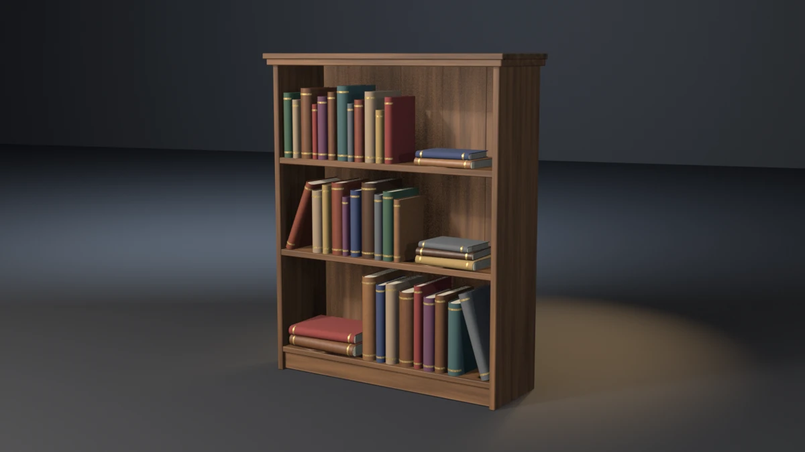

# bookshelf



A bookcase: a stained carcass with two shelves housed in its sides, a base
on a recessed plinth, lapped back boards and a stepped cornice, filled
with thirty-eight hardbacks. Twenty-nine stand upright, seven lie in
three stacks, and two lean on a neighbour. Every book is a rounded-spine
cover in cloth or leather, a page block glued into it, and two gilt bands
tooled round the spine. **A showcase piece, not an example** — it
witnesses no API contract. It asserts that generated geometry meets
declared asset budgets, recomputed from the finished mesh.

## What it composes

| Shipped content | Used for |
| --- | --- |
| `skills/mesh-editing-and-bmesh` | chamfered boards, U-section covers with rounded spines, page blocks and bands built on the spine's own chain, all in `bmesh` |
| `skills/custom-properties` | face attributes (`PlankTone`, `GrainDir`, `Tint`) read by the shaders |
| `skills/procedural-materials-and-shaders` | grained stain, cloth, leather, ruled page edges, gilt |
| `skills/bake-high-to-low` | Cycles tangent-space normal bake, high onto low |
| `skills/engine-export-presets` | Unity glTF (`export_yup=True`) |
| `skills/depsgraph-and-evaluated-data` | evaluated triangle counts for the LOD ratios |
| `snippets/decimate_to_budget.py` | LOD1 / LOD2 COLLAPSE chain |
| `snippets/convex_hull_collider.py` | one hull over the carcass |
| `snippets/lod_chain.py` | LOD naming and ratio pattern |
| `examples/mesh-hygiene-audit` | hygiene combinatorics (copied, not imported) |

## The budget that matters

A leaning book has to rest on its neighbour's head edge and on the shelf,
not in either. Tip it a few degrees too far and its board cuts through the
neighbour's corner; not far enough and it stands in the air against
nothing. Neither is visible to any other budget:

- the leaning book still stands on its shelf, so the seat budget passes;
- it stays inside the carcass, so the bounding box does not move;
- the triangle count is the same, because only a position changed;
- the book-overlap budget has to exempt this very contact, so it cannot
  see how deep the contact goes.

The piece finds the leaning books on the finished mesh (a book whose
largest face, a board, is tilted between 3° and 80°) and the upright
neighbour on the side its top leans toward, on the same shelf. It takes
the plane of the leaning board's outer face off the mesh and measures how
far the neighbour's deepest vertex sits behind it, as a band of
0.3–2.0 mm. Both lean at 0.80 mm.

A plane, not the cover solid: the board is 2.8 mm thick, and a head edge
driven right through it lies in the hollow of the book, outside the cover
again, so a solid test reads a deep cut as no contact at all. That is how
the first `--deep-lean` passed.

`--air-lean` and `--deep-lean` are the falsifiers built for exactly this.
One stops each leaning book 3 mm short of its neighbour, the other drives
it 4.5 mm in. Both exit 22 while every seat, the envelope and the book
overlap budget still pass.

## Budgets

Declared in the script as named constants, recomputed from the generated
mesh. Measured values are from Blender 5.2.1; see the cross-version table
below.

| Budget | Band | Measured |
| --- | --- | --- |
| Base triangles | 10400–11400 | 10908 |
| LOD1 ratio | 0.32–0.62 | 0.5000 |
| LOD2 ratio | 0.10–0.35 | 0.2189 (0.2198 on 4.5 and 5.1) |
| Material slots | exactly 5, distinct | 5 |
| Wood / cloth / leather faces | ≥ 300 / 1850 / 960 | 338 / 2050 / 1066 |
| Paper / gilt faces | ≥ 200 / 1780 | 228 / 1976 |
| UV bounds | inside 0..1 | (0.0004, 0.0004)–(0.9996, 0.9996) |
| UV AABB overlap | ≤ 1e-5 | 0.000000 |
| Outer AABB | 0.972 × 0.332 × 1.176 m ± 0.020 | 0.9720 × 0.3320 × 1.1760 |
| Collider triangles | ≤ 200 | 68 |
| Normal bake | `{'FINISHED'}` with image data | `{'FINISHED'}`, `has_data=True` |
| glTF export | file written, non-empty | ~786 kB |
| Hygiene | all zero | loose 0/0, non-manifold 0, zero-area 0, doubles 0, n-gons 0, coplanar cross-shell pairs 0 |
| Grounded AABB | \|zmin\| ≤ 1e-4 | 0.00000 |
| Named sides | 2 sides, each zmin ≤ 1e-4 | 2 at 0.00000 |
| Dado | 4 cross members, each ≥ 5 mm into both sides and ≥ 6 mm clear of the far face | 8.00 mm in, 14.00 mm clear |
| Page block | 38 books, one block and two bands each; every block corner 0.3–1.2 mm inside its boards | 0.60 mm |
| Book seat | 38 books, each 0.5–3.6 mm into the shelf or the book it stands on | 1.00–3.16 mm |
| Band seat | inner face 0.1–0.8 mm inside the spine, outer face ≥ 0.4 mm proud | 0.29 mm in, 0.80 mm proud |
| Headroom | every book ≥ 20 mm under the member above | 44.36 mm |
| Size spread | thickest / thinnest ≥ 2.5; tallest / shortest ≥ 1.5 | 2.900 / 1.645 |
| Lean contact | 2 leaning and 7 lying books; each neighbour's head edge 0.3–2.0 mm behind the leaning board | 0.80 mm |
| Book overlaps | 0, book against book and against the carcass, designed contacts exempt | 0 |
| Edge treatment | right-angle wood edges | 0 |

Real-world size: 0.97 m wide over the cornice, 1.18 m tall and 0.33 m
deep. Each compartment is 318–348 mm clear, and the books run from a
186 mm octavo to a 305 mm folio.

## Construction

- **Carcass.** Two full-height sides carry everything and are the only
  named supports. The plinth, the base and the two shelves are each housed
  `DADO` (8 mm) into both sides and stop 14 mm short of the outer faces.
  The plinth stands 18 mm back from the base's front and 4 mm off the
  floor, so only the sides ground. The top is seated over the sides and
  the back boards; the cornice steps 10 mm out past it and is seated
  `CORN_BITE` into it, its back held 4 mm short of the top's back so the
  two do not share a plane. Every board is chamfered at 2.5 mm with
  `material=` pinned to wood, edges sorted by index.
- **Back boards.** Five vertical boards, lapped 2 mm into one another and
  every other one stepped forward 1.5 mm, as on `apothecary-shelf`.
- **Covers.** One shell per book: a U of front board, half-round spine and
  back board, extruded up the height (`SPINE_ARC` = 6 segments). The
  boards are tangent to the spine, so it reads round and the boards flat.
  Every edge over 40° is chamfered 0.8 mm; the spine facets (30°) are not,
  and shade smooth.
- **Page blocks.** A block inside the U, `SQUARE` (4 mm) short of the
  cover at head, tail and fore-edge, biting `PAGE_BITE` (0.6 mm) into both
  boards. Its back stops 1.5 mm short of the line where boards meet spine,
  which is where the band ends lie.
- **Gilt bands.** Two per book, built on the cover's own outer chain round
  the spine: every band vertex sits on a cover vertex's normal, inner face
  0.3 mm inside the spine and outer face 0.8 mm proud.
- **Standing books.** Set along each shelf with a 2.5–4.5 mm gap, spines a
  stepped 6–14 mm back from the shelf front, each seated a stepped
  1.0–3.3 mm into the shelf. Each stands a degree or two off square, in a
  four-step cycle (−2.4°, −0.8°, 0.8°, 2.4°).
- **Stacks.** Books laid on a board, spine out, yawed ±3° alternately and
  shifted a few millimetres. The bottom one seats into the shelf; each one
  above takes a 1.0–1.4 mm seat into the board below it.
- **Leaning books.** Turned about Y by 18° (bottom shelf, onto the book on
  its left) and 22° (middle shelf, onto the book on its right), seated on
  the shelf by the lowest vertex of the chamfered cover. Then the leaning
  book (or, leaning right, its neighbour) is slid along the shelf until
  the neighbour's deepest vertex is `LEAN_BITE` (0.8 mm) behind the
  leaning board's outer face. Each leaning book is taller than its
  neighbour's head divided by the cosine of its lean, so the head edge
  meets the board and not its top corner.

## Findings the budgets forced

- **Coplanar page blocks and shelves.** The first page blocks sat 3 mm
  short of the cover's tail, and one book seated 2.98 mm into its shelf put
  its page block's underside 0.02 mm off the shelf top: a coplanar pair.
  The square is now 4 mm, clear of every seat.
- **Every spine has the same facet angles.** A half-round spine of six
  facets has the same six facet normals on every book. Square to the
  shelf, two neighbours share a facet plane whenever their offsets happen
  to line up, and the uniform and crowded falsifiers did so (five and
  twelve coplanar pairs). Each upright now stands a degree or two off
  square in a four-step cycle. A half-degree cycle was not enough: on a
  45° chamfer the normals differ by half the yaw, inside the 1e-4
  parallel tolerance.
- **Planes facing the front.** Spine lines, band ends and fore-edges face
  the shelf front, and two neighbours landed band ends on one plane. Each
  book is stepped back 0.9 mm at a time until none of its front-facing
  planes is within 0.4 mm of a neighbour's.
- **A stacked book on a page block's plane.** A book stacked on another
  with the running seat (up to 3.3 mm) could land its underside on the
  plane of the lower book's page block, 2.2 mm inside its board. A stacked
  book now takes its own 1.0–1.4 mm seat.
- **Matching parts to books.** Page blocks were first matched to the cover
  nearest their centroid. In a stack, the centroid of a thick book's page
  block is nearer the board of the book above than its own. Parts are now
  matched on the mean distance of all their vertices.
- **Deep lean through the board.** Measured against the cover solid, a
  head edge driven 4.5 mm into a 2.8 mm board came out in the hollow of
  the leaning book and read as no contact, so `--deep-lean` exited 0. The
  contact is now measured against the plane of the board's outer face.
- **Black gilt.** Fully metallic bands facing the camera mirrored the dark
  stage and read black except at their edges. The gilt is half metallic.

## Conventions walked

Every convention in `showcase/README.md`, and whether it applies here.

| Convention | Applies | How |
| --- | --- | --- |
| Deterministic, budgets declared, assertions recompute | yes | no RNG; every value above is read off the mesh |
| Falsifier fails the budget it targets | yes | table below, proven on all three binaries |
| Hygiene incl. cross-shell coplanar | yes | exit 15; square, yaw cycle, front-plane step and stack seat chosen to keep it at 0 |
| Named supports | yes | the two sides (`--float-side`); the plinth stops 4 mm off the floor |
| Joint-fit budgets | yes | dado bite and far-face clearance per cross member (`--short-shelves`) |
| A member is tenoned into its seat | yes | top over sides and back boards, cornice into the top, back boards into the base |
| A platform bears on something | yes | every shelf housed in both sides and biting the back boards |
| Carried parts bite their bearers | yes | books into shelves and into the book below (`--float-books`) |
| A joint bites; touching is not joining | yes | page blocks into their boards (`--loose-pages`); the lean contact as a band |
| Bands on a curved host are built on the host's arc | yes | gilt bands on the spine's own chain (`--float-bands`) |
| A leaning prop rests on something | yes | the lean contact, exit 22 (`--air-lean`, `--deep-lean`) |
| Scattered parts do not interpenetrate | yes | exit 23 (`--crowd-books`), designed contacts exempt and counted |
| Scatter varies in size | yes | thickness and height spread, exit 21 (`--uniform-books`) |
| The subject hangs where it can be seen / headroom | yes | every book under the member above, exit 20 (`--tall-book`) |
| Edge treatment: no right angles | yes | exit 24 (`--sharp-shelf`), wood only; covers chamfered 0.8 mm by construction |
| Aim an edge falsifier at one member | yes | one shelf left square: 12 edges |
| Sort bmesh operator inputs | yes | bevel edges sorted by index, carcass and covers |
| A plank wall is boards | yes | five lapped back boards |
| Identical boards read as CG | yes | per-board `PlankTone` and `GrainDir`; per-book `Tint` |
| Variation goes into surface, never into function | yes | sizes, tints, gaps and yaw vary; shelf pitch and seats are budgets |
| Shading is part of the model | yes | spines smooth (round); every edge over 35° hard, so boards and chamfers read crisp |
| One substance, one slot | yes | wood, cloth, leather, paper, gilt |
| Iron is not chrome | n/a | no iron; gilt is half metallic, roughness 0.45 |
| Bake texels per UV cell | measured, not a budget | 1024 px over a 76-cell grid, about 13 px per cell |
| The bake cage is narrower than the nearest neighbour | yes | `CAGE_EXTRUSION` 0.01 m |
| Level on the stage; stage 60 m | yes | turned about Z only; 60 m floor and wall |
| Keep a falsifier's envelope still | yes | every falsifier leaves the AABB unchanged |
| Mirror symmetry, plumb, rope, masonry, roofs, rings, terrain, vessels | no | the piece has none of these |

## Falsifiers

Each breaks one pipeline stage so a **named** budget fails. All fifteen
were run on 4.5.11, 5.1.2 and 5.2.1 and exited the same declared code on
all three.

| Flag | Target budget | Breaks | Exit |
| --- | --- | --- | --- |
| `--skip-decimate` | LOD1 ratio | drops the DECIMATE modifiers, LOD1 ratio goes to 1.0000 | 9 |
| `--stray-vert` | mesh hygiene | adds one loose vertex inside the carcass | 15 |
| `--lift-z` | grounded zmin | lifts the whole mesh 50 mm | 16 |
| `--float-side` | named sides | lifts the left side 5 mm; the right side still grounds the AABB | 16 |
| `--short-shelves` | dado bite | stops the two shelves 4 mm short of the sides; −4.0 mm | 17 |
| `--loose-pages` | page-block bite | builds every page block 0.9 mm clear of its boards; −0.9 mm | 17 |
| `--float-books` | book seat | lifts every book 6 mm; −5.0 mm | 18 |
| `--float-bands` | band seat | builds every band 1.1 mm off its spine; −1.1 mm | 18 |
| `--tall-book` | headroom | stretches one middle-shelf folio 1.20 into the shelf above; −3.9 mm | 20 |
| `--uniform-books` | size spread | one height and depth, thickness within ±1.5 %; 1.030 / 1.000 | 21 |
| `--air-lean` | lean contact | stops each leaning book 3 mm short of its neighbour; −3.0 mm | 22 |
| `--deep-lean` | lean contact | drives each leaning book 4.5 mm into its neighbour; 4.5 mm | 22 |
| `--crowd-books` | book overlaps | closes the top shelf's gaps to −4.1 mm; 11 overlaps | 23 |
| `--sharp-shelf` | edge treatment | leaves the top shelf unchamfered; 12 right-angle edges | 24 |

## Exit codes

File-local and sequential. `9` is a valid check code. `1` is the FATAL
wrapper — a crash, never a named check. `19` (plumb and real-world size)
is reserved across pieces and unused here.

| Code | Meaning |
| --- | --- |
| 0 | Success |
| 1 | Uncaught exception (FATAL wrapper) |
| 2 | argparse / usage |
| 3 | Mesh did not build, or has no UV layer |
| 4 | Base triangle count outside band |
| 5 | Material slots, or a material's face floor |
| 6 | UVs outside 0..1 |
| 7 | UV AABB overlap above tolerance |
| 8 | Outer AABB off declared size |
| 9 | LOD1 or LOD2 ratio outside band (`--skip-decimate`) |
| 10 | Framing gate (`examples/gallery_framing.py`, render path only) |
| 11 | Collider triangles above ceiling |
| 12 | Normal bake failed or produced no image data |
| 13 | glTF export missing or empty |
| 14 | `--output` produced no file |
| 15 | Mesh hygiene (`--stray-vert`) |
| 16 | Grounded zmin, or a side floating (`--lift-z`, `--float-side`) |
| 17 | Dado or page-block bite, or a book without one block and two bands (`--short-shelves`, `--loose-pages`) |
| 18 | Book or band seat (`--float-books`, `--float-bands`) |
| 20 | Headroom under the member above (`--tall-book`) |
| 21 | Size spread below floor (`--uniform-books`) |
| 22 | Lean contact, or leaning / lying count (`--air-lean`, `--deep-lean`) |
| 23 | Books overlap each other or the carcass (`--crowd-books`) |
| 24 | Right-angle wood edges (`--sharp-shelf`) |

## Run it

```bash
# Budget check, no render.
blender --background --python bookshelf.py --

# Falsifier: each leaning book stops short of its neighbour. Must exit 22.
blender --background --python bookshelf.py -- --air-lean

# Falsifier: each leaning book cuts into its neighbour. Must exit 22.
blender --background --python bookshelf.py -- --deep-lean

# Render the gallery still (EEVEE; --engine cycles on a GPU-less host).
blender --background --python bookshelf.py -- --output bookshelf.webp
```

Smoke runs the check-only path. It does not pass `--output` or any falsifier.

## Cross-version measurements

| Value | 4.5.11 | 5.1.2 | 5.2.1 |
| --- | --- | --- | --- |
| Base triangles | 10908 | 10908 | 10908 |
| LOD1 / LOD2 tris | 5454 / 2398 | 5454 / 2398 | 5454 / 2388 |
| Face counts (wood / cloth / leather / paper / gilt) | 338 / 2050 / 1066 / 228 / 1976 | same | same |
| Outer AABB | 0.9720 × 0.3320 × 1.1760 | same | same |
| Collider tris | 68 | 68 | 68 |
| Headroom / spread / lean | 44.36 mm / 2.900, 1.645 / 0.80 mm | same | same |
| glTF bytes | 785836 | 785836 | 785828 |

LOD2 differs by ten triangles on 5.2 (DECIMATE COLLAPSE, the known
divergence; the gate is a ratio band) and the glTF size by 8 bytes
(exporter metadata, not a budget). Every other value is identical.
