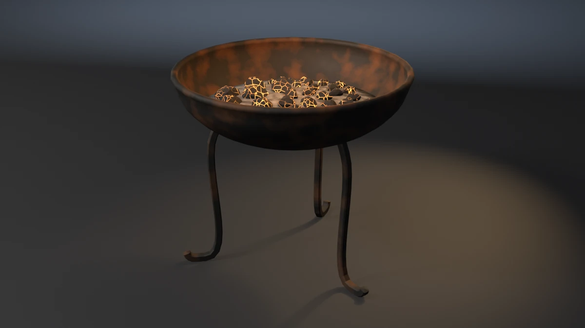

# brazier



A fire brazier: a spun-iron bowl with a rolled rim, three forged legs
swept in one piece from the bowl wall to curled feet, a bed of ash in the
bowl and a heap of thirty-six broken, glowing charcoal lumps on it.
**A showcase piece, not an example** — it witnesses no API contract. It
asserts that generated geometry meets declared asset budgets, recomputed
from the finished mesh.

## What it composes

| Shipped content | Used for |
| --- | --- |
| `skills/mesh-editing-and-bmesh` | lathed bowl and ash, swept legs, cleaved coal lumps in one `bmesh` |
| `skills/procedural-materials-and-shaders` | rusted rough iron, pale ash, charcoal with emissive cracks masked by noise |
| `skills/bake-high-to-low` | Cycles tangent-space normal bake, high onto low |
| `skills/engine-export-presets` | Unity glTF (`export_yup=True`) |
| `skills/depsgraph-and-evaluated-data` | evaluated triangle counts for the LOD ratios |
| `snippets/decimate_to_budget.py` | LOD1 / LOD2 COLLAPSE chain |
| `snippets/convex_hull_collider.py` | one hull for the bowl, one per leg, merged into a compound |
| `snippets/lod_chain.py` | LOD naming and ratio pattern |
| `examples/mesh-hygiene-audit` | hygiene combinatorics (copied, not imported) |

## The budget that matters

A brazier holds burning coals, so the thing it must not do is tip when
someone knocks it. That is invisible to every envelope check: legs tucked
in under the bowl still reach the floor, still ground the piece, and
still fit inside the bowl's own bounding box.

The piece recomputes stability from the finished mesh:

- **Centre of mass.** Signed tetrahedra over every closed shell, each
  triangle weighted by its material's density (iron 7850, coal 500,
  ash 600 kg/m³). The bowl dominates: 51.9 kg in all, centred on the axis
  at 0.466 m.
- **Support polygon.** The convex hull, in plan, of the leg vertices that
  lie on the floor.
- **Tip angle.** `atan(d / z)`, where `d` is the distance from the mass
  centre's plan position to the nearest support edge and `z` is its
  height. This is the lean the brazier survives before it goes over.
  Measured 18.30° against a 13° floor.

`--tuck-legs` is the falsifier built for exactly this. It brings the feet
in from 0.29 m to 0.15 m of the axis. They still ground (zmin and the
three-feet gate pass), the rim still sets the envelope (the AABB is
unchanged), and every other budget passes. Only the tip angle sees it:
10.23°.

## Budgets

Declared in the script as named constants, recomputed from the generated
mesh. Measured values are from Blender 5.2.1; every one is byte-identical
on 4.5.11 and 5.1.2 (only the glTF file size differs, by 4 bytes, which
is exporter metadata and not a budget).

| Budget | Band | Measured |
| --- | --- | --- |
| Base triangles | 6600–8200 | 6960 |
| LOD1 ratio | 0.32–0.62 | 0.5000 |
| LOD2 ratio | 0.10–0.35 | 0.2198 |
| Material slots | exactly 3, distinct | 3 |
| Iron faces | ≥ 1400 | 1680 |
| Coal faces | ≥ 2800 | 2880 |
| Ash faces | ≥ 380 | 448 |
| UV bounds | inside 0..1 | (0.0006, 0.0006)–(0.9994, 0.9994) |
| UV AABB overlap | ≤ 1e-5 | 0.000000 |
| Outer AABB | 0.696 × 0.696 × 0.612 m ± 0.020 | 0.6960 × 0.6960 × 0.6118 |
| Collider triangles | ≤ 400 | 240 (four hulls) |
| Normal bake | `{'FINISHED'}` with image data | `{'FINISHED'}`, `has_data=True` |
| glTF export | file written, non-empty | ~450 kB |
| Hygiene | all zero | loose 0/0, non-manifold 0, zero-area 0, doubles 0, n-gons 0, coplanar cross-shell pairs 0 |
| Grounded AABB | \|zmin\| ≤ 1e-4 | 0.00000 |
| Named feet | 3 legs, each zmin ≤ 1e-3 | 3 at 0.00000 |
| Legs bite the bowl | deepest leg vertex inside the bowl ≥ 1.5 mm | 2.58 mm |
| Coal seat | 36 coals, deepest vertex inside the ash 4–30 mm | 6.40–15.69 mm |
| Freeboard | rim above the highest coal or ash ≥ 30 mm | 53.95 mm |
| Tip angle | ≥ 13° | 18.30° |
| Coal interpenetration | 0 pairs | 0 |
| Coal size spread | largest footprint over smallest ≥ 1.35 | 5.64 |

Real-world size: a 0.70 m bowl, rim 0.61 m off the floor — a courtyard or
hall brazier.

## Construction

- **Bowl.** A half-ellipsoid spun from sheet iron, with a rolled bead at
  the lip. The inner wall is the outer one offset along its own normal by
  `WALL` (8 mm), so the wall keeps its thickness where the bowl runs flat.
- **Legs.** A chamfered-square bar (no 90° edges), swept in one piece:
  - The bar leaves the bowl along the wall's normal, starting `LEG_BITE`
    inside the iron.
  - It bends down and out on a Bézier whose last handle is level, so it
    arrives flat.
  - It runs level on the floor with a flat face down, and ends in a
    curled toe.
  - The section frame is fixed to each leg's own vertical plane.
- **Ash.** A lathed dome whose edge follows the inner wall `ASH_BITE`
  outside it. The bed is held by the bowl, not resting beside it.
- **Coals.** Each coal is an icosphere scaled to a lump, tumbled a few
  degrees and cleaved by three closed-form planes, so it reads as split
  charcoal and not a pebble ("rock is broken"). They are flat-shaded.
  Thirty-six are packed on a golden-angle spiral: each walks outward until
  it clears every placed coal by the two lumps' own plan radii (read off
  their vertices) plus `COAL_GAP`, and stays inside the inner wall. Each
  is then sunk into the ash by a fraction that varies with its index.

## Findings the budgets forced

- **Coal count.** Packing "as many coals as fit" made the coal count, and
  so the triangle budget, move with any falsifier that changed the space
  or the spacing. `--overfill`, `--pile-coals` and `--uniform-coals` all
  exited 4 or 5 instead of their targets. The heap is now a fixed
  `N_COALS` = 36.
- **Coplanar faces.** One coplanar cross-shell pair: two buried underside
  triangles on neighbouring lumps, 0.2° apart in normal and 0.04 mm apart
  in plane. Stood level, similar lumps put near-parallel faces side by
  side. Each lump now leans a closed-form few degrees, and the count is 0.
- **Stale face references.** A dict keyed by `BMFace` returned the wrong
  face after `create_icosphere(subdivisions=2)` freed and reallocated face
  memory. UV islands now live in a face int layer, and the provisional
  strip UVs are written straight into the loop layer.

## Conventions walked

Every convention in `showcase/README.md`, and whether it applies here.

| Convention | Applies | How |
| --- | --- | --- |
| Deterministic, budgets declared, assertions recompute | yes | no RNG; every value above is read off the mesh |
| Falsifier fails the budget it targets | yes | table below, proven on all three binaries |
| Hygiene incl. cross-shell coplanar | yes | exit 15 |
| Named supports | yes | three feet (`--float-foot`) |
| A joint bites | yes | each leg's deepest vertex inside the bowl by signed distance (`--short-legs`) |
| A bent bar is one sweep | yes | each leg is one sweep from bowl to toe |
| Iron is not chrome | yes | near-black and rust, roughness 0.55–0.85, metallic 0.65 |
| A vessel has a base and a belly | yes | the bowl's wall is offset along its normal |
| A vessel holds its contents | yes | the ash bites the inner wall; freeboard is asserted (`--overfill`) |
| Carried parts bite their bearers | yes | coals seated in the ash, banded (`--float-coals`) |
| Rock is broken, not smooth | yes | cleaved, flat-shaded lumps |
| Scattered parts do not interpenetrate | yes | exit 20 (`--pile-coals`) |
| Scatter varies in size | yes | exit 21 (`--uniform-coals`) |
| Shading is part of the model | yes | bowl and ash smooth (spun, powdery); legs flat (forged bar); coals flat (broken) |
| One substance, one slot | yes | iron, coal, ash |
| Edge treatment: no right angles | yes, by construction | chamfered-square legs (45° steps), lathed bowl; not a separate budget |
| Sort bmesh operator inputs | n/a | no set-fed operator is run |
| Level on the stage; stage 60 m | yes | turned about Z only; 60 m floor and wall |
| Keep a falsifier's envelope still | yes | every falsifier leaves the AABB unchanged |
| Timber, masonry, rope, fixtures, roofs, rings, paint | no | the piece has none of these |

## Falsifiers

Each breaks one pipeline stage so a **named** budget fails. All ten were
run on 4.5.11, 5.1.2 and 5.2.1 and exited the same declared code on all
three.

| Flag | Target budget | Breaks | Exit |
| --- | --- | --- | --- |
| `--skip-decimate` | LOD1 ratio | drops the DECIMATE modifiers, LOD1 ratio goes to 1.0000 | 9 |
| `--stray-vert` | mesh hygiene | adds one loose vertex under the bowl | 15 |
| `--lift-z` | grounded zmin | lifts the whole mesh 50 mm | 16 |
| `--float-foot` | named feet | lifts one foot 12 mm; the other two still ground the AABB | 16 |
| `--short-legs` | leg-to-bowl bite | starts every leg 12 mm off the wall; −10.0 mm | 17 |
| `--float-coals` | coal seat | lifts every coal 30 mm off the ash; −13.9 to −23.3 mm | 18 |
| `--overfill` | freeboard | raises the ash and heap 45 mm, still below the rim; 8.3 mm | 18 |
| `--tuck-legs` | tip angle | brings the feet in to 0.15 m of the axis; 10.23° | 19 |
| `--pile-coals` | coal interpenetration | packs coals at 0.6 of their spacing; 40 pairs | 20 |
| `--uniform-coals` | coal size spread | one size for every coal; 1.198 | 21 |

## Exit codes

File-local and sequential. `9` is a valid check code. `1` is the FATAL
wrapper — a crash, never a named check.

| Code | Meaning |
| --- | --- |
| 0 | Success |
| 1 | Uncaught exception (FATAL wrapper) |
| 2 | argparse / usage |
| 3 | Mesh did not build, or has no UV layer |
| 4 | Base triangle count outside band |
| 5 | Material slots, or a material's face floor |
| 6 | UVs outside 0..1 |
| 7 | UV AABB overlap above tolerance |
| 8 | Outer AABB off declared size |
| 9 | LOD1 or LOD2 ratio outside band (`--skip-decimate`) |
| 10 | Framing gate (`examples/gallery_framing.py`, render path only) |
| 11 | Collider triangles above ceiling |
| 12 | Normal bake failed or produced no image data |
| 13 | glTF export missing or empty |
| 14 | `--output` produced no file |
| 15 | Mesh hygiene (`--stray-vert`) |
| 16 | Grounded zmin, or a foot floating (`--lift-z`, `--float-foot`) |
| 17 | A leg not biting the bowl (`--short-legs`) |
| 18 | Coal seat or freeboard (`--float-coals`, `--overfill`) |
| 19 | Tip angle below floor (`--tuck-legs`) |
| 20 | Coals interpenetrate (`--pile-coals`) |
| 21 | Coal size spread below floor (`--uniform-coals`) |

## Run it

```bash
# Budget check, no render. ~2.2 s on 4.5, ~2.0 s on 5.1, ~2.4 s on 5.2.
blender --background --python brazier.py --

# Falsifier: the legs tuck in under the bowl. Must exit 19.
blender --background --python brazier.py -- --tuck-legs

# Falsifier: the bowl is filled to the brim. Must exit 18.
blender --background --python brazier.py -- --overfill

# Render the gallery still (EEVEE; --engine cycles on a GPU-less host).
blender --background --python brazier.py -- --output brazier.webp
```

Smoke runs the check-only path. It does not pass `--output` or any falsifier.

The render adds two render-only lights of its own: a point light above the
coals for the fire, and a spot for the warm floor pool. The camera is low
and close, so the house area wedge landed on the back wall, and an area
lamp brought near lit the whole floor.

## Cross-version measurements

| Value | 4.5.11 | 5.1.2 | 5.2.1 |
| --- | --- | --- | --- |
| Base triangles | 6960 | 6960 | 6960 |
| LOD1 / LOD2 tris | 3480 / 1530 | same | same |
| Face counts (iron / coal / ash) | 1680 / 2880 / 448 | same | same |
| Outer AABB | 0.6960 × 0.6960 × 0.6118 | same | same |
| Collider tris | 240 | 240 | 240 |
| Mass / tip angle | 51.87 kg / 18.30° | same | same |
| glTF bytes | 450940 | 450940 | 450936 |
| Check wall-clock | ~2.2 s | ~2.0 s | ~2.4 s |
