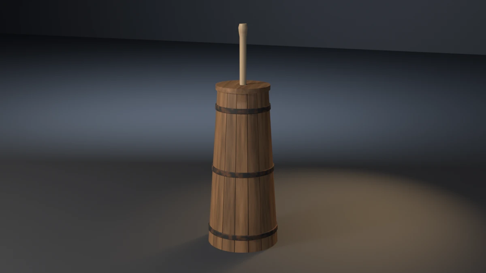

# butter-churn



A plunge butter churn: a tall body of sixteen oak staves that narrows
toward the top, three forged iron hoops, a bottom of three boards set in
a croze, a lid of two boards with a hole for the handle, and a maple
cross dasher whose handle runs up through the lid. **A showcase piece,
not an example** — it witnesses no API contract. It asserts that
generated geometry meets declared asset budgets, recomputed from the
finished mesh.

## What it composes

| Shipped content | Used for |
| --- | --- |
| `skills/mesh-editing-and-bmesh` | lofted staves, banded hoops, clipped board polygons, lathed handle, all in one `bmesh` |
| `skills/custom-properties` | face attributes (`PlankTone`, `GrainDir`) read by the wood shaders |
| `skills/procedural-materials-and-shaders` | oak with grain along each stave, pale maple, rusted rough iron |
| `skills/bake-high-to-low` | Cycles tangent-space normal bake, high onto low |
| `skills/engine-export-presets` | Unity glTF (`export_yup=True`) |
| `skills/depsgraph-and-evaluated-data` | evaluated triangle counts for the LOD ratios |
| `snippets/decimate_to_budget.py` | LOD1 / LOD2 COLLAPSE chain |
| `snippets/convex_hull_collider.py` | one hull for the body and lid, one for the handle above it |
| `snippets/lod_chain.py` | LOD naming and ratio pattern |
| `examples/mesh-hygiene-audit` | hygiene combinatorics (copied, not imported) |

## The budget that matters

A churn is for plunging. The body narrows toward the top, so a plunger
that clears the staves at the bottom can jam partway up the stroke, and
nothing else notices:

- the plunger still sits inside the body without touching it;
- the handle still clears the lid's hole;
- the bounding box does not move.

The piece reads the inner wall off the staves ring by ring and the
plunger's reach off the dasher's slats, about the handle's axis. It
finds the height at which the wall comes within `WALL_CLEAR` (10 mm) of
the plunger, stops at the lid if that comes first, and asserts the
travel from the plunger's rest height as a stroke floor of 400 mm.
Measured: 513.8 mm, for a 100.6 mm reach.

`--wide-dasher` is the falsifier built for exactly this. It widens the
slats to 125 mm. The plunger still clears the staves at rest, but it can
travel only 140.4 mm before it would meet the wall, and the run exits
20. Every other budget passes and the AABB is unchanged.

## Budgets

Declared in the script as named constants, recomputed from the generated
mesh. Measured values are from Blender 5.2.1; every one is byte-identical
on 4.5.11 and 5.1.2 (only the glTF file size differs, by 8 bytes, which is
exporter metadata and not a budget).

| Budget | Band | Measured |
| --- | --- | --- |
| Base triangles | 5000–6500 | 5684 |
| LOD1 ratio | 0.32–0.62 | 0.5000 |
| LOD2 ratio | 0.10–0.35 | 0.2199 |
| Material slots | exactly 3, distinct | 3 |
| Oak / maple / iron faces | ≥ 2000 / 140 / 500 | 2240 / 160 / 576 |
| UV bounds | inside 0..1 | (0.0013, 0.0013)–(0.9987, 0.9987) |
| UV AABB overlap | ≤ 1e-5 | 0.000000 |
| Outer AABB | 0.340 × 0.340 × 1.050 m ± 0.020 | 0.3401 × 0.3401 × 1.0500 |
| Collider triangles | ≤ 200 | 178 (two hulls) |
| Normal bake | `{'FINISHED'}` with image data | `{'FINISHED'}`, `has_data=True` |
| glTF export | file written, non-empty | ~240 kB |
| Hygiene | all zero | loose 0/0, non-manifold 0, zero-area 0, doubles 0, n-gons 0, coplanar cross-shell pairs 0 |
| Grounded AABB | \|zmin\| ≤ 1e-4 | 0.00000 |
| Named staves | 16 staves, each zmin ≤ 1e-4 | 16 at 0.00000 |
| Bottom boards | 3 boards, seams 0.6–2.5 mm | 3, 1.20 mm |
| Handle bite | handle's foot 8–20 mm into the slats | 14.0 mm |
| Hoop seat | 3 hoops, inner face 1.0–4.5 mm into the staves, outer face ≥ 3 mm proud | 2.50 mm in, 4.90 mm proud |
| Lid seat | 2 boards, each 1–4 mm onto the stave tops | 1.40–2.00 mm |
| Handle clearance | lid hole over handle radius, 2–10 mm | 5.00 mm |
| Plunge stroke | ≥ 400 mm | 513.8 mm |

Real-world size: 0.34 m across the foot, 0.75 m to the rim and 1.05 m to
the top of the handle. It is a farmhouse plunge churn.

## Construction

- **Staves.** Sixteen staves are lofted on a straight taper (`R_BOT` 170 mm
  to `R_TOP` 120 mm), with a gap of `STAVE_GAP` between neighbours.
  - Each stave's section has four vertices across its width at fractions
    0, ¼, ¾ and 1, outer face over inner face, and quads close both ends.
  - Ring heights are a uniform run plus both edges of every hoop and of
    the croze, so a hoop's edge and the bottom's faces meet stave
    vertices.
  - Each stave's foot and top are cut sloping inward (`END_CANT`, doubled
    on alternate staves), so the churn stands on its outer edges.
  - Every real edge is chamfered at 1.5 mm; the few-degree edges across a
    stave's width are left alone.
- **Hoops.** Each hoop is a banded iron section: flat inner face,
  chamfered outer edges. It is sampled at every stave's two interior
  vertex angles, so every hoop vertex lies radially over a stave vertex at
  the same height. The inner face is `HOOP_BITE` inside the stave's outer
  face, read from the same taper; the outer face is `HOOP_PROUD` outside
  it.
- **Bottom.** A 48-gon disk sized to the inner wall plus `CROZE`, cut
  across X into three boards with a named seam (Sutherland–Hodgman clip).
  Caps are chamfered as n-gons and then triangulated.
- **Lid.** Two half-annulus boards with the seam across the hole. The
  hole is `HOLE_CLEAR` wider than the handle. The lid rests `LID_SEAT` on
  the stave tops and overhangs by `LID_OVER`.
- **Dasher.** Two crossed maple slats, the second a step higher. The
  handle's foot is driven `HANDLE_BITE` into them. The handle is a
  12-segment lathe with rings at both faces of the lid, so its clearance
  is measured where it passes, and it ends in a swelled grip.

## Findings the budgets forced

- **Neighbouring ends in one plane.** The first build had 240 coplanar
  cross-shell pairs:
  - adjacent stave feet and tops;
  - the two lid boards;
  - the bottom boards' faces and a rim chord the seams split.

  The fixes:
  - stave ends are canted inward, doubled on alternate staves (at one
    cant, neighbours 5.6° apart in bearing still matched as one plane);
  - one lid board stands 0.6 mm proud;
  - the middle bottom board steps up and in by 0.6 mm.

  The count is 0.
- **A falsifier stolen by the collider.** `--float-hoops` exited 11 on
  the collider ceiling (242 against 240) instead of 18. The hoops stand
  5 mm proud and add nothing a character could hit, so they were taken
  out of the body hull rather than the ceiling raised. The collider is
  now 178 triangles, and the falsifier exits 18.

## Conventions walked

Every convention in `showcase/README.md`, and whether it applies here.

| Convention | Applies | How |
| --- | --- | --- |
| Deterministic, budgets declared, assertions recompute | yes | no RNG; every value above is read off the mesh |
| Falsifier fails the budget it targets | yes | table below, proven on all three binaries |
| Hygiene incl. cross-shell coplanar | yes | exit 15; canted stave ends and stepped boards keep it at 0 |
| Named supports | yes | all sixteen staves (`--short-stave`) |
| Seat conformance, sampled per segment | yes | every hoop vertex against the stave vertex under it (`--float-hoops`) |
| Bands on a curved host are built on the host's arc | yes | hoop vertices at the staves' own angles |
| A band wraps its host, never sunk into it | yes | inner face bites, outer face asserted proud |
| A head or bottom is boards, not a slab | yes | three bottom boards with a banded seam (`--one-piece-bottom`); the lid is two boards |
| A vessel holds its contents | n/a | the churn shows no contents |
| A joint bites; touching is not joining | yes | handle into the slats (`--short-handle`) |
| Carried parts bite their bearers | yes | lid on the stave tops (`--float-lid`) |
| What passes through a part must clear its mount | yes | handle through the lid's hole (`--tight-hole`) |
| Identical boards read as CG | yes | per-stave and per-board `PlankTone`, grain along each piece's longest extent |
| Hoops are forged iron, not bright | yes | near-black and rust, roughness 0.55–0.85, metallic 0.65 |
| Shading is part of the model | yes | staves smooth across their width with every edge over 35° hard, so they read as coopered boards; handle smooth (turned) |
| One substance, one slot | yes | oak, maple, iron |
| Chamfer n-gon caps, then triangulate | yes | bottom and lid boards |
| Sort bmesh operator inputs | yes | bevel edges sorted by index |
| Level on the stage; stage 60 m | yes | turned about Z only; 60 m floor and wall |
| Keep a falsifier's envelope still | yes | every falsifier leaves the AABB unchanged |
| Rope, masonry, roofs, rings, scatter, mirrored assemblies | no | the piece has none of these |

## Falsifiers

Each breaks one pipeline stage so a **named** budget fails. All ten were
run on 4.5.11, 5.1.2 and 5.2.1 and exited the same declared code on all
three.

| Flag | Target budget | Breaks | Exit |
| --- | --- | --- | --- |
| `--skip-decimate` | LOD1 ratio | drops the DECIMATE modifiers, LOD1 ratio goes to 1.0000 | 9 |
| `--stray-vert` | mesh hygiene | adds one loose vertex inside the body | 15 |
| `--lift-z` | grounded zmin | lifts the whole mesh 50 mm | 16 |
| `--short-stave` | named staves | stops one stave's foot 6 mm above the floor; the rest ground the AABB | 16 |
| `--one-piece-bottom` | bottom boards | one disk instead of three boards | 17 |
| `--short-handle` | handle bite | starts the handle 5 mm above the slats; −5.0 mm | 17 |
| `--float-hoops` | hoop seat | builds every hoop 4 mm off the staves; −3.5 mm | 18 |
| `--float-lid` | lid seat | lifts the lid 5 mm; −3.6 to −3.0 mm | 18 |
| `--tight-hole` | handle clearance | cuts the hole 2 mm inside the handle; −2.0 mm | 18 |
| `--wide-dasher` | plunge stroke | widens the slats to 125 mm; 140.4 mm | 20 |

## Exit codes

File-local and sequential. `9` is a valid check code. `1` is the FATAL
wrapper — a crash, never a named check. `19` (plumb and real-world size)
is reserved across pieces and unused here.

| Code | Meaning |
| --- | --- |
| 0 | Success |
| 1 | Uncaught exception (FATAL wrapper) |
| 2 | argparse / usage |
| 3 | Mesh did not build, or has no UV layer |
| 4 | Base triangle count outside band |
| 5 | Material slots, or a material's face floor |
| 6 | UVs outside 0..1 |
| 7 | UV AABB overlap above tolerance |
| 8 | Outer AABB off declared size |
| 9 | LOD1 or LOD2 ratio outside band (`--skip-decimate`) |
| 10 | Framing gate (`examples/gallery_framing.py`, render path only) |
| 11 | Collider triangles above ceiling |
| 12 | Normal bake failed or produced no image data |
| 13 | glTF export missing or empty |
| 14 | `--output` produced no file |
| 15 | Mesh hygiene (`--stray-vert`) |
| 16 | Grounded zmin, or a stave floating (`--lift-z`, `--short-stave`) |
| 17 | Bottom boards or handle bite (`--one-piece-bottom`, `--short-handle`) |
| 18 | Hoop seat, lid seat or handle clearance (`--float-hoops`, `--float-lid`, `--tight-hole`) |
| 20 | Plunge stroke below floor (`--wide-dasher`) |

## Run it

```bash
# Budget check, no render. ~1.8 s on 4.5 and 5.2.
blender --background --python butter_churn.py --

# Falsifier: the plunger jams partway up the narrowing body. Must exit 20.
blender --background --python butter_churn.py -- --wide-dasher

# Falsifier: the lid's hole is narrower than the handle. Must exit 18.
blender --background --python butter_churn.py -- --tight-hole

# Render the gallery still (EEVEE; --engine cycles on a GPU-less host).
blender --background --python butter_churn.py -- --output butter_churn.webp
```

Smoke runs the check-only path. It does not pass `--output` or any falsifier.

## Cross-version measurements

| Value | 4.5.11 | 5.1.2 | 5.2.1 |
| --- | --- | --- | --- |
| Base triangles | 5684 | 5684 | 5684 |
| LOD1 / LOD2 tris | 2842 / 1250 | same | same |
| Face counts (oak / maple / iron) | 2240 / 160 / 576 | same | same |
| Outer AABB | 0.3401 × 0.3401 × 1.0500 | same | same |
| Collider tris | 178 | 178 | 178 |
| Plunge stroke / reach | 513.8 mm / 100.6 mm | same | same |
| glTF bytes | 239804 | 239804 | 239796 |
