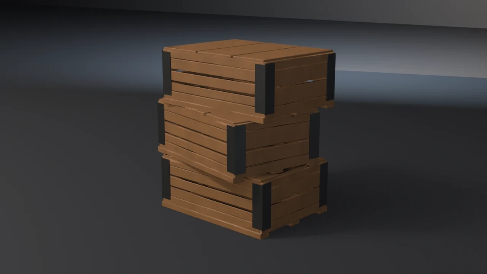

# crate-stack



A stack of three shipping crates. **A showcase piece, not an example** — it
witnesses no API contract. It asserts that generated geometry meets declared
asset budgets, recomputed from the finished mesh.

## What it composes

One `build_crate` generator, invoked three times with a per-instance seed,
then the shipped pipeline:

| Shipped content | Used for |
| --- | --- |
| `skills/mesh-editing-and-bmesh` | box, bevel and UV construction in one `bmesh` |
| `skills/procedural-materials-and-shaders` | two Principled materials with noise-driven wear |
| `skills/bake-high-to-low` | Cycles tangent-space normal bake, high onto low |
| `skills/engine-export-presets` | Unity glTF (`export_yup=True`) |
| `skills/depsgraph-and-evaluated-data` | evaluated triangle counts for the LOD ratios |
| `snippets/decimate_to_budget.py` | LOD1 / LOD2 COLLAPSE chain |
| `snippets/convex_hull_collider.py` | convex collider |
| `snippets/lod_chain.py` | LOD naming and ratio pattern |
| `examples/mesh-hygiene-audit` | hygiene combinatorics (copied, not imported) |

## Reuse with variation

The point of the piece. Each crate comes out of the same generator; what
differs is the seed. That seed drives the yaw, the plank widths, and the
board heights, so the three read as three of the same design rather than one
model pasted three times.

True instancing — three objects sharing one mesh datablock — and
per-instance geometry variation are mutually exclusive. This piece takes the
variation, and the shipped asset is the flattened single mesh an engine would
receive. The generator is reused; the geometry is not.

Two independent random streams keep that honest. The **design** stream
(yaw, plank widths) is what `--same-seed` collapses. The **placement** stream
(lateral offsets) stays per-instance either way, so a falsified stack has the
same footprint as a good one and fails on the variation budget rather than on
the bounding box.

## Budgets

Declared in the script as named constants, recomputed from the generated
mesh. Measured values below are from Blender 5.2.1; see the table at the end
for the 4.5.11 / 5.1.2 figures.

| Budget | Band | Measured |
| --- | --- | --- |
| Base triangles | 3200–7200 | 4380 |
| LOD1 ratio | 0.32–0.62 | 0.5000 |
| LOD2 ratio | 0.10–0.35 | 0.2005 (5.2) / 0.2199 (4.5, 5.1) |
| Material slots | exactly 2, distinct | 2 |
| Iron faces | ≥ 120 | 216 |
| Timber faces | ≥ 600 | 2436 |
| UV bounds | inside 0..1 | (0.0008, 0.0008)–(0.9992, 0.9992) |
| UV AABB overlap | ≤ 1e-5 | 0.000000 |
| Outer AABB | 0.658 × 0.524 × 0.704 m ± 0.020 | 0.6582 × 0.5235 × 0.7040 |
| Crate body footprint | 0.585 × 0.425 m ± 0.015, in the crate's own frame | 0.5846 × 0.4246 (all three) |
| Collider triangles | ≤ 260 | 202 |
| Normal bake | `{'FINISHED'}` with image data | `{'FINISHED'}`, `has_data=True` |
| glTF export | file written, non-empty | ~340 kB |
| Hygiene | all zero | loose 0/0, non-manifold 0, zero-area 0, doubles 0, n-gons 0, coplanar disjoint pairs 0 |
| Grounded AABB | \|zmin\| ≤ 1e-4 | 0.00000 |
| Ground runners | 3 named supports, each zmin ≤ 1e-3 | 3 at 0.00000 |
| Crate-to-crate seat | both seats, surface gap ≤ 0.0015 m | 0.00000 (overlapping) |
| Yaw band | each \|yaw\| in 0.040–0.192 rad | 0.0681, 0.0943, 0.1093 |
| Per-instance variation | yaw spread ≥ 0.020 rad, plank spread ≥ 0.0008 m | 0.0262 rad, 0.00205 m |

Real-world size: each crate is 0.58 × 0.42 m at the timber and 0.585 × 0.425 m
over the corner iron, 0.244 m tall including runners and lid. Three stacked
come to 0.70 m — knee height, wider than tall.

### Why the footprint is measured in the crate's own frame

The stack AABB is the union of three yawed boxes, so a crate could drift to
any size underneath it and the outer budget would not notice. Each crate's
footprint is therefore measured after un-rotating by the yaw that crate was
*measured* to have, not the yaw it was built with. All three land on
0.5846 × 0.4246 m exactly, which is what makes the un-rotation trustworthy.

### Why parts are classified by principal axes

Every part is an axis-aligned box in its crate's frame and then rotated about
Z. A world-AABB shape filter measures the rotated bounding box, not the part:
a 0.554 m board yawed 0.09 rad reports 0.061 m of depth instead of its
0.013 m thickness, and every filter keyed to thickness silently matches
nothing. `xy_principal` recovers each box's own axes, and hands back the yaw
as a by-product — which is where the variation budget's yaw numbers come from.

### Why stack levels come from the runners

Binning parts against the declared stack pitch put a lid — which sits 8 mm
below the next crate's base — on the wrong level the moment a falsifier
shifted a crate, and the seat budget then compared a crate against itself.
The bands are clustered from the runner heights the mesh actually has, so
they follow the geometry including when a falsifier moves it.

## Determinism

Fixed seed 41; no unseeded randomness. Identical geometry across runs on one
binary and across 4.5.11, 5.1.2 and 5.2.1 — every measured value above is
byte-identical on the three **except** LOD2, where `DECIMATE COLLAPSE`
produces 878 triangles on 5.2 and 934 on 4.5 and 5.1. That is why the LOD
gate is a ratio band (0.10–0.35, measured 0.2005 and 0.2199) and not an exact
count.

## Falsifiers

Each breaks one pipeline stage so a **named** budget fails. All six were run
on 4.5.11, 5.1.2 and 5.2.1 and produced the same exit code on all three.

| Flag | Breaks | Exit |
| --- | --- | --- |
| `--skip-decimate` | drops the DECIMATE modifiers, LOD1 ratio goes to 1.0000 | 9 |
| `--stray-vert` | adds one loose vertex *inside* the silhouette, so hygiene catches it rather than the bounding box | 15 |
| `--lift-z` | lifts the whole mesh 50 mm off the floor | 16 |
| `--short-skids` | floats **one** of the three ground runners 12 mm; the other two still ground the AABB, so only the named-support budget sees it | 16 |
| `--float-stack` | lifts the top crate 9 mm clear of the lid below, opening a 34 mm seat gap | 18 |
| `--same-seed` | gives all three crates the same design seed; yaw spread and plank spread both go to 0 | 20 |

## Exit codes

File-local and sequential. `9` is a valid check code; there is no rule
against it. `1` is the FATAL wrapper — a crash, never a named check.

| Code | Meaning |
| --- | --- |
| 0 | Success |
| 1 | Uncaught exception (FATAL wrapper) |
| 2 | argparse / usage |
| 3 | Mesh did not build, or has no UV layer |
| 4 | Base triangle count outside band |
| 5 | Material slots, or a material's face floor |
| 6 | UVs outside 0..1 |
| 7 | UV AABB overlap above tolerance |
| 8 | Outer AABB off declared size |
| 9 | LOD1 or LOD2 ratio outside band (`--skip-decimate`) |
| 10 | Framing gate (`examples/gallery_framing.py`, render path only) |
| 11 | Collider triangles above ceiling |
| 12 | Normal bake failed or produced no image data |
| 13 | glTF export missing or empty |
| 14 | `--output` produced no file |
| 15 | Mesh hygiene (`--stray-vert`) |
| 16 | Grounded zmin, or a named ground runner floating (`--lift-z`, `--short-skids`) |
| 18 | Crate-to-crate seat gap (`--float-stack`) |
| 19 | Crate body footprint off declared size |
| 20 | Per-instance variation collapsed (`--same-seed`) |

`17` is unused here: this piece has no diagonal member. `15`–`19` are
reserved across showcase pieces for the hygiene family, so the numbering
skips rather than reuses.

## Run it

```bash
# Budget check, no render. ~1.0 s on 4.5/5.1, ~1.2 s on 5.2.
blender --background --python crate_stack.py --

# Falsifier: the three crates become copies. Must exit 20.
blender --background --python crate_stack.py -- --same-seed

# Falsifier: the top crate floats off the lid below. Must exit 18.
blender --background --python crate_stack.py -- --float-stack

# Render the gallery still (EEVEE; --engine cycles on a GPU-less host).
blender --background --python crate_stack.py -- --output stack.webp
```

Smoke runs the check-only path. It does not pass `--output` or any falsifier.

## Cross-version measurements

| Value | 4.5.11 | 5.1.2 | 5.2.1 |
| --- | --- | --- | --- |
| Base triangles | 4380 | 4380 | 4380 |
| LOD1 tris / ratio | 2190 / 0.5000 | 2190 / 0.5000 | 2190 / 0.5000 |
| LOD2 tris / ratio | 934 / 0.2199 | 934 / 0.2199 | 878 / 0.2005 |
| Outer AABB | 0.6582 × 0.5235 × 0.7040 | same | same |
| Collider tris | 202 | 202 | 202 |
| Yaws (rad) | 0.0943, −0.1093, 0.0681 | same | same |
| Seat gap | 0.00000 | 0.00000 | 0.00000 |
| Check wall-clock | ~0.99 s | ~1.01 s | ~1.20 s |
