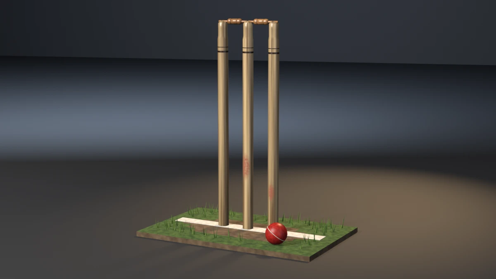

# cricket-wicket



A cricket wicket as Law 8 of the Laws of Cricket describes it: three
turned ash stumps, 28 inches proud of the turf and 9 inches wide over
their outer faces, each with a shoulder, a neck and a grooved domed crown;
two turned bails whose spigots lie in the grooves and whose collared
barrels hang across the gaps; a tight strip of turf worn bare along a
chalked bowling crease, its grass thickening toward the edges; and a red
leather ball with a raised seam resting in front of the stumps. **A showcase piece, not an example** — it witnesses no API
contract. It asserts that generated geometry meets declared asset budgets,
recomputed from the finished mesh.

## What it composes

| Shipped content | Used for |
| --- | --- |
| `skills/mesh-editing-and-bmesh` | lathed stumps, bails and ball, a lofted turf slab, bipyramid grass blades, all in one `bmesh` |
| `skills/custom-properties` | face attributes (`PlankTone`, `GrainDir`) read by the wood and grass shaders |
| `skills/procedural-materials-and-shaders` | lacquered ash with turned bands and red ball scuffs that knock off the lacquer, stained bail wood, turf, earth, chalk, grass, leather, thread |
| `skills/bake-high-to-low` | Cycles tangent-space normal bake, high onto low |
| `skills/engine-export-presets` | Unity glTF (`export_yup=True`) |
| `skills/depsgraph-and-evaluated-data` | evaluated triangle counts for the LOD ratios |
| `snippets/decimate_to_budget.py` | LOD1 / LOD2 COLLAPSE chain |
| `snippets/convex_hull_collider.py` | a hull per stump, per bail, for the ball and for the slab, merged into a compound |
| `snippets/lod_chain.py` | LOD naming and ratio pattern |
| `examples/mesh-hygiene-audit` | hygiene combinatorics (copied, not imported) |

## The budgets that matter

A wicket fails invisibly in two ways, and neither moves the bounding box.

**The bails must lie in the grooves.** A bail floating a few millimetres
above its stumps still spans the gap, still sits over the stumps, still
fits the outer AABB, and still renders as a bail. The piece measures the
seat of each of the four spigots: the lowest point of the spigot against
the floor of the groove it lies in, read off the finished stump mesh.
Band 0.5–2.0 mm; measured 0.92–1.00 mm. `--lift-bails` raises both bails
5 mm, the seat goes to −4.0 mm, and the run exits 18 with every other
budget green.

**The stumps are a real size.** Law 8 states numbers, and each is
recomputed from the mesh:

- diameter 34.9–38.1 mm (measured 36.5), taken on the shaft;
- 711.2 mm from the turf to the highest point of each stump (band
  ± 1.5 mm, measured 711.2);
- 228.6 mm over the outer faces (band ± 3 mm);
- every gap narrower than a ball, 71.3 mm, and no pair touching (measured
  59.55 mm);
- bails stand 2–12.7 mm above the stumps (measured 4.7 mm);
- the ball is 71.3–72.9 mm across (measured 72.0).

`--thin-stumps` turns the shafts to 32.9 mm and exits 19 on the diameter.
`--fat-bails` swells the barrels and the bails stand 13.7 mm proud, which
Law 8 forbids. `--small-ball` makes a 60 mm ball. Each of these leaves
every stump on the floor.

## Budgets

Declared in the script as named constants, recomputed from the generated
mesh. Measured values are from Blender 5.2.1.

| Budget | Band | Measured |
| --- | --- | --- |
| Base triangles | 6100–6800 | 6448 |
| LOD1 ratio | 0.32–0.62 | 0.5000 |
| LOD2 ratio | 0.10–0.35 | 0.2199 |
| Material slots | exactly 8, distinct | 8 |
| Face floors (ash / bail / turf / earth / chalk / blade / leather / seam) | ≥ 1300 / 630 / 100 / 135 / 6 / 1250 / 180 / 220 | 1344 / 672 / 112 / 152 / 6 / 1344 / 200 / 240 |
| UV bounds | inside 0..1 | (0.0012, 0.0011)–(0.9988, 0.9944) |
| UV AABB overlap | ≤ 1e-5 | 0.000000 |
| Outer AABB | 0.646 × 0.406 × 0.7359 m ± 0.010 | 0.6460 × 0.4060 × 0.7359 |
| Collider triangles | ≤ 360 | 294 (seven hulls) |
| Normal bake | `{'FINISHED'}` with image data | `{'FINISHED'}`, `has_data=True` |
| glTF export | file written, non-empty | ~278 kB |
| Hygiene | all zero | loose 0/0, non-manifold 0, zero-area 0, doubles 0, n-gons 0, coplanar cross-shell pairs 0 |
| Grounded AABB | \|zmin\| ≤ 1e-4 | 0.00000 |
| Named stumps | 3 stumps, each foot z ≤ 1e-4 | 3 at 0.00000 |
| Spigot tip on its neck | 4 tips, ≥ 0.5 mm inside the neck radius | 1.03 mm |
| Barrel clear of stumps | ≥ 0.5 mm in x at the barrel's height | 6.92 mm |
| Bail pair | gap between the two short spigots ≥ 0.3 mm | 0.85 mm |
| Spigot seat | 4 spigots, lowest point 0.5–2.0 mm below the groove floor | 0.92–1.00 mm |
| Chalk line | 0.8–3.0 mm proud of the turf, ≥ 0.5 mm bitten in | 1.50 / 1.00 mm |
| Ball rest | lowest point 0.2–1.5 mm below the turf top | 0.60 mm |
| Seam | 0.5–2.0 mm proud of the ball | 1.00 mm |
| Stump diameter | 34.9–38.1 mm (Law 8) | 36.5 mm |
| Stump height | 711.2 mm ± 1.5 above the turf top | 711.2 mm |
| Width over outer faces | 228.6 mm ± 3.0; every gap 40 mm to under 71.3 mm | 228.6 mm; gaps 59.55 mm |
| Mirrored stumps | left/right axes mirrored within 1 mm | 0.000 mm |
| Bail projection | 2.0–12.7 mm above the stumps' highest point (Law 8) | 4.7 mm |
| Ball diameter | 71.3–72.9 mm (Law 5) | 72.0 mm |

## Construction

- **Stumps.** One lathe each, 32 segments, in one shell from the foot:
  - a spike through the turf, its point at z = 0;
  - a shaft from the turf up;
  - a shoulder that steps in to the neck;
  - a domed crown cut by a groove running along the wicket.

  The groove floor is flat where the dome is higher and follows the dome
  where it is lower, so the groove opens through the rim as a ramp. The
  crown's highest vertex is found by evaluating the crown once, and the
  crown is placed so that vertex lands exactly 711.2 mm above the turf.
- **Bails.** One lathe each along X: a 34.9 mm long spigot, a 54 mm
  barrel turned with a crisp shoulder off each spigot and a full-width
  collar set off from a slightly slimmer body by a V-cut bead line, a
  22.2 mm short spigot, 111.1 mm in all as
  Law 8 gives. The long spigot lies on an outer stump, the short on the
  middle one. Each is shifted 1.6 mm outward so the two short spigots meet
  without touching. The right bail's facets are turned half a segment: two
  collinear cylinders share facet planes, and a coplanar cross-shell pair
  is exactly what the hygiene budget forbids.
- **Turf.** A tight 0.64 × 0.40 m strip of pitch, a grid of 16 × 10
  cells whose outer ring rolls down 3 mm and drops in a wall to a
  fan-filled floor. The bowling crease runs through the stumps' line
  (Law 7); the popping crease, 1.22 m in front, is off the strip. Faces
  inside a worn ellipse centred on the crease take the earth slot. The
  floor fan's centre sits off the stump line: on the slab's centre it
  welds to the middle stump's spike point, a double at the origin. The
  chalk stops at the last flat cell so it never rides the roll. The chalk is a box sunk 1 mm into the turf and 1.5
  mm proud, so it sits in the turf rather than on its plane.
- **Grass.** Fifty-six tufts of three bipyramid blades, a fixed-seed
  `random.Random(11)`, kept with a probability that rises toward the
  slab's edges and stays off the worn crease. Tuft roots are at least
  24 mm apart. A tuft's three blades are turned a third of a quarter-turn
  apart, and each blade's root depth walks a golden-ratio sequence, so no
  two blades share a buried facet plane.
- **Ball.** A 72 mm lathe sphere on a tilted axis, lowered until its
  lowest vertex is 0.6 mm below the turf top, with a 40-segment torus seam
  on its great circle, seated so it stands 1 mm proud.

## Findings the budgets forced

- **Coplanar bails.** Two bails on one line have facets in the same
  planes. The hygiene budget counted 82 pairs, 64 of them from the bails.
  Turning one bail half a segment took it to 0.
- **Coplanar grass.** The remaining 18 pairs were blades in one tuft with
  identical diamond base rings. A random ring phase per blade fixed them.
  Crowding the tufts toward the edges in the quality pass brought 2 pairs
  back, from blades in different tufts that happened to line up on one
  tilted plane; a stratified phase per tuft and a golden-ratio root depth
  per blade took them to 0.
- **UV fan overlap.** The slab floor is a triangle fan, and a planar map
  of a fan overlaps the triangles' AABBs (2.28 in total). It is unrolled
  into one strip per triangle.
- **Collider.** Hulls over every second vertex of every ring came to 802
  triangles. Hulls over the rings where the silhouette turns, every
  fourth vertex, are 308 (294 on the tighter slab).
- **A falsifier that missed its target (inspection-only at first).**
  `--fat-bails` at a 17.5 mm barrel stood the bails 12.2 mm proud, inside
  Law 8's 12.7 mm, and exited 0. At 19.0 mm it stands 13.7 mm proud and
  exits 19. `--lift-bails` at 6 mm landed a flat facet in a stump facet's
  plane and exited 15 on hygiene; at 5 mm it exits 18.

## Conventions walked

Every convention in `showcase/README.md`, and whether it applies here.

| Convention | Applies | How |
| --- | --- | --- |
| Deterministic, budgets declared, assertions recompute | yes | fixed-seed RNG for grass only; every value above is read off the mesh |
| Falsifier fails the budget it targets | yes | table below, each run on 5.2.1 |
| Hygiene incl. cross-shell coplanar | yes | exit 15 |
| Named supports | yes | the three stumps' feet (`--float-stump`) |
| Even shaping terms and mirror symmetry | yes | left and right stumps paired (`--skew-stump`) |
| Plumb and real-world size | yes | stump diameter, height, width, gaps, ball size (`--thin-stumps`, `--small-ball`) |
| Joint-fit budgets | yes | spigot tips on their necks, barrels clear of the stumps (`--shift-bails`) |
| Seat conformance | yes | spigots in the grooves, ball on the turf, seam on the ball, chalk in the turf (`--lift-bails`, `--float-ball`, `--sink-seam`, `--sink-chalk`) |
| A member is tenoned into its seat, never stood on it | yes | spigots 1 mm into the groove floor, chalk 1 mm into the turf, ball 0.6 mm, stumps through the slab |
| Orthogonal members | n/a | nothing is a board |
| Wrappers follow the host's profile | n/a | no band or hoop |
| Rope, masonry, roofs, vessels, scatter | n/a | grass tufts are decoration, not a scatter budget |
| Shading is part of the model | yes | stumps, bails, ball smooth (turned); every edge over 40° hard (slab, groove walls, blades) |
| One substance, one slot | yes | ash, bail wood, turf, earth, chalk, grass, leather, thread |
| Edge treatment: no right angles | n/a | turned and lofted, no box edges; the asset-quality `edge90` is 0.090 |
| Material face floors | yes | all eight slots |
| The bake cage is narrower than the nearest neighbour | yes | `CAGE_EXTRUSION` 4 mm, well under the 59 mm gaps |
| Level on the stage; stage 60 m | yes | turned about Z only; 60 m floor and wall |
| Keep a falsifier's envelope still | yes | every falsifier stays inside the 10 mm bounding-box tolerance |

## Falsifiers

Each breaks one pipeline stage so a **named** budget fails. All thirteen
were run on Blender 5.2.1 and exited the declared code. 4.5 and 5.1 were
not available locally; CI exercises the default path on both.

| Flag | Target budget | Breaks | Exit |
| --- | --- | --- | --- |
| `--skip-decimate` | LOD1 ratio | drops the DECIMATE modifiers, LOD1 ratio goes to 1.0000 | 9 |
| `--stray-vert` | mesh hygiene | adds one loose vertex above the turf | 15 |
| `--lift-z` | grounded AABB | lifts the whole mesh 50 mm | 16 |
| `--float-stump` | named stumps | lifts the left stump 8 mm; the other two and the slab still ground the AABB | 16 |
| `--shift-bails` | bail footprint | slides both bails 8 mm outward; a tip lies 7.0 mm outside its neck | 17 |
| `--lift-bails` | spigot seat | lifts both bails 5 mm; seats go to −4.0 mm | 18 |
| `--sink-chalk` | chalk line | buries the chalk 4 mm; −4.0 mm proud | 18 |
| `--float-ball` | ball rest | lifts the ball 5 mm; −4.4 mm | 18 |
| `--sink-seam` | seam | sinks the seam 3 mm; −2.0 mm proud | 18 |
| `--thin-stumps` | stump diameter | turns the shafts to 0.9 of their radius; 32.85 mm | 19 |
| `--skew-stump` | mirrored stumps | moves the right stump 2 mm along the wicket; 2.0 mm | 19 |
| `--fat-bails` | bail projection | swells the barrels to 19 mm radius; 13.7 mm proud | 19 |
| `--small-ball` | ball diameter | shrinks the ball to 30 mm radius; 60.0 mm | 19 |

## Exit codes

File-local and sequential. `9` is a valid check code. `1` is the FATAL
wrapper — a crash, never a named check.

| Code | Meaning |
| --- | --- |
| 0 | Success |
| 1 | Uncaught exception (FATAL wrapper) |
| 2 | argparse / usage |
| 3 | Mesh did not build, or has no UV layer |
| 4 | Base triangle count outside band |
| 5 | Material slots, or a material's face floor |
| 6 | UVs outside 0..1 |
| 7 | UV AABB overlap above tolerance |
| 8 | Outer AABB off declared size |
| 9 | LOD1 or LOD2 ratio outside band (`--skip-decimate`) |
| 10 | Framing gate (`examples/gallery_framing.py`, render path only) |
| 11 | Collider triangles above ceiling, or asset-quality gate (render path only) |
| 12 | Normal bake failed or produced no image data |
| 13 | glTF export missing or empty |
| 14 | `--output` produced no file |
| 15 | Mesh hygiene (`--stray-vert`) |
| 16 | Grounded AABB zmin, or a stump floating (`--lift-z`, `--float-stump`) |
| 17 | Bails not located, spigot tip off its neck, barrel against a stump, or bails touching (`--shift-bails`) |
| 18 | Spigot seat, chalk line, ball rest or seam (`--lift-bails`, `--sink-chalk`, `--float-ball`, `--sink-seam`) |
| 19 | Stump diameter, height, width or gaps, mirrored stumps, bail projection, ball diameter (`--thin-stumps`, `--skew-stump`, `--fat-bails`, `--small-ball`) |

## Run it

```bash
# Budget check, no render.
blender --background --python cricket_wicket.py --

# Falsifier: the bails float over the grooves. Must exit 18.
blender --background --python cricket_wicket.py -- --lift-bails

# Falsifier: the stump shafts are too thin for Law 8. Must exit 19.
blender --background --python cricket_wicket.py -- --thin-stumps

# Render the gallery still (EEVEE; --engine cycles on a GPU-less host).
blender --background --python cricket_wicket.py -- --output cricket_wicket.webp
```

Smoke runs the check-only path. It does not pass `--output` or any falsifier.

## Measurements

Blender 5.2.1 only; 4.5.11 and 5.1.2 were not available locally.

| Value | 5.2.1 |
| --- | --- |
| Base triangles | 6448 |
| LOD1 / LOD2 tris | 3224 / 1418 |
| Face counts (ash / bail / turf / earth / chalk / blade / leather / seam) | 1344 / 672 / 112 / 152 / 6 / 1344 / 200 / 240 |
| Outer AABB | 0.6460 × 0.4060 × 0.7359 |
| Collider tris | 294 |
| Stump 711.2 mm, 36.5 mm, 228.6 mm, gaps 59.55 mm | exact |
| Spigot seats | 0.92–1.00 mm |
