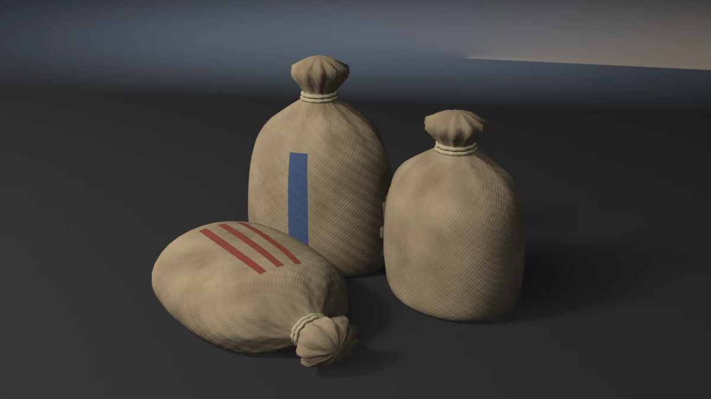

# grain-sacks



A pile of three burlap grain sacks. Two stand, one lies slumped in front
of them, and each is gathered at the neck under a two-turn twine tie with
a pleated crown above it. The sacks have settled onto flat bases and
press into each other where they lean.
**A showcase piece, not an example** — it witnesses no API contract. It
asserts that generated geometry meets declared asset budgets, recomputed
from the finished mesh.

## What it composes

| Shipped content | Used for |
| --- | --- |
| `skills/mesh-editing-and-bmesh` | lofted, pleated sack bodies and laid twine in one `bmesh` |
| `skills/procedural-materials-and-shaders` | hessian weave and stripes on the cloth's own coordinates (a second UV layer), per-sack tone |
| `skills/bake-high-to-low` | Cycles tangent-space normal bake, high onto low |
| `skills/engine-export-presets` | Unity glTF (`export_yup=True`) |
| `skills/depsgraph-and-evaluated-data` | evaluated triangle counts for the LOD ratios |
| `snippets/decimate_to_budget.py` | LOD1 / LOD2 COLLAPSE chain |
| `snippets/convex_hull_collider.py` | one hull per sack, merged into a compound |
| `snippets/lod_chain.py` | LOD naming and ratio pattern |
| `examples/mesh-hygiene-audit` | hygiene combinatorics (copied, not imported) |

## The budget that matters

A sack full of grain settles. Its contents slump into the bottom and it
rests on a flat patch of cloth pressed against the floor. An egg-bottomed
sack still touches the floor at its lowest vertex, so the grounded-zmin
gate and the per-sack support gate both pass it, but it reads as a
balloon rocking on a point. The piece sums, per sack, the area of the
faces that lie flat on the floor (every vertex at z = 0) and asserts each
is at least 0.012 m².

`--round-bottom` is the falsifier built for exactly this. It sinks each
sack by the same amount and folds the same height, but squashes the base
linearly instead of flattening it, so every sack keeps its height, its
footprint and its single lowest point on the floor. Every other budget
passes. Only the patch sees it: 0 m² on all three.

## Settling and pressing

- **Settle.** Each sack is built standing (or laid on its flat side and
  squashed 16%), sunk `SINK` = 60 mm into the floor, and everything under
  `SETTLE_C` = 30 mm is folded back up by g(u) = ((u + 1) / 2)², clamped to 0
  below u = −1. The fold is C1 at its top and exactly flat where the grain
  presses the floor. The squashed height goes outward from the sack's own
  axis (`SPREAD`), so the base bulges the way a filled sack does.
- **Press.** Sacks are placed, then slid along the line between centres
  until the moving sack's deepest vertex inside the sack it leans on
  reaches `PRESS` = 12 mm. This uses bisection on the real meshes, so the
  press is exact whatever the lumps and pleats do where the two meet.
- **Tie.** Each twine turn's centreline is the host's own section at its
  station, pushed out along each vertex's radial by the twine radius less
  `TIE_BITE`. The turn follows the pleats instead of standing proud of the
  valleys and sinking into the crests.

## Budgets

Declared in the script as named constants, recomputed from the generated
mesh. Measured values are from Blender 5.2.1; every one is byte-identical
on 4.5.11 and 5.1.2.

| Budget | Band | Measured |
| --- | --- | --- |
| Base triangles | 8000–9300 | 8640 |
| LOD1 ratio | 0.32–0.62 | 0.5000 |
| LOD2 ratio | 0.10–0.35 | 0.2199 |
| Material slots | exactly 2, distinct | 2 |
| Cloth faces | ≥ 2600 | 3264 |
| Twine faces | ≥ 900 | 1152 |
| UV bounds | inside 0..1 | (0.0133, 0.0133)–(0.9867, 0.9867) |
| UV AABB overlap | ≤ 1e-5 | 0.000000 |
| Outer AABB | 0.914 × 0.905 × 0.636 m ± 0.020 | 0.9139 × 0.9054 × 0.6360 |
| Collider triangles | ≤ 450 | 376 (three hulls) |
| Normal bake | `{'FINISHED'}` with image data | `{'FINISHED'}`, `has_data=True` |
| glTF export | file written, non-empty | ~280 kB |
| Hygiene | all zero | loose 0/0, non-manifold 0, zero-area 0, doubles 0, n-gons 0, coplanar cross-shell pairs 0 |
| Grounded AABB | \|zmin\| ≤ 1e-4 | 0.00000 |
| Named supports | 3 sacks, each zmin ≤ 1e-3 | 3 at 0.00000 |
| Tie in the waist | host under the tie ≥ 8 mm narrower than 40 mm either side, per sack | 14.25 / 15.04 / 13.11 mm |
| Tie seat | 6 turns, deepest twine vertex inside the cloth 1.0–6.0 mm | 3.57–5.21 mm |
| Press between sacks | each sack's deepest vertex inside another 6–20 mm | 11.96 / 12.00 / 12.00 mm |
| Contact patch | each sack ≥ 0.012 m² flat on the floor | 0.0352 / 0.0988 / 0.1168 m² |
| Settled belly | widest station ≤ 0.42 of the body from its base | 0.251 / 0.280 / 0.316 |

Real-world size: the tall sack stands 0.64 m and is 0.47 m across the
belly — a 50 kg grain sack. The outer AABB is the three sacks themselves,
with no appendage above or beside them, so the AABB gate already holds
the bodies to their stated size.

## Surface

- **Weave.** Hessian is two perpendicular sine gratings on a second UV
  layer, `ClothCo`: metres round the sack from its front, and metres up it.
  The weave follows the cloth whichever way up the sack lies. A 6 mm period
  aliased into moiré at hero distance, so the period is 12 mm with a soft
  bump.
- **Stripes.** Stripes are the old feed-sack marking, centred on each
  sack's front face (the broad face a viewer sees): one broad blue band on
  the tall sack, three thin red ones on the lying sack, none on the third.
  Each sack also has its own tone.
- **Twine.** Twine is paler and yellower than the hessian, so the tie reads
  against the neck.

## Conventions walked

Every convention in `showcase/README.md`, and whether it applies here.

| Convention | Applies | How |
| --- | --- | --- |
| Deterministic, budgets declared, assertions recompute | yes | no RNG at all; every value above is read off the mesh |
| Falsifier fails the budget it targets | yes | table below, proven on all three binaries |
| Hygiene incl. cross-shell coplanar | yes | exit 15. A twine face parallel to the cloth it hugs, one column over, first shared its plane (2 pairs); the turns now sit a quarter step off the body's columns |
| Named supports | yes | every sack grounded (`--float-sack`) |
| Wrappers follow the host's profile | yes | the tie is built on the host's own pleated section |
| Band hooped, never flush / seat conformance | yes | tie bite banded (`--loose-tie`) |
| One connected assembly / carried parts bite | yes | sacks press a banded depth into one another (`--part-sacks`) |
| A vessel has a base and a belly | yes | settled belly low (`--high-belly`) and the contact patch (`--round-bottom`) |
| Plumb and real-world size | partly | a slumped sack is not plumb by design; size is held by the AABB, which is the bodies themselves |
| Shading is part of the model | yes | cloth and twine smooth-shaded: nothing on a sack is faceted in life |
| One substance, one slot | yes | burlap, twine |
| Rope is laid, not piped | yes | three-lobed 6-vertex twine section, turned per ring |
| Two identical sections stacked share planes | yes | the two tie turns are half a step apart |
| Identical parts read as CG | yes | each sack has its own height, width, depth, pleat phase, tone and stripe |
| Sort bmesh operator inputs | n/a | no bevel or other set-fed operator is run |
| Edge treatment: no right angles | n/a | no boxes; every surface is lofted cloth or twine |
| Bake texels per UV cell | n/a | nine UV islands, one per shell, each a ninth of the sheet |
| Level on the stage; stage 60 m | yes | turned about Z only; 60 m floor and wall |
| Keep a falsifier's envelope still | yes | worst deltas: `--high-belly` −16.2 mm Y, `--part-sacks` +15.5 mm Y, against 20 mm |
| Timber, iron, masonry, scatter, fixtures, roofs, rings | no | the piece has none of these |

## Falsifiers

Each breaks one pipeline stage so a **named** budget fails. All nine were
run on 4.5.11, 5.1.2 and 5.2.1 and exited the same declared code on all
three.

| Flag | Target budget | Breaks | Exit |
| --- | --- | --- | --- |
| `--skip-decimate` | LOD1 ratio | drops the DECIMATE modifiers, LOD1 ratio goes to 1.0000 | 9 |
| `--stray-vert` | mesh hygiene | adds one loose vertex inside the pile | 15 |
| `--lift-z` | grounded zmin | lifts the whole mesh 50 mm | 16 |
| `--float-sack` | named supports | floats the lying sack 12 mm; the standing ones still ground the AABB | 16 |
| `--slip-tie` | tie in the waist | slides every tie 50 mm up onto the crown, still seated on it; margin −13.4 to −44.6 mm | 17 |
| `--loose-tie` | tie seat | sizes each turn 6 mm wider; shallowest turn −1.67 mm | 18 |
| `--part-sacks` | press between sacks | stops the lying sack 4 mm short of the one it leans on | 18 |
| `--round-bottom` | contact patch | squashes the bases round instead of flat; 0 m² on all three | 19 |
| `--high-belly` | settled belly | moves the widest station up to 0.52 of the body, same widths; 0.535–0.586 | 19 |

## Exit codes

File-local and sequential. `9` is a valid check code. `1` is the FATAL
wrapper — a crash, never a named check.

| Code | Meaning |
| --- | --- |
| 0 | Success |
| 1 | Uncaught exception (FATAL wrapper) |
| 2 | argparse / usage |
| 3 | Mesh did not build, or has no UV layer |
| 4 | Base triangle count outside band |
| 5 | Material slots, or a material's face floor |
| 6 | UVs outside 0..1 |
| 7 | UV AABB overlap above tolerance |
| 8 | Outer AABB off declared size |
| 9 | LOD1 or LOD2 ratio outside band (`--skip-decimate`) |
| 10 | Framing gate (`examples/gallery_framing.py`, render path only) |
| 11 | Collider triangles above ceiling |
| 12 | Normal bake failed or produced no image data |
| 13 | glTF export missing or empty |
| 14 | `--output` produced no file |
| 15 | Mesh hygiene (`--stray-vert`) |
| 16 | Grounded zmin, or a sack floating (`--lift-z`, `--float-sack`) |
| 17 | A tie not in its neck's waist (`--slip-tie`) |
| 18 | Tie seat, or press between sacks (`--loose-tie`, `--part-sacks`) |
| 19 | Contact patch or settled belly (`--round-bottom`, `--high-belly`) |

## Run it

```bash
# Budget check, no render. ~1.9 s on 4.5, ~1.7 s on 5.1, ~2.1 s on 5.2.
blender --background --python grain_sacks.py --

# Falsifier: the sacks stop settling onto flat bases. Must exit 19.
blender --background --python grain_sacks.py -- --round-bottom

# Falsifier: every tie rides up onto its crown. Must exit 17.
blender --background --python grain_sacks.py -- --slip-tie

# Render the gallery still (EEVEE; --engine cycles on a GPU-less host).
blender --background --python grain_sacks.py -- --output sacks.webp
```

Smoke runs the check-only path. It does not pass `--output` or any falsifier.

## Cross-version measurements

| Value | 4.5.11 | 5.1.2 | 5.2.1 |
| --- | --- | --- | --- |
| Base triangles | 8640 | 8640 | 8640 |
| LOD1 / LOD2 tris | 4320 / 1900 | same | same |
| Face counts (cloth / twine) | 3264 / 1152 | same | same |
| Outer AABB | 0.9139 × 0.9054 × 0.6360 | same | same |
| Collider tris | 376 | 376 | 376 |
| Contact patches (m²) | 0.0352 / 0.0988 / 0.1168 | same | same |
| glTF bytes | identical | identical | identical |
| Check wall-clock | ~1.9 s | ~1.7 s | ~2.1 s |

`DECIMATE COLLAPSE` is the usual cross-version suspect. Here it produces
identical LOD counts on all three binaries; the gate is still a ratio
band, not an exact count.
