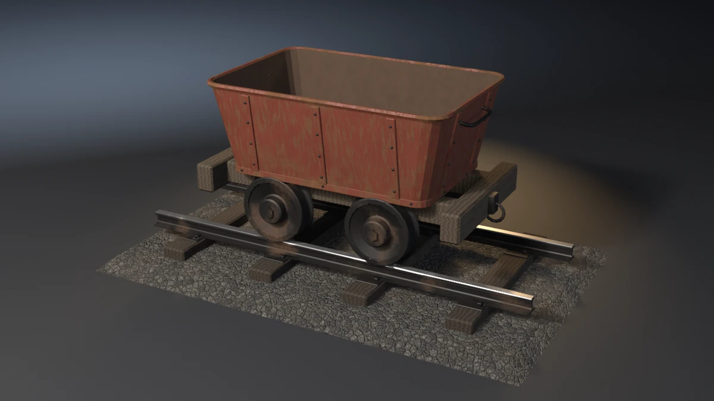

# mine-cart



A narrow-gauge mine cart on a rail segment: a riveted steel tub with a
rolled lip, a base strap, ten stiffener ribs and an iron grab bar on each
end, carried on two timber sills and two buffer beams with a coupling ring
at each end; four flanged wheels on two axles running in four iron axle
boxes; and the track it stands on, two 30 lb rails on tie plates, held by
dog spikes to four sleepers bedded in ballast. **A showcase piece, not an
example** — it witnesses no API contract. It asserts that generated
geometry meets declared asset budgets, recomputed from the finished mesh.

## What it composes

| Shipped content | Used for |
| --- | --- |
| `skills/mesh-editing-and-bmesh` | lathed wheels and rivets, swept rail sections, rolled lip, base strap, grab bars and coupling rings, chamfered boxes, all in one `bmesh`, chamfered with `bmesh.ops.bevel` |
| `skills/custom-properties` | face attributes read back by the audits (`Part`) and the shaders (`WoodTone`, `Grime`) |
| `skills/procedural-materials-and-shaders` | red-oxide paint with run-off rust and a dusty inside; mill-scaled iron with the railheads and treads polished where they run; creosoted sleepers and weathered oak; two sizes of crushed-stone ballast |
| `skills/bake-high-to-low` | Cycles tangent-space normal bake, the 48-segment wheels onto the 24-segment low |
| `skills/engine-export-presets` | Unity glTF (`export_yup=True`) |
| `skills/depsgraph-and-evaluated-data` | evaluated triangle counts for the LOD ratios |
| `snippets/decimate_to_budget.py` | LOD1 / LOD2 COLLAPSE chain |
| `snippets/convex_hull_collider.py` | a hull per wheel, rail and sleeper, plus the ballast, tub and frame, merged into a compound |
| `snippets/lod_chain.py` | LOD naming and ratio pattern |
| `examples/mesh-hygiene-audit` | hygiene combinatorics (copied, not imported) |

## The budget that matters

A cart on rails has one job the mesh can fail without looking wrong: it
has to run on the track. A wheel hovering a few millimetres over its
railhead, an axle yawed a degree and a half, or a wheel set spread so its
flanges sit inside the railheads all fit the bounding box and pass every
hygiene check. The piece measures, off the finished mesh, per wheel:

- **Seat.** Every wheel is a lathe, so the mean of its vertices is its
  axle centre. Its tread is the set of vertices no farther than the tread
  radius from that centre (so not the flange) and over its own railhead.
  The tread's lowest point minus the rail top must lie in
  −1.5..+0.5 mm: resting, not floating, not sunk. Measured −0.50 mm on all
  four wheels. The wheels are revolved so a vertex, not a face, is the
  lowest point of the tread, so no wheel face lies in the railhead's plane.
- **Guide.** The flange (every vertex beyond the tread radius) must reach
  at least 12 mm below the rail top; measured 20.5 mm.
- **Clearance.** The flange's face toward the rail must clear the
  railhead's inner face by 3–10 mm; measured 6.00 mm on every wheel.
- **Square.** For each axle, the line through its two wheel centres must be
  within 0.10° of the rails' normal (measured with `atan2`; `acos` of a
  cosine this close to 1 reads float32 noise as 0.01°). Measured 0.0000°.
- **Real-world size.** Wheelbase 0.600 m, track gauge 0.600 m between the
  railheads' inner faces, rail height 79 mm (30 lb ASCE), wheel tread
  diameter 0.360 m, all measured off the mesh.

## Budgets

Declared in the script as named constants, recomputed from the generated
mesh.

| Axis | Declared | Measured (4.5.11 / 5.1.2 / 5.2.1) |
| --- | --- | --- |
| Base triangles | 11500–13200 | 12334 / 12334 / 12334 |
| LOD1 ratio | 0.32–0.62 | 0.4999 / 0.4999 / 0.4999 |
| LOD2 ratio | 0.10–0.35 | 0.2199 / 0.2199 / 0.2118 |
| Material slots | exactly 4, distinct | 4 / 4 / 4 |
| Steel / iron / timber / ballast faces | ≥ 700 / 4400 / 180 / 550 | 816 / 5104 / 208 / 622 on all three |
| UV bounds | inside 0..1 | (0.0005, 0.0005)–(0.9995, 0.9995) |
| UV AABB overlap | ≤ 1e-5 | 0.000000 |
| Outer AABB | 2.400 × 1.500 × 1.048 m ± 0.020 | 2.4000 × 1.5000 × 1.0481 on all three |
| Collider triangles | ≤ 1700 | 1532 (13 hulls) on all three |
| Normal bake | `{'FINISHED'}` with image data | `{'FINISHED'}`, `has_data=True` |
| glTF export | file written, non-empty | 990544 bytes on all three |

### Hygiene

| Axis | Declared | Measured (4.5.11 / 5.1.2 / 5.2.1) |
| --- | --- | --- |
| Loose verts / edges | 0 / 0 | 0 / 0 |
| Non-manifold edges | 0 | 0 |
| Zero-area faces | 0 | 0 |
| Doubles (1e-5 m) | 0 | 0 |
| N-gons | 0 | 0 |
| Coplanar cross-shell pairs | 0 | 0 |
| Grounded zmin | \|zmin\| ≤ 1e-4 | 0.00000 |

### Joint fit / seat

| Axis | Declared | Measured (4.5.11 / 5.1.2 / 5.2.1) |
| --- | --- | --- |
| Parts | 4 wheels, 2 rails, 2 axles | as stated |
| Wheel seat (tread low point − rail top) | −1.5..+0.5 mm, every wheel | −0.50 mm, every wheel |
| Flange depth below the rail top | ≥ 12 mm | 20.50 mm |
| Flange clearance to the railhead | 3–10 mm, every wheel | 6.00 mm, every wheel |

### Form

| Axis | Declared | Measured (4.5.11 / 5.1.2 / 5.2.1) |
| --- | --- | --- |
| Axles square to the rails | ≤ 0.10° | 0.0000° |
| Wheelbase | 0.600 ± 0.003 m | 0.60000 |
| Track gauge | 0.600 ± 0.001 m | 0.60000 |
| Rail height | 0.079 ± 0.001 m | 0.07900 |
| Wheel tread diameter | 0.360 ± 0.004 m | 0.36000 |

Real-world size: a 600 mm (24 in) gauge tub on 30 lb rail, the common
narrow-gauge mining track. The tub is 1.30 × 0.85 m at the lip and its top
stands 1.05 m above the ground, 0.84 m above the rail, inside the range
IS 8066 gives for 600 mm gauge mine cars; 0.36 m wheels on a 0.60 m
wheelbase.

## Construction

- **Track.** Each rail is the 18-point ASCE section (foot, sloped foot
  top, web, head with chamfered corners) swept 2.2 m along X, its foot
  3 mm into the tie plates. Plates sit 4 mm into the sleepers. Two dog
  spikes per plate, staggered along the rail: a square shank driven into
  the sleeper and a head that bites the rail foot's sloped top, so no head
  shares a plane with the rail. Sleepers are chamfered boxes bedded 30 mm
  into the ballast; the ballast is a 28 × 16 grid jittered ±6 mm by a fixed
  hash, over sloped shoulders and a flat foot at z = 0.
- **Wheels.** A 23-point closed half-section revolved about the axle: bore,
  hub, dished web, rim, a 20 mm flange on the gauge side with a fillet
  into the tread, and a tread ring over the rail centreline. A hexagon
  nut closes the hub. The axles end 63 mm inside the hubs; their caps are
  phased half a step so no axle face lies flat.
- **Frame.** Two oak sills and two buffer beams (chamfered), four iron
  axle boxes bitten 10 mm into the sills, a drawbar plate and a hanging
  ring at each end.
- **Tub.** A rounded-rectangle shell, 10 mm skin, leaning out from
  1.10 × 0.70 m at the floor to 1.30 × 0.85 m at the rim, its floor 10 mm
  into the sills. The lip is a 14 mm tube swept round the rim and rolled
  to the outside; the base strap a chamfered band round the foot of the
  walls. Ten ribs follow the leaning walls, 3 mm into them, four rivets
  each; more rivets run along the strap. Each end carries a round grab bar.
- **Collider.** A hull per wheel, rail and sleeper, the ballast's
  shoulders (its jittered top only adds faces), the tub with its lip and
  ribs, and the frame. Plates, spikes, rivets and rings are left out:
  millimetres of relief on surfaces a hull already covers.

## Findings the budgets forced

- **A float32 cosine.** The first squareness measure, `acos(d.y / |d|)`,
  read 0.0102° on a mesh whose wheel centres were exact: float32 vertex
  noise near a cosine of 1. It is now `atan2` of the off-axis and on-axis
  components, and reads 0.0000°.
- **The flange is not the tread.** Measured as "the lowest wheel vertex
  over the railhead", `--wide-gauge` failed the seat (the flange is lower
  than the tread and had moved over the head) and the wheel size, never
  reaching the clearance it was built to break. The tread is now the
  vertices within the tread radius, so the falsifier lands on 20.

## Conventions walked

| Convention | Applies | How |
| --- | --- | --- |
| Deterministic, budgets declared, assertions recompute | yes | no RNG (the ballast jitter is a fixed hash); every value above is read off the mesh |
| Falsifier fails the budget it targets | yes | table below, proven on 4.5.11, 5.1.2 and 5.2.1 |
| Hygiene incl. cross-shell coplanar | yes | exit 15 |
| Plumb and real-world size | yes | axle squareness, wheelbase, gauge, rail height, wheel size; exit 19 |
| A member is tenoned into its seat | yes | rails into plates into sleepers into ballast, spikes into sleepers, boxes into sills, tub into sills, axles into hubs, ribs into walls |
| Seat conformance (a band: minimum so it cannot float) | yes | every wheel's tread on its railhead (`--float-wheel`) |
| Mirrored assemblies | yes | wheel sets measured pairwise: squareness and clearance per wheel |
| Material face floors | yes | steel 700, iron 4400, timber 180, ballast 550 |
| One substance, one slot | yes | painted steel, iron, timber, ballast |
| Shading is part of the model | yes | wheels, axles, rivets, grab bars and rings smooth, every edge over 35° hard; boxes faceted |
| Edge treatment | yes | sleepers, plates, spike heads, sills, beams, boxes, ribs chamfered; the right-angle edge fraction is 0.083 |
| Sort bmesh operator inputs | yes | the bevel's edge list is sorted by index |
| The bake cage is narrower than the nearest neighbour | yes | `CAGE_EXTRUSION` 0.01 m |
| Level on the stage; stage 60 m | yes | turned about Z only; 60 m floor and wall |
| Keep a falsifier's envelope still | yes | no falsifier moves the AABB |

## Falsifiers

Each breaks one pipeline stage so a **named** budget fails. All six were
run on Blender 4.5.11, 5.1.2 and 5.2.1 and exited the declared code.

| Flag | Target budget | Breaks | Exit |
| --- | --- | --- | --- |
| `--skip-decimate` | LOD1 ratio | drops the DECIMATE modifiers, LOD1 ratio goes to 1.0000 | 9 |
| `--stray-vert` | mesh hygiene | adds one loose vertex inside the tub | 15 |
| `--lift-z` | grounded zmin | lifts the whole mesh 50 mm | 16 |
| `--float-wheel` | wheel seat | lifts one wheel 6 mm; its tread is 5.50 mm over the rail top | 18 |
| `--skew-axle` | axle squareness | yaws one axle and its wheels 1.5°; measured 1.500° | 19 |
| `--wide-gauge` | flange clearance | sets every wheel 12 mm outboard; the flanges sit 6.00 mm inside the railheads | 20 |

## Exit codes

File-local and sequential. `9` is a valid check code. `1` is the FATAL
wrapper — a crash, never a named check.

| Code | Meaning |
| --- | --- |
| 0 | Success |
| 1 | Uncaught exception (FATAL wrapper) |
| 2 | argparse / usage |
| 3 | Mesh did not build, has no UV layer, or a part count is wrong |
| 4 | Base triangle count outside band |
| 5 | Material slots, or a material's face floor |
| 6 | UVs outside 0..1 |
| 7 | UV AABB overlap above tolerance |
| 8 | Outer AABB off declared size |
| 9 | LOD1 or LOD2 ratio outside band (`--skip-decimate`) |
| 10 | Framing gate (`examples/gallery_framing.py`, render path only) |
| 11 | Collider triangles above ceiling |
| 12 | Normal bake failed or produced no image data |
| 13 | glTF export missing or empty |
| 14 | `--output` produced no file |
| 15 | Mesh hygiene (`--stray-vert`) |
| 16 | Grounded zmin (`--lift-z`) |
| 18 | Wheel seat or flange depth (`--float-wheel`) |
| 19 | Axle squareness, wheelbase, gauge, rail height or wheel size (`--skew-axle`) |
| 20 | Flange clearance to the railhead (`--wide-gauge`) |
| 21 | Asset-quality floors (`examples/gallery_asset_quality.py`, render path only; its 11 is this piece's collider code) |

## Run it

```bash
# Budget check, no render. A few seconds warm.
blender --background --python mine_cart.py --

# Falsifier: one wheel hovers 6 mm over its railhead. Must exit 18.
blender --background --python mine_cart.py -- --float-wheel

# Falsifier: every wheel 12 mm outboard. Must exit 20.
blender --background --python mine_cart.py -- --wide-gauge

# Render the gallery still (EEVEE).
blender --background --python mine_cart.py -- --output mine-cart.webp
```

Smoke runs the check-only path. It does not pass `--output` or any falsifier.

## Cross-version measurements

| Value | 4.5.11 | 5.1.2 | 5.2.1 |
| --- | --- | --- | --- |
| Base triangles | 12334 | 12334 | 12334 |
| LOD1 / LOD2 tris | 6166 / 2712 | 6166 / 2712 | 6166 / 2612 |
| Face counts (steel / iron / timber / ballast) | 816 / 5104 / 208 / 622 | same | same |
| Outer AABB | 2.4000 × 1.5000 × 1.0481 | same | same |
| Collider tris | 1532 | 1532 | 1532 |
| Wheel seat / clearance | −0.50 / 6.00 mm | same | same |
| glTF bytes | 990544 | 990544 | 990544 |

DECIMATE COLLAPSE gives LOD2 2612 triangles on 5.2.1 and 2712 on 4.5.11
and 5.1.2; the ratio band holds both.
