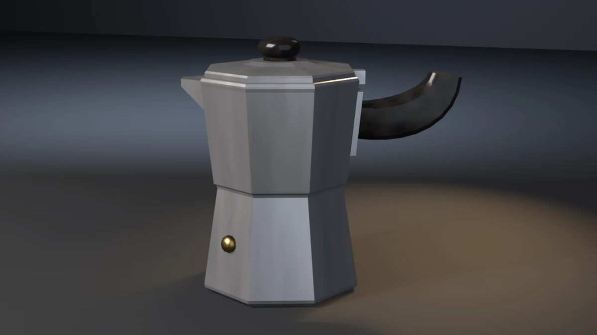

# moka-pot



A three-cup stovetop moka pot: a tapered eight-flat boiler, a collector
that flares back out from the waist, a faceted lid under a bakelite
knob, a pinched pour spout, a bakelite handle on a riveted bracket, and a
brass safety valve. **A showcase piece, not an example** — it witnesses
no API contract. It asserts that generated geometry meets declared asset
budgets, recomputed from the finished mesh.

## What it composes

| Shipped content | Used for |
| --- | --- |
| `skills/mesh-editing-and-bmesh` | eight-flat lathes, a swept handle, wedges and plates, all in one `bmesh`; bevel pinned to a material slot |
| `skills/procedural-materials-and-shaders` | brushed aluminium, glossy bakelite, brass |
| `skills/bake-high-to-low` | Cycles tangent-space normal bake, high onto low |
| `skills/engine-export-presets` | Unity glTF (`export_yup=True`) |
| `skills/depsgraph-and-evaluated-data` | evaluated triangle counts for the LOD ratios |
| `snippets/decimate_to_budget.py` | LOD1 / LOD2 COLLAPSE chain |
| `snippets/convex_hull_collider.py` | one hull for the body, spout and lid, one for the handle |
| `snippets/lod_chain.py` | LOD naming and ratio pattern |
| `examples/mesh-hygiene-audit` | hygiene combinatorics (copied, not imported) |

## The budget that matters

A moka pot is an octagon all the way up. Eight flats, every ring of the
boiler and of the collector the same size on all eight sides, every ring
centred on one vertical axis. Two ways to break that leave every other
budget green:

- one flat a couple of millimetres proud of its seven neighbours;
- the whole pot sheared a few millimetres sideways by the time it reaches
  the lid.

Neither moves the bounding box (the handle and spout set it), the
triangle band, the hygiene audit or a joint. So the piece measures both
off the generated vertices:

- **Eight-fold spread.** Each shell's vertices are bucketed by ring
  height. At each ring the outermost radius per 45° sector is taken about
  *that ring's own centroid* and the spread between sectors asserted
  ≤ 0.2 mm. Measured about the ring's own centroid so a sheared pot
  does not trip it: that is the plumb budget's job.
- **Plumb.** The XY centroid of the boiler's foot slab is compared with
  the collector's top slab, ≤ 0.8 mm.
- **Real-world size.** Across the foot (flats), across the collector
  (flats) and total height, each against the three-cup figures below,
  ± 3 mm. The outer AABB cannot do this: the handle and spout set it.

`--odd-facet` pushes one flat of the collector's mid ring 2.5 mm out and
exits 19 on the spread (1.97 mm measured, with the AABB unchanged).
`--lean-pot` shears the pot 4 mm over its height and exits 19 on the
plumb line (3.41 mm measured, spread untouched).

## Budgets

Declared in the script as named constants, recomputed from the generated
mesh. Measured values are from Blender 5.2.1; **4.5 and 5.1 were not
available locally and are unverified** (CI runs the check-only path on
both).

| Budget | Band | Measured |
| --- | --- | --- |
| Base triangles | 950–1250 | 1092 |
| LOD1 ratio | 0.32–0.62 | 0.5000 |
| LOD2 ratio | 0.10–0.35 | 0.2179 |
| Material slots | exactly 3, distinct | 3 |
| Aluminium / bakelite / brass faces | ≥ 160 / 210 / 150 | 190 / 244 / 180 |
| UV bounds | inside 0..1 | (0.0023, 0.0023)–(0.9977, 0.9977) |
| UV AABB overlap | ≤ 1e-5 | 0.000000 |
| Outer AABB | 0.1665 × 0.0928 × 0.1522 m ± 0.006 | 0.1665 × 0.0928 × 0.1522 |
| Collider triangles | ≤ 200 | 170 (two hulls) |
| Normal bake | `{'FINISHED'}` with image data | `{'FINISHED'}`, `has_data=True` |
| glTF export | file written, non-empty | ~72 kB |
| Hygiene | all zero | loose 0/0, non-manifold 0, zero-area 0, doubles 0, n-gons 0, coplanar cross-shell pairs 0 |
| Grounded AABB | \|zmin\| ≤ 1e-4, boiler zmin ≤ 1e-4 | 0.00000 |
| Shells | exactly 11, none unclassified | 11 |
| Collector seat on the boiler | 2.5–4.5 mm | 3.50 mm |
| Handle bite into the bracket | 1.0–3.0 mm, per root vertex | 1.71–1.80 mm |
| Knob bite into the lid | 1.0–3.0 mm | 2.00 mm |
| Lid seat on the collector | 1.0–3.0 mm | 1.50 mm |
| Spout bite and reach | base 0.9–3.0 mm into the wall; tip 10–15 mm beyond it | 1.50 mm; 12.50 mm |
| Bracket bite | 0.9–3.0 mm into the wall | 1.50 mm |
| Hinge bite | 1.5–5.0 mm into the collector | 3.10 mm |
| Fasteners (valve, two rivets) | bite 0.8–2.5 mm, proud ≥ 1.2 mm | valve 1.60 / 4.60; rivets 1.20 / 1.80 |
| Real size: foot, collector, height | 92.8 / 91.2 / 152.2 mm ± 3 | 92.8 / 91.2 / 152.2 |
| Plumb | ≤ 0.8 mm | 0.000 mm |
| Eight-fold spread | ≤ 0.2 mm | 0.000 mm |

Real-world size: 92.8 mm across the foot flats, 91.2 mm across the
collector, 152.2 mm to the top of the knob, about 166 mm from the spout
tip to the handle end. It is a three-cup Bialetti-pattern pot.

## Construction

- **Body.** Boiler, collector and lid are eight-flat lathes from
  `(apothem, z)` profiles: the distance from the axis to the middle of a
  flat, which is what a ruler across the pot reads. Vertices every 45°
  offset by 22.5° put a flat square on each axis, so the handle bracket
  and spout each sit on a flat. Every edge over 30° is chamfered 0.7 mm,
  which includes the 45° ridge between flats, so the ridges catch light.
- **Joints are tenoned, not stood.** The collector's floor sits 3.5 mm
  below the boiler's top plane (the boiler's neck runs up inside it); the
  lid sits 1.5 mm below the collector's top plane; the knob is driven
  2 mm into the lid. Nothing lands on a shared plane.
- **Spout.** A wedge on the −x flat, 28 mm wide at the wall and 10 mm at
  the tip, its base vertices computed per corner from the collector's own
  wall function and driven 1.5 mm in.
- **Bracket.** A plate on the +x flat built the same way, so it follows
  the wall's 5.6° rake, with two brass rivets above and below the handle.
  The handle's root is driven 2 mm into it.
- **Handle.** A swept bakelite blade: ten rings of a twelve-point rounded
  rectangle along a cubic Bézier in the XZ plane, thicker mid-span than
  at either end, smooth-shaded with end caps hard and chamfered 1.2 mm.
- **Fasteners.** Rivets and the valve are small turned heads aimed down
  the host's normal (the bracket's rake, the boiler's taper). Their
  seat is read back as height above the host's own nearest face.
- **Shading.** Aluminium is flat-shaded, because the faceting is the
  object. Bakelite and brass are turned or swept and smooth-shaded with
  every edge over 35° hard.

## Findings the budgets forced

- **Spout floated the wrong way.** `--float-spout` first shifted the
  whole spout in +x, which is *into* the pot: the bite read 5.5 mm and
  the failure was a sunk spout, not a floating one. It now lifts the base
  outward by 4 mm and leaves the tip where it was, so only the bite fails
  and the reach stays in its band.
- **Handle bite measured the chamfer, not the root.** The root's rays
  were cast from every vertex within 1.5 mm of the root plane, which
  includes the chamfer ring 1.2 mm out; that ring is seated only 0.8 mm
  and tripped the band on a correct model. The root cap ring alone is
  now measured.
- **Collider hit its ceiling by 6 triangles** when the spout was widened
  for the silhouette; the hull's planar-dissolve angle went from 6° to 9°
  rather than the ceiling being raised (206 → 170 triangles).

## Conventions walked

Every convention in `showcase/README.md`, and whether it applies here.

| Convention | Applies | How |
| --- | --- | --- |
| Deterministic, budgets declared, assertions recompute | yes | no RNG; every value above is read off the mesh |
| Falsifier fails the budget it targets | yes | table below |
| Hygiene incl. cross-shell coplanar | yes | exit 15; `--flush-joint` is the coplanar falsifier |
| Named supports | no | one support (the boiler's foot) |
| Joint-fit budgets | yes | shell count, collector seat, handle bite (exit 17) |
| Fasteners aimed down the host normal | yes | rivets and valve (`--float-valve`, exit 18) |
| Seat conformance | yes | knob, lid, spout, bracket, hinge, fasteners (exit 18) |
| A member is tenoned into its seat, never stood on it | yes | collector, lid, knob, handle |
| Plumb and real-world size | yes | exit 19; plumb, three sizes in metres |
| Mirrored assemblies | no | the two rivets are not a paired budget |
| Even shaping terms | n/a | no shaping function; profiles are piecewise linear |
| Edge treatment: no right angles | yes | 0.7 mm chamfer on every aluminium edge over 30°; the asset-quality right-angle fraction is 0.059 |
| One substance, one slot | yes | aluminium, bakelite, brass |
| Shading is part of the model | yes | see Construction |
| Chamfer n-gon caps, then triangulate | yes | every cap |
| Sort bmesh operator inputs | yes | bevel edges sorted by index |
| Level on the stage; stage scaled | yes | turned about Z only; the 60 m stage and the rig are scaled by 0.2 with light power by 0.04 |
| Keep a falsifier's envelope still | yes | every falsifier moves less than `BBOX_TOL` (6 mm) |
| Rope, masonry, roofs, hung rings, scatter | no | none present |

## Falsifiers

Each breaks one pipeline stage so a **named** budget fails. All ten were
run on Blender 5.2.1 and exited the documented code; 4.5.11 and 5.1.2
were not available locally and are unverified.

| Flag | Target budget | Breaks | Exit |
| --- | --- | --- | --- |
| `--skip-decimate` | LOD1 ratio | drops the DECIMATE modifiers, LOD1 ratio goes to 1.0000 | 9 |
| `--stray-vert` | mesh hygiene | adds one loose vertex on the axis | 15 |
| `--flush-joint` | coplanar cross-shell pairs | drops the boiler's top plane onto the collector's floor plane; 9 pairs | 15 |
| `--lift-z` | grounded zmin | lifts the whole mesh 20 mm | 16 |
| `--short-handle` | handle bite | starts the handle root 3 mm outside the bracket; −3.1 mm | 17 |
| `--float-knob` | knob bite | lifts the knob 4 mm; −2.0 mm | 18 |
| `--float-spout` | spout bite | lifts the spout's base 4 mm off the wall, tip fixed; −2.5 mm | 18 |
| `--float-valve` | fastener seat | lifts the valve 3 mm off its flat; −1.4 mm | 18 |
| `--lean-pot` | plumb | shears the pot 4 mm over its height; 3.41 mm drift | 19 |
| `--odd-facet` | eight-fold spread | pushes one mid-ring flat 2.5 mm out; 1.97 mm spread | 19 |

## Exit codes

File-local and sequential. `9` is a valid check code. `1` is the FATAL
wrapper — a crash, never a named check. `10` is the framing gate and `21`
the asset-quality gate (the helper's own code, `11`, is spent here on the
collider ceiling), both on the render path only.

| Code | Meaning |
| --- | --- |
| 0 | Success |
| 1 | Uncaught exception (FATAL wrapper) |
| 2 | argparse / usage |
| 3 | Mesh did not build, or has no UV layer |
| 4 | Base triangle count outside band |
| 5 | Material slots, or a material's face floor |
| 6 | UVs outside 0..1 |
| 7 | UV AABB overlap above tolerance |
| 8 | Outer AABB off declared size |
| 9 | LOD1 or LOD2 ratio outside band (`--skip-decimate`) |
| 10 | Framing gate (`examples/gallery_framing.py`, render path only) |
| 11 | Collider triangles above ceiling |
| 12 | Normal bake failed or produced no image data |
| 13 | glTF export missing or empty |
| 14 | `--output` produced no file |
| 15 | Mesh hygiene (`--stray-vert`, `--flush-joint`) |
| 16 | Grounded zmin (`--lift-z`) |
| 17 | Shell count, collector seat, or handle bite (`--short-handle`) |
| 18 | Knob, lid, spout, bracket, hinge or fastener seat (`--float-knob`, `--float-spout`, `--float-valve`) |
| 19 | Real-world size, plumb, or eight-fold spread (`--lean-pot`, `--odd-facet`) |
| 21 | Asset-quality gate (`examples/gallery_asset_quality.py`, render path only) |

## Run it

```bash
# Budget check, no render. ~1 s on a warm 5.2.
blender --background --python moka_pot.py --

# Falsifier: the pot leans at the lid. Must exit 19.
blender --background --python moka_pot.py -- --lean-pot

# Falsifier: one flat out of line with the other seven. Must exit 19.
blender --background --python moka_pot.py -- --odd-facet

# Render the gallery still (EEVEE; --engine cycles on a GPU-less host).
blender --background --python moka_pot.py -- --output moka_pot.webp
```

Smoke runs the check-only path. It does not pass `--output` or any falsifier.

## Cross-version measurements

Measured on 5.2.1 only. 4.5 and 5.1 are unverified locally.

| Value | 5.2.1 |
| --- | --- |
| Base triangles | 1092 |
| LOD1 / LOD2 tris | 546 / 238 |
| Face counts (aluminium / bakelite / brass) | 190 / 244 / 180 |
| Outer AABB | 0.1665 × 0.0928 × 0.1522 |
| Collider tris | 170 |
| glTF bytes | 72148 |
