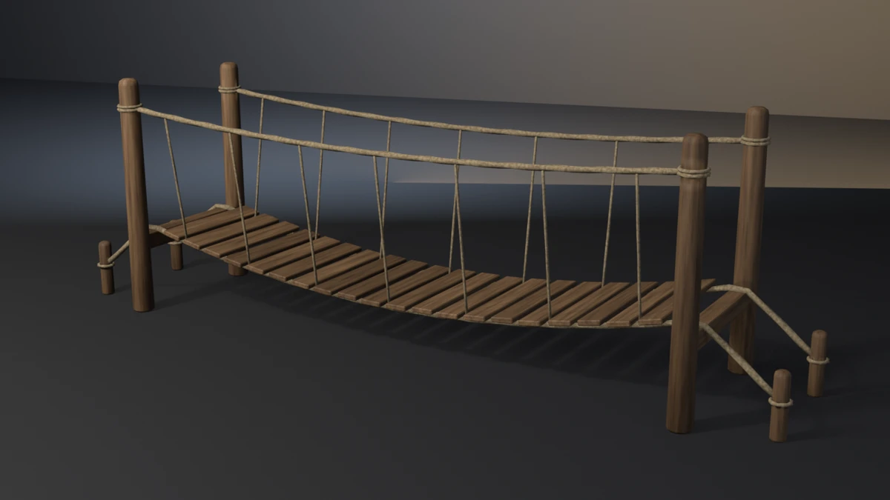

# rope-bridge



A rope footbridge — two pairs of log posts, a squared sill through-tenoned
across each end, twenty planks laid on two foot ropes that hang between the
sills, two hand ropes lashed to the posts, suspenders tying hand rope to foot
rope, and the foot ropes run back over the sills to ground stakes.
**A showcase piece, not an example** — it witnesses no API contract. It
asserts that generated geometry meets declared asset budgets, recomputed
from the finished mesh.

## What it composes

| Shipped content | Used for |
| --- | --- |
| `skills/mesh-editing-and-bmesh` | lathed logs, laid-rope sweeps, chamfered boards, UVs in one `bmesh` |
| `skills/procedural-materials-and-shaders` | timber grain along each member (`GrainDir`), per-member tone (`PlankTone`), hemp with a fibre bump |
| `skills/bake-high-to-low` | Cycles tangent-space normal bake, high onto low |
| `skills/engine-export-presets` | Unity glTF (`export_yup=True`) |
| `skills/depsgraph-and-evaluated-data` | evaluated triangle counts for the LOD ratios |
| `snippets/decimate_to_budget.py` | LOD1 / LOD2 COLLAPSE chain |
| `snippets/lod_chain.py` | LOD naming and ratio pattern |
| `examples/mesh-hygiene-audit` | hygiene combinatorics (copied, not imported) |

`snippets/convex_hull_collider.py` is deliberately **not** used; see
*Collider* below.

## The budget that matters

A rope bridge can fail invisibly. A deck of planks laid on two straight ramps
that meet at midspan has the same ends, the same sag, the same planks and the
same bounding box as one that hangs; only the shape is wrong. A uniformly
loaded cable hangs as a **parabola**, so the piece fits a least-squares
parabola to the plank top-face centres read off the finished mesh — not to
the function the generator used — and asserts every plank lands within
6 mm of it, with the fitted sag within 15 mm of the declared 0.22 m.

`--vee-deck` is the falsifier built for exactly this. It keeps the sill
heights, the sag, the plank count, the pitch, every seat and the envelope,
and swaps the parabola for two straight ramps. Its fitted sag is 0.215 m —
inside the sag tolerance — and every other budget passes. Only the residual
sees it: 32.5 mm against a 6 mm band.

The measured residual on the true deck is 2.97 mm, not zero, and that is the
model rather than noise: each plank's underside is set from the foot rope's
own reach at its station (below), and the three-strand lay turns under the
deck, so the planks ride a few millimetres up and down on the strands.

## Budgets

Declared in the script as named constants, recomputed from the generated
mesh. Measured values are from Blender 5.2.1; every one is byte-identical on
4.5.11 and 5.1.2.

| Budget | Band | Measured |
| --- | --- | --- |
| Base triangles | 8300–9200 | 8768 |
| LOD1 ratio | 0.32–0.62 | 0.5000 |
| LOD2 ratio | 0.10–0.35 | 0.2199 |
| Material slots | exactly 2, distinct | 2 |
| Timber faces | ≥ 1100 | 1356 |
| Rope faces | ≥ 2800 | 3348 |
| UV bounds | inside 0..1 | (0.0016, 0.0016)–(0.9984, 0.9984) |
| UV AABB overlap | ≤ 1e-5 | 0.000000 |
| Baked texels per UV island | ≥ 12 | 18.84 (610 islands, 512 px) |
| Outer AABB | 4.619 × 1.073 × 1.480 m ± 0.020 | 4.6185 × 1.0733 × 1.4800 |
| Collider triangles | ≤ 400 | 360 |
| Normal bake | `{'FINISHED'}` with image data | `{'FINISHED'}`, `has_data=True` |
| glTF export | file written, non-empty | ~300 kB |
| Hygiene | all zero | loose 0/0, non-manifold 0, zero-area 0, doubles 0, n-gons 0, coplanar cross-shell pairs 0 |
| Grounded AABB | \|zmin\| ≤ 1e-4 | 0.00000 |
| Named supports | 4 posts + 4 stakes, each zmin ≤ 1e-3 | 8 at 0.00000 |
| Hand-rope ends inside their posts | deepest vertex ≥ 0.030 m | 0.05669 |
| Foot-rope ends inside their stakes | deepest vertex ≥ 0.020 m | 0.03347 |
| Sill tenons inside their posts | deepest vertex ≥ 0.010 m | 0.01980 |
| Plank seat on each foot rope | 20 planks, bite 0.002–0.008 m | 0.00400 on all 40 |
| Lashing hoop | 12 turns, bite 0.0005–0.005 m | 0.00238–0.00246 |
| One connected assembly | 1 component | 1 (60 shells) |
| Plumb (posts and stakes) | bottom-to-top slab centroid ≤ 0.004 m | 0.00000 |
| Deck parabola | every plank top within 0.006 m; sag 0.22 ± 0.015 m | 0.00297; 0.22037 |
| Plank pitch | every gap within 0.003 m of the mean | 0.00008 (mean 0.1689) |
| Rail height at midspan | 0.80–1.00 m above the deck | 0.86521 |
| Right-angle edges | 0 | 0 |

Real-world size: a 3.6 m span between post centres carrying a 3.2 m walkable
deck of 0.80 m planks, hand ropes 0.87 m over the deck at midspan, posts
1.48 m tall — a garden or gorge footbridge module, 4.6 m overall with its
stakes.

## Construction

- **Laid rope.** Every rope is a three-lobed section turned one vertex step
  per ring, so each lobe winds as a strand. The main ropes use 9 vertices;
  suspenders and lashings use 6. The section frame is fixed to each path's
  plane: +Y for the ropes that run the span, +X for the suspenders, +Z for
  the lashings.
- **Rope ends close in a blunt cone.** A fan cap maps to overlapping UV
  triangles. A cone half the radius long maps as one more row of the rope's
  strip island, so every rope is a single UV island with no overlap.
- **The foot rope wraps the sill with one mitred ring.** The bend radius
  over the arris is smaller than the rope. With a ring every few degrees of
  arc the section folded through itself and left six right-angle creases,
  which the edge budget found.
- **Planks are seated from the host.** Each plank's underside is the foot
  rope's own reach along the plank normal at its station, less
  `PLANK_BITE`. The bite is therefore exact (4.00 mm on all 40 seats)
  whatever the lay does under the plank.
- **Lashings are hooped.** Each turn's inner radius is the post's (or
  stake's) own radius at that height, taken from its lathe profile, less
  `LASH_BITE`. The two turns on each post are rotated half a vertex step
  against each other. Stacked identically, their outer faces shared planes
  and the coplanar budget counted 84 pairs.
- **Collider.** A single convex hull over a sagging deck is a lens whose top
  is the chord between the sills: a character would walk 0.22 m above the
  planks at midspan. The collider is a compound, one oriented box per plank,
  sill, post and stake (30 boxes, 360 triangles). Ropes are left out.

## Conventions walked

Every convention in `showcase/README.md`, and whether it applies here.

| Convention | Applies | How |
| --- | --- | --- |
| Deterministic, budgets declared, assertions recompute | yes | seed 31; every value above is read off the mesh |
| Falsifier fails the budget it targets | yes | table below, proven on all three binaries |
| Hygiene incl. cross-shell coplanar | yes | exit 15; KD-tree range query, cross-shell |
| Named supports | yes | 4 posts + 4 stakes (`--float-post`) |
| Joint-fit / a joint bites | yes | rope ends and sill tenons, deepest vertex by signed distance (`--short-rails`) |
| Diagonal from stations | yes | suspenders run from the foot-rope centre to the hand-rope centre at a plank gap |
| Even shaping terms / mirror symmetry | no | the laid rope is chiral: a right-hand lay mirrors to a left-hand one, so the body has no mirror partner by design |
| Wrappers follow the host's profile | yes | lashings take the lathe profile's radius at their height |
| Seat conformance (banded) | yes | plank seats and lashing hoops, both banded (`--float-planks`, `--loose-lashings`) |
| Plumb and real-world size | yes | posts and stakes plumb (`--lean-post`); rail height (`--slack-rails`) |
| Band hooped, never flush | yes | lashings bite 2.5 mm |
| Member tenoned into its seat | yes | sills end at the post centres |
| Segment counts are a silhouette budget | yes | 16-segment posts, 12-segment stakes, smooth-shaded |
| Material face floors | yes | timber ≥ 1100, rope ≥ 2800 |
| Shading is part of the model | yes | posts, stakes and ropes smooth (round, organic); planks and sills flat (sawn) |
| One substance, one slot | yes | timber (posts, sills, planks, stakes), rope |
| Edge treatment: no right angles | yes | exit 20 (`--sharp-plank`) |
| Sort bmesh operator inputs | yes | bevel edges sorted by index |
| Variation into surface, never function | yes | plank length, tone and post wobble vary; plank pitch is asserted (`--drift-planks`) |
| A platform bears on something | yes | every plank seats on both foot ropes, counted |
| One connected assembly | yes | exit 18 (`--float-suspenders`) |
| Bake texels per UV cell | yes | exit 21 (`--low-bake`) |
| Bake cage narrower than the nearest neighbour | yes | `CAGE_EXTRUSION` 0.01 m |
| Rope is laid, not piped | yes | above |
| Identical boards read as CG | yes | `PlankTone` and `GrainDir` per shell |
| Level on the stage; stage 60 m | yes | turned about Z only; 60 m floor and wall |
| Keep a falsifier's envelope still | yes | worst deltas: `--float-post` +12 mm Z, `--loose-lashings` +13 mm X/Y, against 20 mm |
| Masonry, vessels, scatter, fixtures, roofs, forgings, rings, iron, paint | no | the piece has no stone, vessel, scatter, plate, roof, forging, ring hardware or paint |

## Falsifiers

Each breaks one pipeline stage so a **named** budget fails. All fourteen were
run on 4.5.11, 5.1.2 and 5.2.1 and exited the same declared code on all
three.

| Flag | Target budget | Breaks | Exit |
| --- | --- | --- | --- |
| `--skip-decimate` | LOD1 ratio | drops the DECIMATE modifiers, LOD1 ratio goes to 1.0000 | 9 |
| `--stray-vert` | mesh hygiene | adds one loose vertex above the deck, inside the envelope | 15 |
| `--lift-z` | grounded zmin | lifts the whole mesh 50 mm | 16 |
| `--float-post` | named supports | floats one post 12 mm; the others still ground the AABB | 16 |
| `--short-rails` | joint bite | stops each hand rope 20 mm short of its post; deepest end vertex −19.3 mm | 17 |
| `--float-planks` | plank seat | lifts every plank 7 mm off the ropes; bite −3.0 mm | 18 |
| `--loose-lashings` | lashing hoop | sizes every lashing 6.5 mm wider; bite −4.0 mm | 18 |
| `--float-suspenders` | one connected assembly | stops both ends of every suspender 30 mm short; 15 components | 18 |
| `--lean-post` | plumb | leans one post 20 mm at the top, lashings and all; 19.4 mm off plumb | 19 |
| `--vee-deck` | deck parabola | two straight ramps with the same ends and sag; 32.5 mm off the fit | 19 |
| `--drift-planks` | plank pitch | shifts alternate planks ±15 mm along the rope; 31.7 mm off the mean gap | 19 |
| `--slack-rails` | rail height | hangs the hand ropes 0.40 m instead of 0.10 m; rail 0.565 m | 19 |
| `--sharp-plank` | edge treatment | leaves the middle plank unchamfered; 12 right-angle edges | 20 |
| `--low-bake` | baked texels per UV island | bakes at 256 px; 9.42 texels | 21 |

## Exit codes

File-local and sequential. `9` is a valid check code. `1` is the FATAL
wrapper — a crash, never a named check.

| Code | Meaning |
| --- | --- |
| 0 | Success |
| 1 | Uncaught exception (FATAL wrapper) |
| 2 | argparse / usage |
| 3 | Mesh did not build, or has no UV layer |
| 4 | Base triangle count outside band |
| 5 | Material slots, or a material's face floor |
| 6 | UVs outside 0..1 |
| 7 | UV AABB overlap above tolerance |
| 8 | Outer AABB off declared size |
| 9 | LOD1 or LOD2 ratio outside band (`--skip-decimate`) |
| 10 | Framing gate (`examples/gallery_framing.py`, render path only) |
| 11 | Collider triangles above ceiling |
| 12 | Normal bake failed or produced no image data |
| 13 | glTF export missing or empty |
| 14 | `--output` produced no file |
| 15 | Mesh hygiene (`--stray-vert`) |
| 16 | Grounded zmin, or a named support floating (`--lift-z`, `--float-post`) |
| 17 | A rope end or sill tenon not biting its host (`--short-rails`) |
| 18 | Plank seat, lashing hoop, or the contact graph (`--float-planks`, `--loose-lashings`, `--float-suspenders`) |
| 19 | Plumb, deck parabola, plank pitch or rail height (`--lean-post`, `--vee-deck`, `--drift-planks`, `--slack-rails`) |
| 20 | Right-angle edges (`--sharp-plank`) |
| 21 | Baked texels per UV island below floor (`--low-bake`) |

## Run it

```bash
# Budget check, no render. ~2.2 s on 4.5, ~2.0 s on 5.1, ~2.2 s on 5.2.
blender --background --python rope_bridge.py --

# Falsifier: the deck stops hanging as a parabola. Must exit 19.
blender --background --python rope_bridge.py -- --vee-deck

# Falsifier: every suspender stops short of both ropes. Must exit 18.
blender --background --python rope_bridge.py -- --float-suspenders

# Render the gallery still (EEVEE; --engine cycles on a GPU-less host).
blender --background --python rope_bridge.py -- --output bridge.webp
```

Smoke runs the check-only path. It does not pass `--output` or any falsifier.

## Cross-version measurements

| Value | 4.5.11 | 5.1.2 | 5.2.1 |
| --- | --- | --- | --- |
| Base triangles | 8768 | 8768 | 8768 |
| LOD1 tris / ratio | 4384 / 0.5000 | same | same |
| LOD2 tris / ratio | 1928 / 0.2199 | same | same |
| Face counts (timber / rope) | 1356 / 3348 | same | same |
| Outer AABB | 4.6185 × 1.0733 × 1.4800 | same | same |
| Collider tris | 360 | 360 | 360 |
| Deck fit residual / sag | 0.00297 / 0.22037 | same | same |
| glTF bytes | 300212 | 300212 | 300212 |
| Check wall-clock | ~2.2 s | ~2.0 s | ~2.2 s |

`DECIMATE COLLAPSE` is the usual cross-version suspect. Here it happens to
produce identical LOD counts on all three binaries; the gate is still a ratio
band, not an exact count.
