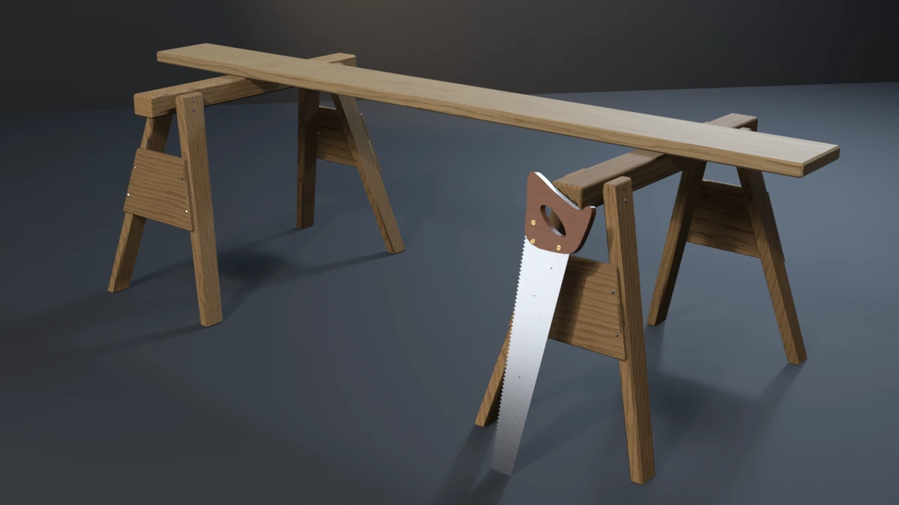

# sawhorse-plank



A pair of traditional pine sawhorses carrying an 8 ft fir plank, with a
western handsaw leaning against the near horse. Each horse is a beam on four legs splayed out to
the side and out to the end, each leg let 9 mm into the beam's side and
nailed through, with an apron across each end's leg pair. **A showcase
piece, not an example** — it witnesses no API contract. It asserts that
generated geometry meets declared asset budgets, recomputed from the
finished mesh.

## What it composes

| Shipped content | Used for |
| --- | --- |
| `skills/mesh-editing-and-bmesh` | sheared-prism legs, aprons cut to the legs' splay, a toothed blade with hand-built caps, a handle prism with a hand-hole (caps from `mathutils.geometry.tessellate_polygon`), split-nut halves, revolved nail heads, all in one `bmesh`, chamfered with `bmesh.ops.bevel` |
| `skills/custom-properties` | face attributes: `Part` (what each shell is), `GrainDir` (fibres along Z, X or Y) and `WoodTone` (one tone per member) |
| `skills/procedural-materials-and-shaders` | pine and fir with growth rings round each member's long axis, sampled at a per-piece offset through a noise warp: a broad pale earlywood ground and a thin dark latewood line, long fibre streaks for figure, roughness following both, knots in the plank; polished saw steel brushed along its length (stretched noise driving roughness) with rare rust; a coated apple handle; polished brass; the baked normal wired into every slot |
| `skills/bake-high-to-low` | Cycles tangent-space normal bake, a high with 12-segment nails, a 32-segment hand-hole and a three-round handle outline onto the low's 6, 16 and two rounds |
| `skills/engine-export-presets` | Unity glTF (`export_yup=True`) |
| `skills/depsgraph-and-evaluated-data` | evaluated triangle counts for the LOD ratios |
| `snippets/decimate_to_budget.py` | LOD1 / LOD2 COLLAPSE chain |
| `snippets/convex_hull_collider.py` | a hull per horse, one over the plank |
| `snippets/lod_chain.py` | LOD naming and ratio pattern |
| `examples/mesh-hygiene-audit` | hygiene combinatorics (copied, not imported) |

## The budget that matters

A plank across two sawhorses is a two-support span, and it fails
without looking wrong:

- **The plank must bear on both saddles.** Let one horse stand a few
  millimetres low and the plank still crosses its beam in every picture,
  but it rests on one saddle and rocks.
- **Every foot must stand on the floor.** One short leg and the horse
  rocks on its diagonal; the floor shadow hides it.
- **Every leg must be housed into its beam**, not glued to its side.
- **Every leg must be splayed at the same angle**, out to the side and
  out to the end. One leg off and the stance is lopsided.

The piece measures all four off the finished mesh. Every shell carries a
`Part` face attribute written at build time, so the audit finds the
beams, the eight legs and the plank without guessing from shape; each
leg is assigned to the nearer beam and to its quadrant.

- **Seat.** The plank's underside against each beam's top: −1.0 to
  −0.2 mm (it bears 0.5 mm into each saddle, so no two faces are one
  plane), and the plank must span the beam in plan. Measured −0.500 mm on
  both saddles.
- **Feet.** Each leg's lowest vertex within 0.1 mm of the floor.
  Measured 0.000 mm on all eight.
- **Housing.** How far each leg's inner face is let into its beam's side,
  read on every leg vertex at or above the beam's underside: 6–14 mm.
  Measured 8.58 mm on all eight.
- **Splay.** Each leg's axis is the line through the centroids of its two
  end faces (both cut level, as a horse's legs are cut to stand flat).
  Side splay and end splay are read off that line: 15° and 10° ± 0.15°.
  Measured 15.0000° and 10.0000° on all eight.

`--low-horse` builds the second horse 6 mm lower, legs and all, so every
foot is still on the floor and every leg still housed and splayed; only
the plank's seat on that saddle fails, +5.50 mm: exit 20.
`--uneven-splay` swings one leg's foot out to 19° from the same top, so
its housing and its foot are unchanged and only the splay fails: exit 19.
`--short-leg` stops one leg 8 mm short along its own axis, so its splay
holds: exit 18. `--loose-leg` slides one leg 14 mm out of its housing:
exit 17. None of them moves the AABB: the plank, the outer feet and the
saw's toe set it, and the saw is placed from the declared beam height, not
from the horse a falsifier lowers.

## Budgets

Declared in the script as named constants, recomputed from the generated
mesh. Measured values below are from Blender 5.2.1; every value is the
same on 4.5.11 and 5.1.2 (see the cross-version table).

| Budget | Band | Measured |
| --- | --- | --- |
| Base triangles | 3000–3500 | 3248 |
| LOD1 ratio | 0.32–0.62 | 0.5000 |
| LOD2 ratio | 0.10–0.35 | 0.2198 |
| Material slots | exactly 5, distinct | 5 |
| Pine / fir / steel / beech / brass faces | ≥ 330 / 24 / 1070 / 300 / 108 | 364 / 26 / 1190 / 340 / 120 |
| UV bounds | inside 0..1 | (0.0009, 0.0009)–(0.9991, 0.9991) |
| UV AABB overlap | ≤ 1e-5 | 0.000000 |
| Outer AABB | 2.440 × 1.135 × 0.7575 m ± 0.020 | 2.4400 × 1.1350 × 0.7575 |
| Collider triangles | ≤ 200 | 164 (three hulls) |
| Normal bake | `{'FINISHED'}` with image data | `{'FINISHED'}`, `has_data=True` |
| glTF export | file written, non-empty | ~270 kB |
| Hygiene | all zero | loose 0/0, non-manifold 0, zero-area 0, doubles 0, n-gons 0, coplanar cross-shell pairs 0 |
| Grounded AABB | \|zmin\| ≤ 1e-4 | 0.00000 |
| Parts | 2 beams, 8 legs, 4 aprons, 1 plank, 32 nails, 1 blade, 1 handle, 6 split-nut halves | as stated |
| Leg housing | 6–14 mm into the beam's side | 8.58 mm (all eight) |
| Feet on the floor | each within 0.1 mm | 0.000 mm (all eight) |
| Splay | 15° side, 10° end, ± 0.15° each leg | 15.0000°, 10.0000° (all eight) |
| Plank seat | −1.0 to −0.2 mm on each saddle, spanning it | −0.500 mm, −0.500 mm |
| Real-world size | span 1.600, beam 0.950, plank 2.440 × 0.235 × 0.038, each ± 0.003 | 1.6000, 0.9500, 2.4400 × 0.2350 × 0.0380 |

Real-world size: a traditional sawhorse stands about 30 in to the top of
its beam on a 40 in beam with a 21.5 in stance. Here the beam tops are at
0.72 m on 0.95 m beams (90 × 70 mm), the legs are 38 mm stock tapering
from 89 mm under the beam to 68 mm at the floor, splayed to a
0.49 m stance, and the plank is a 2×10 (2.44 × 0.235 × 0.038 m) on a 1.6 m
span. The handsaw is a 24 in (600 mm) blade tapering from 130 mm at the
heel to 60 mm at the toe, on a closed beech handle about 185 × 200 mm.

## Construction

- **Beams.** 90 × 70 × 950 mm boxes, every arris eased: a 7 mm chamfer
  on the game mesh, rounded in three segments on the bake source.
- **Legs.** Sheared, tapered prisms: a level 38 × 89 mm section at the
  top narrowing to 38 × 68 mm at the floor (along the beam), the centreline running from 12 mm under the beam top out by
  15° to the side and 10° to the end. Their inner faces are let 10 mm
  into the beam's sides at the top (8.6 mm once the 5.5 mm chamfer is taken off),
  and two nails through each leg's outer face hold it.
- **Aprons.** A 18 mm board across each end's leg pair, cut to the legs'
  splay and taper and set 1 mm into their end faces, inset 6 mm from the legs'
  outer faces so no two faces share a plane, nailed into each leg twice.
- **Nails.** Rose heads. The two nails in one face differ in sink
  (0.7 and 1.0 mm) and in phase (30°): at one depth their underside discs
  were one plane, at one phase their flats were.
- **Plank.** 2440 × 235 × 38 mm, centred on the span, bearing 0.5 mm into
  both beams, its arrises eased 5.5 mm (legs 5.5 mm, aprons 4.5 mm).
- **Handsaw.** A 0.9 mm blade tapering from a 130 mm heel to a 60 mm toe,
  60 teeth (10 mm pitch, 6 mm deep, raked) along one edge, so the edge
  silhouettes as serrated at hero distance. It is let into a closed beech
  handle: an outline with a top horn, a lower horn and a front cheek,
  rounded by Chaikin corner-cutting, round a hand-hole slanted 53° along
  the grip, chamfered 2.5 mm. Three brass split nuts on the outer cheek,
  each two half-discs either side of a slot.
- **The saw's pose.** It stands on its toe and leans against the near
  horse's end with its flat facing out. The lean (12.6°) is solved so the
  toe's edge sits on the floor and the handle's back cheek rests on the
  beam's top arris 140 mm behind the heel; it clears every leg and apron.
- **Collider.** One hull per horse, one over the plank. The saw is left
  out: a millimetre of blade and a 22 mm handle leaning on the horse.

## Findings the budgets forced

- **Zero-area teeth.** The blade's comb-shaped cap was first one n-gon,
  and ear-clipping it joined collinear tooth roots into 43 zero-area
  triangles. The caps are now built explicitly: a quad from each tooth's
  root to the back edge above it, and a triangle per tooth.
- **Coplanar nails.** 288 cross-shell coplanar pairs on the first run:
  the two nails in each leg, sunk to the same depth at the same phase.
- **A falsifier that would land early.** Lifting one end of the plank
  was the obvious way to break the seat, but it moves the AABB.
  `--low-horse` lowers the second horse instead; the plank stays level
  and the envelope stays put.
- **Grain on a slanted leg.** A planar band texture along X cut the
  splayed legs' side faces into horizontal stripes. Growth rings round
  each member's fibre axis read as long lines on every face, but a single
  ring set read as even, high-contrast corduroy. Each piece now samples
  the rings at its own offset through a noise warp, under a finer ring
  set and a fleck layer, with a low-contrast ramp.
- **A saw that did not read.** Lying flat on the plank, the first saw was
  a disc and a strip at hero distance. Leaning against the horse, its
  whole profile faces the camera.
- **Coplanar nuts.** Two split nuts 45 mm apart (inside the 50 mm coplanar
  search) shared top planes; each nut now stands 0.3 mm higher than the
  last.
- **Rough at gallery size (quality pass).** The first shipped still read
  as CG boxes: 3–4 mm one-segment chamfers are one or two pixels at hero
  distance, the baked normal fed only the pine slot, the legs were
  untapered, the wood ramp was a soft orange band with no latewood line,
  and the saw steel, polished, mirrored a black studio. The arrises are
  now 4.5–7 mm and rounded in the bake, every slot takes the baked
  normal, the legs taper, the grain has a thin latewood line and long
  figure streaks, and a weak reflector card stands where the blade's
  mirror direction points (low and to the left, out of frame), so the
  steel shows a graded sheen. Budgets did not move: the low mesh keeps
  one chamfer segment, so its triangle and face counts are unchanged.

## Conventions walked

Every convention in `showcase/README.md`, and whether it applies here.

| Convention | Applies | How |
| --- | --- | --- |
| Deterministic, budgets declared, assertions recompute | yes | no RNG; every value above is read off the mesh |
| Falsifier fails the budget it targets | yes | table below |
| Hygiene incl. cross-shell coplanar | yes | exit 15 |
| Plumb and real-world size | yes | splay of every leg (`--uneven-splay`), span, beam and plank sizes; exit 19 |
| A member is tenoned into its seat | yes | legs housed into the beams (`--loose-leg`, exit 17), aprons into the legs, the plank into the saddles, the blade into its handle, the nuts into the cheek |
| Seat conformance (a band: minimum so it cannot float) | yes | the plank on both saddles (`--low-horse`, exit 20); every foot on the floor (`--short-leg`, exit 18) |
| Mirrored assemblies | yes | each horse is built from one leg rule mirrored in X and Y; the splay check reads every leg against the same declared angles |
| Material face floors | yes | pine 330, fir 24, steel 1070, beech 300, brass 108 |
| One substance, one slot | yes | pine, fir, steel, beech, brass |
| Shading is part of the model | yes | timber, blade and nuts faceted; the handle smooth, every edge over 35° hard |
| Edge treatment | yes | every timber member and the handle chamfered; one flat segment on the game mesh, three rounded on the bake source, the bake carrying the roundness onto the low; no separate budget, removing the chamfers moves the triangle band first |
| Sort bmesh operator inputs | yes | the bevel's edge list is sorted by index |
| The bake cage is narrower than the nearest neighbour | yes | `CAGE_EXTRUSION` 0.01 m |
| Level on the stage; stage 60 m | yes | turned about Z only; 60 m floor and wall |
| Keep a falsifier's envelope still | yes | the plank, outer feet and saw toe set the envelope; no falsifier moves it |
| Named supports, wrappers, rope, roofs, vessels, scatter, fasteners | partly | supports: the two saddles are named and measured; fasteners: nails and screws are counted as parts |

## Falsifiers

Each breaks one pipeline stage so a **named** budget fails. All seven
were run on Blender 4.5.11, 5.1.2 and 5.2.1 and exited the declared code.

| Flag | Target budget | Breaks | Exit |
| --- | --- | --- | --- |
| `--skip-decimate` | LOD1 ratio | drops the DECIMATE modifiers, LOD1 ratio goes to 1.0000 | 9 |
| `--stray-vert` | mesh hygiene | adds one loose vertex inside the first beam | 15 |
| `--lift-z` | grounded zmin | lifts the whole mesh 50 mm | 16 |
| `--loose-leg` | leg housing | slides one leg 14 mm out of its beam; housing −5.42 mm | 17 |
| `--short-leg` | feet on the floor | stops one leg 8 mm short along its axis; foot 8.00 mm up | 18 |
| `--uneven-splay` | splay | swings one leg's foot out to 19° side splay from the same top | 19 |
| `--low-horse` | plank seat on both saddles | builds the second horse 6 mm lower; seat +5.50 mm | 20 |

## Exit codes

File-local and sequential. `9` is a valid check code. `1` is the FATAL
wrapper — a crash, never a named check.

| Code | Meaning |
| --- | --- |
| 0 | Success |
| 1 | Uncaught exception (FATAL wrapper) |
| 2 | argparse / usage |
| 3 | Mesh did not build, has no UV layer, or a part count is wrong |
| 4 | Base triangle count outside band |
| 5 | Material slots, or a material's face floor |
| 6 | UVs outside 0..1 |
| 7 | UV AABB overlap above tolerance |
| 8 | Outer AABB off declared size |
| 9 | LOD1 or LOD2 ratio outside band (`--skip-decimate`) |
| 10 | Framing gate (`examples/gallery_framing.py`, render path only) |
| 11 | Collider triangles above ceiling |
| 12 | Normal bake failed or produced no image data |
| 13 | glTF export missing or empty |
| 14 | `--output` produced no file |
| 15 | Mesh hygiene (`--stray-vert`) |
| 16 | Grounded zmin (`--lift-z`) |
| 17 | Leg housing into its beam (`--loose-leg`) |
| 18 | A foot off the floor (`--short-leg`) |
| 19 | Leg splay or real-world size (`--uneven-splay`) |
| 20 | Plank seat on a saddle (`--low-horse`) |
| 24 | Asset-quality floors (`examples/gallery_asset_quality.py`, render path only) |

## Run it

```bash
# Budget check, no render. A few seconds warm.
blender --background --python sawhorse_plank.py --

# Falsifier: the second horse 6 mm low under the plank. Must exit 20.
blender --background --python sawhorse_plank.py -- --low-horse

# Falsifier: one leg 8 mm short of the floor. Must exit 18.
blender --background --python sawhorse_plank.py -- --short-leg

# Render the gallery still (EEVEE; --engine cycles on a GPU-less host).
blender --background --python sawhorse_plank.py -- --output sawhorse_plank.webp
```

Smoke runs the check-only path. It does not pass `--output` or any falsifier.

## Cross-version measurements

Every default run and every falsifier was run on all three binaries
(`.scratch/blender-<ver>-windows-x64/blender.exe`, reporting 4.5.11 LTS,
5.1.2 and 5.2.1 LTS). Every value is identical, the DECIMATE counts
included.

| Value | 4.5.11 | 5.1.2 | 5.2.1 |
| --- | --- | --- | --- |
| Base triangles | 3248 | 3248 | 3248 |
| LOD1 / LOD2 triangles | 1624 / 714 | 1624 / 714 | 1624 / 714 |
| Faces pine / fir / steel / beech / brass | 364 / 26 / 1190 / 340 / 120 | same | same |
| Collider triangles | 164 | 164 | 164 |
| Seat, housing, splay | −0.500 mm / 8.58 mm / 15° and 10° | same | same |
| Falsifier exits 9 / 15 / 16 / 17 / 18 / 19 / 20 | all as declared | all as declared | all as declared |
