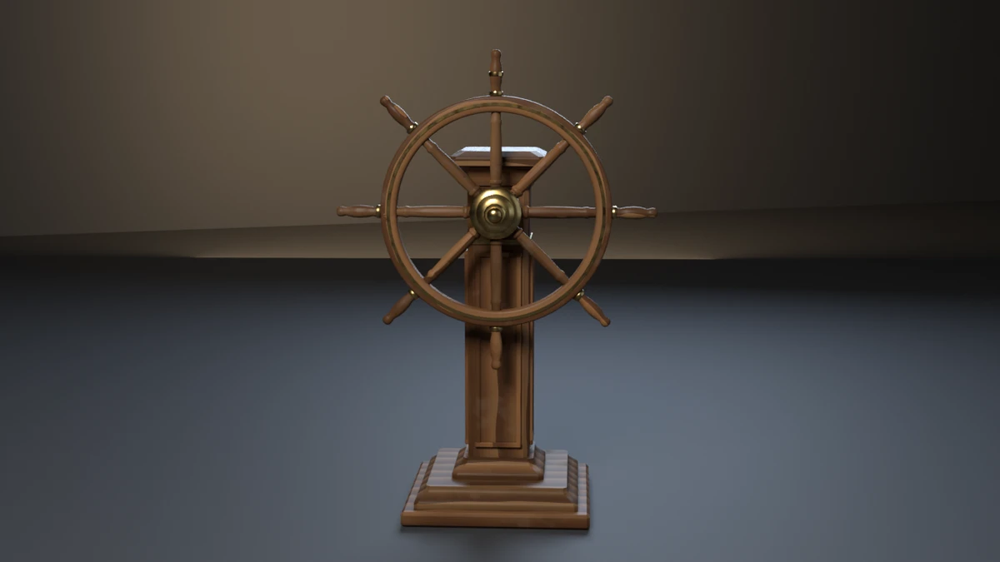

# ships-wheel



A one-metre, eight-spoke ship's wheel on its pedestal: eight turned teak
spokes running from a brass nave out to a laminated teak rim, eight
turned handles carried on past the rim on the spokes' own axes, a 10 mm
brass inlay round the rim's face, brass ferrules where the handles leave
the rim and a second brass ring on the king spoke. It turns on an iron
shaft in a flanged brass bearing collar bolted to a panelled teak helm
stand: a moulded plinth and base, a brass band, a coved capital and an
overhanging cap. **A showcase piece, not an example** — it witnesses
no API contract. It asserts that generated geometry meets declared asset
budgets, recomputed from the finished mesh.

## What it composes

| Shipped content | Used for |
| --- | --- |
| `skills/mesh-editing-and-bmesh` | revolved spokes, handles, nave, rim, shaft, collar, nut, ferrules and bolt heads, a chamfered plinth block and pedestal mouldings lofted through square-ring profiles, all in one `bmesh`, chamfered with `bmesh.ops.bevel` |
| `skills/custom-properties` | face attributes `Part` (what each shell is) and `WoodTone` (one tone per member), and a point attribute `GrainCo` (each vertex in its member's own grain frame) |
| `skills/procedural-materials-and-shaders` | varnished teak whose figure runs along each member (up the column, along every spoke and handle, round the rim), with a tone and hue per member and hand wear, recess grime from an ambient-occlusion term and a light varnish coat; brass polished on its high points and tarnished in its recesses; black iron |
| `skills/bake-high-to-low` | Cycles tangent-space normal bake, a doubled-segment high onto the low |
| `skills/engine-export-presets` | Unity glTF (`export_yup=True`) |
| `skills/depsgraph-and-evaluated-data` | evaluated triangle counts for the LOD ratios |
| `snippets/decimate_to_budget.py` | LOD1 / LOD2 COLLAPSE chain |
| `snippets/convex_hull_collider.py` | a hull over the plinth, one over the column, one over the whole wheel |
| `snippets/lod_chain.py` | LOD naming and ratio pattern |
| `examples/mesh-hygiene-audit` | hygiene combinatorics (copied, not imported) |

## The budget that matters

A ship's wheel is exact radial repetition, and it can fail without
looking wrong:

- **The spokes must be evenly spread.** Half a degree out and a picture
  still shows eight even spokes, but the rim is pulled out of round.
- **Every spoke must seat in the rim**, and every handle must seat in the
  rim's outer face on the spoke's own axis. A spoke a few millimetres
  short meets the rim in every face-on picture and carries nothing.
- **The nave must be concentric with the rim and turn on the shaft.** A
  nave two millimetres off the rim's centre wobbles the wheel on every
  turn, and a shaft off the nave's axis is not inside its bore.

The piece measures all of it off the finished mesh. Every shell carries a
`Part` face attribute written at build time, so the audit finds the rim,
the nave, the shaft, the eight spokes and the eight handles without
guessing from shape.

- **Concentric nave, shaft in the bore.** The rim, the nave and the shaft
  are each revolved about the shaft's axis, so the centroid of a shell's
  vertices in the wheel's plane is its axis. Nave to rim ≤ 0.3 mm; shaft
  to nave ≤ 0.3 mm; radial clearance (nave bore − shaft radius − offset)
  0.3–1.0 mm. Measured 0.0001 mm, 0.0004 mm and 0.599 mm.
- **Seats.** The rim's inner and outer faces are the nearest and farthest
  of its own vertices from its measured centre. A spoke's axis is the
  direction from the rim's centre to the spoke's centroid; its tip is the
  farthest its vertices reach along that axis. Spoke tip into the rim's
  inner face and handle foot into its outer face, each 1–6 mm. Measured
  3.000 mm on every spoke and 4.000 mm on every handle.
- **Spacing and coaxial handles.** Consecutive spoke axes 45° apart
  within 0.05°; every handle's axis within 0.05° of a spoke's. Measured
  0.00013° and 0.00007° at worst.

`--offset-hub` moves the nave 2 mm across and leaves the shaft and every
spoke where they were: concentric, coaxial and bore all fail, exit 17.
`--short-spoke` shortens one diagonal spoke 10 mm, so its tip stands 7 mm
clear of the rim: exit 18. `--skew-spoke` turns one diagonal spoke and its
handle 2° about the shaft; its tip still seats, so only the spacing fails,
exit 19. Both act on diagonal spokes, whose tips set no edge of the
envelope.

## Budgets

Declared in the script as named constants, recomputed from the generated
mesh. Measured values below are from Blender 5.2.1; see the
cross-version table for 4.5.11 and 5.1.2.

| Budget | Band | Measured |
| --- | --- | --- |
| Base triangles | 10500–11600 | 11036 |
| LOD1 ratio | 0.32–0.62 | 0.5000 |
| LOD2 ratio | 0.10–0.35 | 0.2193 |
| Material slots | exactly 3, distinct | 3 |
| Teak / brass / iron faces | ≥ 3700 / 1500 / 190 | 3996 / 1628 / 208 |
| UV bounds | inside 0..1 | (0.0005, 0.0005)–(0.9995, 0.9995) |
| UV AABB overlap | ≤ 1e-5 | 0.000000 |
| Outer AABB | 1.000 × 0.622 × 1.500 m ± 0.020 | 1.0000 × 0.6220 × 1.5000 |
| Collider triangles | ≤ 560 | 478 (three hulls) |
| Normal bake | `{'FINISHED'}` with image data | `{'FINISHED'}`, `has_data=True` |
| glTF export | file written, non-empty | ~826 kB |
| Hygiene | all zero | loose 0/0, non-manifold 0, zero-area 0, doubles 0, n-gons 0, coplanar cross-shell pairs 0 |
| Grounded AABB | \|zmin\| ≤ 1e-4 | 0.00000 |
| Parts | plinth block and ogee step, moulded base, column, brass band, capital, cap, 3 panel fields in 12 moulding pieces, collar, 4 bolts, shaft, nut, nave, rim, inlay, 8 spokes, 8 handles, 8 ferrules, 1 king ring | as stated |
| Nave concentric, shaft coaxial | ≤ 0.3 mm each, bore clearance 0.3–1.0 mm | 0.0001 mm, 0.0004 mm, 0.599 mm |
| Spoke seat in the rim | 1–6 mm into the inner face | 3.000 mm (all eight) |
| Handle seat in the rim | 1–6 mm into the outer face | 4.000 mm (all eight) |
| Spoke spacing | 45° ± 0.05° | worst 0.00013° |
| Handle on its spoke's axis | ≤ 0.05° | worst 0.00007° |
| Real-world size | 1.000 ± 0.004 m over the handles, rim 0.720 ± 0.004 m, centre 1.000 ± 0.002 m above the deck | 1.0000, 0.7200, 1.0000 |

Real-world size: a small vessel's pedestal helm is about a metre over the
handles with eight spokes, the rim a little under three quarters of that,
the handles turned to a hand's grip (about 40 mm at the bulb) and the
wheel's centre about a metre off the deck.

## Construction

- **Rim.** One teak ring, 50 mm deep and 46 mm thick, its section a
  rounded rectangle (8 mm radius on all four arrises, so each edge catches
  a highlight), and a 10 mm brass inlay let 0.8 mm into its face.
- **Spokes.** Turned: a collar and bead by the nave, a long swelling
  shank, a second bead before the rim. Each is tenoned 12 mm into the nave
  and 3 mm into the rim's inner face.
- **Handles.** Turned on the spoke's own axis from 4 mm inside the rim's
  outer face to 0.50 m from the centre: a neck, a long bulb for the grip, a
  knob at the tip. A brass ferrule where each leaves the rim; the king
  spoke (upright at rest) carries a second brass ring, the mark a
  helmsman finds by touch.
- **Nave and shaft.** A turned brass drum with a front boss, bored 0.6 mm
  over a 40 mm iron shaft, and an acorn nut over the shaft's end.
- **Pedestal.** A helm stand: a chamfered plinth block under an
  ogee-moulded step, a moulded base, a 200 mm square column with
  stop-chamfered arrises, a brass band below the collar, a coved capital
  with a bead, and an overhanging cap with a rounded edge and a low hip.
  Every moulded member is lofted through a profile of chamfered square
  rings and let into the one below. On three faces of the column a raised field
  (6 mm proud, darker) sits in a moulded frame whose rails stand 12 mm
  proud and stiles 11 mm, so no two front faces are one plane; each piece
  is let into the column by a different depth so no two back faces are
  either. The
  shaft runs into the column through a flanged brass collar held by four
  iron bolts.
- **Collider.** One hull over the plinth, one over the column with its
  base, capital, cap and fittings, one over
  the whole wheel: a turning wheel is a disc to anything that hits it.

## Findings the budgets forced

- **Panels as thin as their chamfer.** The column's first panels were
  8 mm deep; a 4 mm chamfer from both faces met in the middle and the
  hygiene audit reported 16 zero-area faces and 24 doubled vertices. Every
  panel and moulding piece takes a 2 mm chamfer.
- **Grain that reads as stripes.** Object-space bands drew the same even
  stripes across every member, whichever way it ran. Each vertex now
  carries its member's grain frame (`GrainCo`), the rings run about the
  fibre axis with noise pulling their spacing about, and the ramp is
  narrow, so the figure is a shift in shade along the member.
- **Mouldings on the panel planes.** The quality pass's first base
  moulding ended in a fillet 112 mm from the column's axis, the plane the
  panel frames' rails stand proud to; the brass band's inner skin sat on
  the rails' buried backs (97 mm). The cross-shell coplanar audit counted
  six pairs; the fillet moved to 115 mm and the band's skin to 94.5 mm.
- **Treads that mirror the wall.** With the camera low enough to make the
  wheel the subject, the plinth's treads and the cap's top see the lit
  wall at grazing incidence and greyed out (sampled 109, 97, 89 against
  78, 56, 41 on a riser). A zero-specular test render brought them back to
  brown, so the teak's specular level is 0.15 under a 0.05 coat, and the
  still is denoised.
- **Falsifiers on diagonal spokes.** Shortening or turning a horizontal
  or upright spoke moves the handle tip that sets an edge of the envelope,
  so the AABB would fail first. Both falsifiers act on diagonal spokes.

## Conventions walked

Every convention in `showcase/README.md`, and whether it applies here.

| Convention | Applies | How |
| --- | --- | --- |
| Deterministic, budgets declared, assertions recompute | yes | no RNG; every value above is read off the mesh |
| Falsifier fails the budget it targets | yes | table below |
| Hygiene incl. cross-shell coplanar | yes | exit 15 |
| Plumb and real-world size | yes | wheel diameter, rim diameter and centre height; exit 19 |
| A member is tenoned into its seat | yes | spokes into the nave and the rim, handles into the rim, the column into the plinth, the collar into the column |
| Seat conformance (a band: minimum so it cannot float) | yes | every spoke and handle in the rim (`--short-spoke`), exit 18 |
| Mirrored assemblies | no | a wheel is radial, not mirrored; its symmetry is the spacing budget |
| Material face floors | yes | teak 3700, brass 1500, iron 190 |
| One substance, one slot | yes | teak, brass, iron |
| Shading is part of the model | yes | turned parts smooth, every edge over 35° hard; pedestal faceted |
| Edge treatment | yes | every box chamfered, every moulding profiled, the rim's section rounded; no separate budget, removing the chamfers moves the triangle band first |
| Sort bmesh operator inputs | yes | the bevel's edge list is sorted by index |
| The bake cage is narrower than the nearest neighbour | yes | `CAGE_EXTRUSION` 0.01 m |
| Level on the stage; stage 60 m | yes | turned about Z only; 60 m floor and wall |
| Keep a falsifier's envelope still | yes | no falsifier moves the AABB |
| Named supports, wrappers, rope, roofs, vessels, scatter, fasteners | partly | fasteners: the collar's bolts are counted as parts |

## Falsifiers

Each breaks one pipeline stage so a **named** budget fails. All six were
run on Blender 4.5.11, 5.1.2 and 5.2.1 and exited the declared code.

| Flag | Target budget | Breaks | Exit |
| --- | --- | --- | --- |
| `--skip-decimate` | LOD1 ratio | drops the DECIMATE modifiers, LOD1 ratio goes to 1.0000 | 9 |
| `--stray-vert` | mesh hygiene | adds one loose vertex behind the wheel | 15 |
| `--lift-z` | grounded zmin | lifts the whole mesh 50 mm | 16 |
| `--offset-hub` | concentric nave, shaft in its bore | moves the nave 2 mm across; 2.000 mm off centre, bore clearance −1.400 mm | 17 |
| `--short-spoke` | spoke seat in the rim | shortens one diagonal spoke 10 mm; tip −7.000 mm from the rim | 18 |
| `--skew-spoke` | equal angular spacing | turns one diagonal spoke and its handle 2°; spacing off by 2.0000° | 19 |

## Exit codes

File-local and sequential. `9` is a valid check code. `1` is the FATAL
wrapper — a crash, never a named check.

| Code | Meaning |
| --- | --- |
| 0 | Success |
| 1 | Uncaught exception (FATAL wrapper) |
| 2 | argparse / usage |
| 3 | Mesh did not build, has no UV layer, or a part count is wrong |
| 4 | Base triangle count outside band |
| 5 | Material slots, or a material's face floor |
| 6 | UVs outside 0..1 |
| 7 | UV AABB overlap above tolerance |
| 8 | Outer AABB off declared size |
| 9 | LOD1 or LOD2 ratio outside band (`--skip-decimate`) |
| 10 | Framing gate (`examples/gallery_framing.py`, render path only) |
| 11 | Collider triangles above ceiling |
| 12 | Normal bake failed or produced no image data |
| 13 | glTF export missing or empty |
| 14 | `--output` produced no file |
| 15 | Mesh hygiene (`--stray-vert`) |
| 16 | Grounded zmin (`--lift-z`) |
| 17 | Nave off the rim's centre, shaft off its axis, or bore clearance out of band (`--offset-hub`) |
| 18 | A spoke or handle not seated in the rim (`--short-spoke`) |
| 19 | Spoke spacing, a handle off its spoke's axis, or real-world size (`--skew-spoke`) |
| 21 | Asset-quality floors (`examples/gallery_asset_quality.py`, render path only) |

## Run it

```bash
# Budget check, no render. A few seconds warm.
blender --background --python ships_wheel.py --

# Falsifier: one spoke turned 2 degrees. Must exit 19.
blender --background --python ships_wheel.py -- --skew-spoke

# Falsifier: one spoke 10 mm short of the rim. Must exit 18.
blender --background --python ships_wheel.py -- --short-spoke

# Render the gallery still (Cycles; EEVEE is the default engine).
blender --background --python ships_wheel.py -- --output ships_wheel.png --engine cycles
```

Smoke runs the check-only path. It does not pass `--output` or any falsifier.

## Cross-version measurements

Every default run and every falsifier was run on all three binaries
(`.scratch/blender-<ver>-windows-x64/blender.exe`, reporting 4.5.11 LTS,
5.1.2 and 5.2.1 LTS). Only the DECIMATE counts differ, which is why the LOD
gate is a ratio band; every concentric, seat, spacing and size value is
identical.

| Value | 4.5.11 | 5.1.2 | 5.2.1 |
| --- | --- | --- | --- |
| Base triangles | 11036 | 11036 | 11036 |
| LOD1 / LOD2 triangles | 5518 / 2426 | 5518 / 2426 | 5518 / 2420 |
| LOD2 ratio | 0.2198 | 0.2198 | 0.2193 |
| Faces teak / brass / iron | 3996 / 1628 / 208 | same | same |
| Collider triangles | 478 | 478 | 478 |
| Concentric, coaxial, bore | 0.0001 / 0.0004 / 0.599 mm | same | same |
| Spoke / handle seat | 3.000 / 4.000 mm | same | same |
| Falsifier exits 9 / 15 / 16 / 17 / 18 / 19 | all as declared | all as declared | all as declared |
