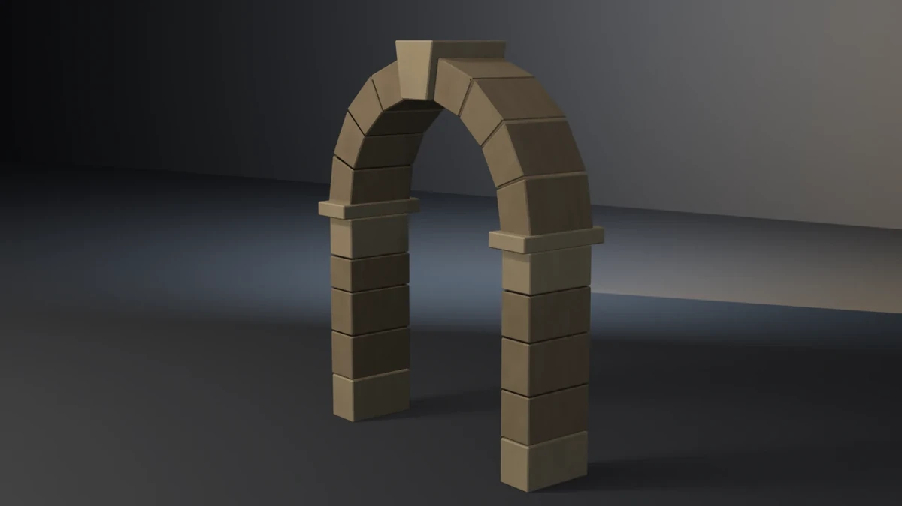

# stone-archway



A freestanding masonry arch — two coursed piers, projecting imposts, nine
voussoirs turning a semicircle, and a keystone standing proud at the crown.
**A showcase piece, not an example** — it witnesses no API contract. It
asserts that generated geometry meets declared asset budgets, recomputed
from the finished mesh.

## What it composes

| Shipped content | Used for |
| --- | --- |
| `skills/mesh-editing-and-bmesh` | wedge and box construction, chamfer, UVs in one `bmesh` |
| `skills/procedural-materials-and-shaders` | two Principled stone materials with noise-driven weathering |
| `skills/bake-high-to-low` | Cycles tangent-space normal bake, high onto low |
| `skills/engine-export-presets` | Unity glTF (`export_yup=True`) |
| `skills/depsgraph-and-evaluated-data` | evaluated triangle counts for the LOD ratios |
| `snippets/decimate_to_budget.py` | LOD1 / LOD2 COLLAPSE chain |
| `snippets/convex_hull_collider.py` | convex collider |
| `snippets/lod_chain.py` | LOD naming and ratio pattern |
| `examples/mesh-hygiene-audit` | hygiene combinatorics (copied, not imported) |

## The budget that matters

An arch can fail invisibly. Nine wedge blocks laid in a row are still nine
wedge blocks; the thing that makes them an arch is that their **intrados
vertices sit on a circle**. So the piece recomputes that circle from vertex
positions — not from the angles the generator used — and asserts every
intrados vertex lands within 4 mm of the declared 0.60 m radius, over an arc
spanning at least 168°.

`--off-circle` is the falsifier built for exactly this. It keeps the angles,
the joints, the materials, the triangle count and the bounding box identical,
and only wanders the intrados radius by ±18 mm. Every other budget in the
piece still passes. Only the circle fit sees it.

### Measuring it took two corrections

The first attempt selected intrados vertices by radius. That swept in the
chamfer vertices sitting one bevel-width out on each radial face and reported
a 5.1 mm error on a true arch. The fit now runs over the vertices of faces
that actually face the springing centre — normal inward in XZ *and* with a
small Y component, which is what excludes the chamfer strips running along
the intrados edges.

## Budgets

Declared in the script as named constants, recomputed from the generated
mesh. Measured values are from Blender 5.2.1; the cross-version table is at
the end.

| Budget | Band | Measured |
| --- | --- | --- |
| Base triangles | 700–2600 | 924 |
| LOD1 ratio | 0.32–0.62 | 0.5000 |
| LOD2 ratio | 0.10–0.35 | 0.2121 (5.2) / 0.2186 (4.5, 5.1) |
| Material slots | exactly 2, distinct | 2 |
| Dressed faces (keystone, imposts, plinth and head courses) | ≥ 100 | 182 |
| Ashlar faces | ≥ 280 | 364 |
| UV bounds | inside 0..1 | (0.0017, 0.0017)–(0.9983, 0.9983) |
| UV AABB overlap | ≤ 1e-5 | 0.000000 |
| Outer AABB | 1.644 × 0.510 × 2.057 m ± 0.020 | 1.6440 × 0.5100 × 2.0568 |
| Clear opening | 1.200 m ± 0.015, measured between the pier faces | 1.2033 |
| Collider triangles | ≤ 260 | 168 |
| Normal bake | `{'FINISHED'}` with image data | `{'FINISHED'}`, `has_data=True` |
| glTF export | file written, non-empty | ~87 kB |
| Hygiene | all zero | loose 0/0, non-manifold 0, zero-area 0, doubles 0, n-gons 0, coplanar disjoint pairs 0 |
| Grounded AABB | \|zmin\| ≤ 1e-4 | 0.00000 |
| Pier supports | 2 piers, each base course zmin ≤ 1e-3 | 2 at 0.00000 |
| Keystone proud of the wall face | ≥ 0.020 m | 0.03500 |
| Springing joint | overlap, surface gap ≤ 1e-4 | 0.00000 |
| Mortar joints | every adjacent pair in 0.006–0.017 m | all eight at 0.00970 |
| Intrados circle fit | every vertex within 0.004 m of R = 0.60 | 0.00097 |
| Intrados arc span | ≥ 168° | 178.0° |

Real-world size: a 1.20 m clear opening under a semicircular head, 1.64 m
across the piers and 2.06 m to the top of the keystone — a garden gate arch.

## Determinism

Fixed seed 23; no unseeded randomness. Every measured value above is
byte-identical on 4.5.11, 5.1.2 and 5.2.1 **except** LOD2, where
`DECIMATE COLLAPSE` produces 196 triangles on 5.2 and 202 on 4.5 and 5.1.
That is why the LOD gate is a ratio band (0.10–0.35, measured 0.2121 and
0.2186) and not an exact count.

## Falsifiers

Each breaks one pipeline stage so a **named** budget fails. All seven were
run on 4.5.11, 5.1.2 and 5.2.1 and produced the same exit code on all three.

| Flag | Breaks | Exit |
| --- | --- | --- |
| `--skip-decimate` | drops the DECIMATE modifiers, LOD1 ratio goes to 1.0000 | 9 |
| `--stray-vert` | adds one loose vertex inside the opening, so hygiene catches it rather than the bounding box | 15 |
| `--lift-z` | lifts the whole mesh 50 mm off the floor | 16 |
| `--float-pier` | floats one pier 12 mm; the other still grounds the AABB, so only the named-support budget sees it | 16 |
| `--sink-keystone` | sinks the keystone to a quarter of its projection (8.75 mm) — the imposts still set the Y envelope, so the bounding box is unchanged | 17 |
| `--wide-mortar` | triples the joint angle, opening every joint to 29.1 mm | 18 |
| `--off-circle` | wanders the intrados radius ±18 mm while keeping angles, joints and envelope | 19 |

Three of these needed the model changed, not the budget:

- **`--sink-keystone`** originally removed the projection outright, which
  shrank the Y bounding box by 70 mm and tripped the AABB gate first. The
  imposts were added so the envelope no longer depends on the keystone —
  and an impost course is correct masonry the arch was missing anyway.
- **`--off-circle`** began as `--flat-arch`, laying the voussoirs as a
  lintel. That is 0.62 m shorter and fails on the bounding box, proving
  nothing about the circle fit. Wandering the radius inside the same
  envelope is the honest version.
- **`--float-pier`** tripped the z-fight budget rather than the support
  budget, because the impost was pinned to an absolute height while the
  courses under it rose into it. The impost now rides on its own pier.

## Findings the budgets forced

- **The chamfer pass silently repainted the mesh.** `bmesh.ops.bevel` gives
  every face it creates `material_index` 0, so chamfering nineteen blocks
  left 30 faces on the dressed slot and moved 464 to ashlar. The slot count
  and the distinct-material check both still passed. Only the per-material
  face floor caught it, which is exactly the class `showcase/README.md`
  warns about. Materials are now re-stamped after the bevel, per block, by
  nearest recorded centroid.
- **The impost landed exactly on the top course.** Same footprint, same
  plane, two coincident face centres — a z-fight. It now sits on its own
  mortar bed, which is why the pier lays `N_COURSE` beds rather than
  `N_COURSE - 1`.
- **`find_nearest` is unsigned.** A voussoir seated *inside* the pier head
  reported a 5.4 mm gap where there was none, because the distance to the
  host's skin is positive from inside too. Joint gaps now test BVH overlap
  first and return zero when two blocks interpenetrate.
- **Joint gaps have to be measured both ways.** The keystone's radial faces
  are wider in Y than its neighbours', so every keystone vertex on the joint
  lies outside the neighbour and read 33 mm instead of the 9.7 mm joint. The
  metric is the closest approach of the two surfaces, min of both directions.

## Exit codes

File-local and sequential. `9` is a valid check code; there is no rule
against it. `1` is the FATAL wrapper — a crash, never a named check.

| Code | Meaning |
| --- | --- |
| 0 | Success |
| 1 | Uncaught exception (FATAL wrapper) |
| 2 | argparse / usage |
| 3 | Mesh did not build, or has no UV layer |
| 4 | Base triangle count outside band |
| 5 | Material slots, or a material's face floor |
| 6 | UVs outside 0..1 |
| 7 | UV AABB overlap above tolerance |
| 8 | Outer AABB off declared size |
| 9 | LOD1 or LOD2 ratio outside band (`--skip-decimate`) |
| 10 | Framing gate (`examples/gallery_framing.py`, render path only) |
| 11 | Collider triangles above ceiling |
| 12 | Normal bake failed or produced no image data |
| 13 | glTF export missing or empty |
| 14 | `--output` produced no file |
| 15 | Mesh hygiene (`--stray-vert`) |
| 16 | Grounded zmin, or a pier base floating (`--lift-z`, `--float-pier`) |
| 17 | Keystone projection or springing joint (`--sink-keystone`) |
| 18 | Mortar joint outside band (`--wide-mortar`) |
| 19 | Intrados circle fit, or clear opening (`--off-circle`) |

## Run it

```bash
# Budget check, no render. ~0.82 s on 4.5, ~0.85 s on 5.1, ~0.98 s on 5.2.
blender --background --python stone_archway.py --

# Falsifier: the intrados stops being a circle. Must exit 19.
blender --background --python stone_archway.py -- --off-circle

# Falsifier: every mortar joint opens to 29 mm. Must exit 18.
blender --background --python stone_archway.py -- --wide-mortar

# Render the gallery still (EEVEE; --engine cycles on a GPU-less host).
blender --background --python stone_archway.py -- --output arch.webp
```

Smoke runs the check-only path. It does not pass `--output` or any falsifier.

## Cross-version measurements

| Value | 4.5.11 | 5.1.2 | 5.2.1 |
| --- | --- | --- | --- |
| Base triangles | 924 | 924 | 924 |
| LOD1 tris / ratio | 462 / 0.5000 | 462 / 0.5000 | 462 / 0.5000 |
| LOD2 tris / ratio | 202 / 0.2186 | 202 / 0.2186 | 196 / 0.2121 |
| Face counts (ashlar / dressed) | 364 / 182 | 364 / 182 | 364 / 182 |
| Outer AABB | 1.6440 × 0.5100 × 2.0568 | same | same |
| Collider tris | 168 | 168 | 168 |
| Intrados deviation | 0.00097 | 0.00097 | 0.00097 |
| Mortar joints | all 0.00970 | all 0.00970 | all 0.00970 |
| Check wall-clock | ~0.82 s | ~0.85 s | ~0.98 s |
