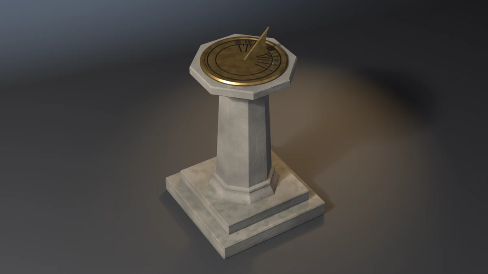

# sundial



A horizontal garden sundial for 45° north: a stepped stone plinth, a
tapered octagonal granite column with a flared foot and collar, a cap, a
bronze dial plate with a bead rim, a curved-backed bronze gnomon, and
twenty-two inked lines laid out by the dial formula. **A showcase piece,
not an example** — it witnesses no API contract. It asserts that generated
geometry meets declared asset budgets, recomputed from the finished mesh.

## What it composes

| Shipped content | Used for |
| --- | --- |
| `skills/mesh-editing-and-bmesh` | frusta, lathed plate and ring, swept ink bars and a lofted gnomon, all in one `bmesh`, chamfered with `bmesh.ops.bevel` |
| `skills/custom-properties` | a face attribute (`StoneTone`) read by the granite shader |
| `skills/procedural-materials-and-shaders` | speckled, mossy granite with a pitted bump; bronze going green in patches; satin ink |
| `skills/bake-high-to-low` | Cycles tangent-space normal bake, a 128-segment high onto the 64-segment low |
| `skills/engine-export-presets` | Unity glTF (`export_yup=True`) |
| `skills/depsgraph-and-evaluated-data` | evaluated triangle counts for the LOD ratios |
| `snippets/decimate_to_budget.py` | LOD1 / LOD2 COLLAPSE chain |
| `snippets/convex_hull_collider.py` | a hull per stone block, the plate and the gnomon, merged into a compound |
| `snippets/lod_chain.py` | LOD naming and ratio pattern |
| `examples/mesh-hygiene-audit` | hygiene combinatorics (copied, not imported) |

## The budget that matters

A sundial exists to tell the time, and it can fail at that without
looking wrong. Two things decide it:

- **The gnomon's style edge must be inclined to the plate at the
  latitude**, and must meet the plate at the point the hour lines fan out
  from.
- **Each hour line must lie at the bearing the horizontal-dial formula
  gives**: `tan(φ) = sin(latitude) · tan(15° · hours from noon)`. Spaced
  evenly at 15° an hour, the lines look right in every picture and are
  wrong from 7 to 11 and 13 to 17.

The piece measures both off the finished mesh:

- **Style angle.** The gnomon's face that looks up and south has its
  normal in the meridian plane. Its tilt from the horizontal is
  `atan2(-n.y, n.z)`, area-weighted over every such face. Band ±0.25°
  around 45°; measured 45.0000°. The same face gives the height where its
  plane crosses the dial centre; it must equal the plate's top, ±0.5 mm.
- **Hour lines.** Ten hour bars and ten half-hour ticks, each told apart
  by how far out it sits. Each one's bearing is the plan angle of its own
  vertex centroid from the plate's centroid, and its long axis, from a
  principal-axis fit of its vertices, must point along that radius within
  1°. The sorted bearings are compared with the formula: band ±0.10°;
  measured 0.00001°.
- **Noon.** The arrow on the meridian is the one piece nearest x = 0; its
  centroid must sit within 0.5 mm of the gnomon's.

`--wrong-latitude` is the falsifier built for the first. It keeps the
apex where it is and tilts the style edge to 38°, so the foot slides 41 mm
south of the centre and the envelope does not move. Every other budget
passes and the run exits 17. `--linear-hours` is built for the second: the
lines go in at 15° an hour and the bearings are out by 9.84°.

## Budgets

Declared in the script as named constants, recomputed from the generated
mesh. Measured values are from Blender 5.2.1; 4.5 and 5.1 were not run
locally (see the cross-version note below).

| Budget | Band | Measured |
| --- | --- | --- |
| Base triangles | 2200–2700 | 2404 |
| LOD1 ratio | 0.32–0.62 | 0.5000 |
| LOD2 ratio | 0.10–0.35 | 0.2196 |
| Material slots | exactly 3, distinct | 3 |
| Stone / bronze / ink faces | ≥ 140 / 430 / 570 | 180 / 507 / 713 |
| UV bounds | inside 0..1 | (0.0011, 0.0011)–(0.9989, 0.9989) |
| UV AABB overlap | ≤ 1e-5 | 0.000000 |
| Outer AABB | 0.600 × 0.600 × 1.010 m ± 0.020 | 0.6000 × 0.6000 × 1.0100 |
| Collider triangles | ≤ 480 | 444 (eight hulls) |
| Normal bake | `{'FINISHED'}` with image data | `{'FINISHED'}`, `has_data=True` |
| glTF export | file written, non-empty | ~208 kB |
| Hygiene | all zero | loose 0/0, non-manifold 0, zero-area 0, doubles 0, n-gons 0, coplanar cross-shell pairs 0 |
| Grounded AABB | \|zmin\| ≤ 1e-4 | 0.00000 |
| Parts | 6 stone, 1 plate, 1 gnomon, 1 ring, 1 noon, 10 bars, 10 ticks | as stated |
| Style angle | 45° ± 0.25° | 45.0000° |
| Hour-line bearings | formula ± 0.10°, radial ± 1° | 0.00001°, 0.0000° |
| Gnomon bite | 2.0–5.0 mm below the plate's top | 3.50 mm |
| Style foot | within 0.5 mm of the dial centre at the plate's top | 0.00 mm |
| Ink seat | 0.5–2.5 mm proud, 0.8–3.0 mm buried, every line | 2.00 mm / 2.50 mm |
| Noon on the meridian | ≤ 0.5 mm from the gnomon | 0.00 mm |
| Plumb column | bottom ring vs top ring centroid ≤ 1.5 mm | 0.00 mm |
| Real-world size | column 0.670 ± 0.020, plate Ø 0.400 ± 0.004, gnomon 0.130 ± 0.003 m | 0.670, 0.400, 0.130 |

Real-world size: a 1.01 m garden sundial. A 0.40 m dial at hip height
(0.88 m), on a 0.67 m column, with a 0.13 m gnomon at 45°.

## Construction

- **Stone.** Six frusta, each an n-gon with flats on the axes: two square
  steps, a flared octagonal foot, the tapered column, an inverted-frustum
  collar and the cap. Every upper part is tenoned into its host and its
  top is the fixed figure, so no two bodies land on one plane. The
  foot starts 5 mm into the step, the column 10 mm, so the two bottoms
  are not the same plane. Near-right-angle edges are chamfered with
  `bmesh.ops.bevel`, `material=` passed so the chamfer keeps the stone slot.
- **Plate.** One lathe about Z: a flat field, a bead rim, a bevelled
  outer edge and an underside that sits 4 mm into the cap. 64 segments;
  the high mesh is 128.
- **Gnomon.** A lofted (y, z) outline in the meridian plane, 8 mm thick.
  The style edge is **one** straight edge from foot to apex: stations on
  it are collinear, and the ear-clipped caps turned collinear triples into
  zero-area triangles. The back edge is a sine sag. The bottom is 3.5 mm
  below the plate's top. `--wrong-latitude` holds the apex and changes the
  slope.
- **Ink.** Every line is a keeled hexagon swept along its bearing: a
  ridge 2.0 mm proud of the plate, a keel 2.5 mm buried. A ridge and a keel
  keep the tops and the bottoms of twenty lines from being one plane.
  The noon arrow is the exception: a flat-topped, chamfered prism.
- **Collider.** One hull per stone block, one for the gnomon, and one for
  the plate taken over every fourth segment. The ink is left out: it is a
  couple of millimetres of relief on a surface the plate hull covers.

## Findings the budgets forced

- **Coplanar cross-shell.** The first run reported one pair. The noon
  arrow's 8 mm shaft shared its side plane with the 8 mm gnomon. The shaft
  is now 10 mm wide.
- **Coplanar by construction.** Ink bars with a flat top would put twenty
  top faces on one plane, and twenty bottoms on another. The keeled
  hexagon has neither.
- **Collinear stations.** Stations on the style edge, kept so a
  regression had points to fit, gave zero-area triangles at 38° but not
  at 45°. The angle is now measured from the style face's normal, so the
  stations are gone.
- **Collider.** Hulls over chamfered stone are heavier than they look; the
  foot took the compound from 388 to 444 triangles.

## Conventions walked

Every convention in `showcase/README.md`, and whether it applies here.

| Convention | Applies | How |
| --- | --- | --- |
| Deterministic, budgets declared, assertions recompute | yes | no RNG; every value above is read off the mesh |
| Falsifier fails the budget it targets | yes | table below |
| Hygiene incl. cross-shell coplanar | yes | exit 15 |
| Plumb and real-world size | yes | column plumb and height, plate and gnomon size (`--lean-pedestal`); exit 19 |
| A member is tenoned into its seat | yes | each stone part into its host; the gnomon 3.5 mm into the plate (`--float-gnomon`) |
| Seat conformance (a band: minimum so it cannot float) | yes | the gnomon bite and every ink line's proud and buried depth (`--float-gnomon`, `--float-lines`) |
| Mirrored assemblies | partly | the gnomon and noon arrow are centred on the meridian; asserted as one centroid offset (`--shift-noon`) |
| Material face floors | yes | stone 140, bronze 430, ink 570 |
| One substance, one slot | yes | granite, bronze, ink |
| Shading is part of the model | yes | stone and gnomon faceted (dressed stone, a bronze plate); the lathed plate and ring smooth, every edge over 35° hard |
| Edge treatment | partly | chamfered, but no separate budget: removing the chamfers moves the triangle band first |
| Sort bmesh operator inputs | yes | the bevel's edge list is sorted by index |
| The bake cage is narrower than the nearest neighbour | yes | `CAGE_EXTRUSION` 0.01 m |
| Level on the stage; stage 60 m | yes | turned about Z only; 60 m floor and wall |
| Keep a falsifier's envelope still | yes | no falsifier moves the AABB; `--wrong-latitude` holds the apex |
| Named supports, wrappers, rope, roofs, vessels, scatter, fasteners | no | the piece has none of these |

## Falsifiers

Each breaks one pipeline stage so a **named** budget fails. All nine were
run on Blender 5.2.1 and exited the declared code.

| Flag | Target budget | Breaks | Exit |
| --- | --- | --- | --- |
| `--skip-decimate` | LOD1 ratio | drops the DECIMATE modifiers, LOD1 ratio goes to 1.0000 | 9 |
| `--stray-vert` | mesh hygiene | adds one loose vertex inside the column | 15 |
| `--lift-z` | grounded zmin | lifts the whole mesh 50 mm | 16 |
| `--wrong-latitude` | style angle | holds the apex and tilts the style edge to 38° | 17 |
| `--linear-hours` | hour-line bearings | puts every line at 15° an hour; 9.839° out | 17 |
| `--float-gnomon` | gnomon bite | lifts the gnomon 5 mm; the bite goes to −1.5 mm | 18 |
| `--float-lines` | ink seat | lifts every ink line 4 mm; 6.0 mm proud, buried −1.5 mm | 18 |
| `--shift-noon` | noon on the meridian | moves the noon arrow 3 mm east; 3.00 mm off | 19 |
| `--lean-pedestal` | plumb column | shears the column's top ring 12 mm east; 11.93 mm | 19 |

## Exit codes

File-local and sequential. `9` is a valid check code. `1` is the FATAL
wrapper — a crash, never a named check.

| Code | Meaning |
| --- | --- |
| 0 | Success |
| 1 | Uncaught exception (FATAL wrapper) |
| 2 | argparse / usage |
| 3 | Mesh did not build, has no UV layer, or a part count is wrong |
| 4 | Base triangle count outside band |
| 5 | Material slots, or a material's face floor |
| 6 | UVs outside 0..1 |
| 7 | UV AABB overlap above tolerance |
| 8 | Outer AABB off declared size |
| 9 | LOD1 or LOD2 ratio outside band (`--skip-decimate`) |
| 10 | Framing gate (`examples/gallery_framing.py`, render path only) |
| 11 | Collider triangles above ceiling |
| 12 | Normal bake failed or produced no image data |
| 13 | glTF export missing or empty |
| 14 | `--output` produced no file |
| 15 | Mesh hygiene (`--stray-vert`) |
| 16 | Grounded zmin (`--lift-z`) |
| 17 | Style angle or hour-line bearings (`--wrong-latitude`, `--linear-hours`) |
| 18 | Gnomon bite, style foot or ink seat (`--float-gnomon`, `--float-lines`) |
| 19 | Noon on the meridian, plumb column or real-world size (`--shift-noon`, `--lean-pedestal`) |

## Run it

```bash
# Budget check, no render. A few seconds warm.
blender --background --python sundial.py --

# Falsifier: the lines are spaced at 15 degrees an hour. Must exit 17.
blender --background --python sundial.py -- --linear-hours

# Falsifier: the style edge is tilted to 38 degrees. Must exit 17.
blender --background --python sundial.py -- --wrong-latitude

# Render the gallery still (EEVEE; --engine cycles on a GPU-less host).
blender --background --python sundial.py -- --output sundial.webp
```

Smoke runs the check-only path. It does not pass `--output` or any falsifier.

## Cross-version measurements

Measured on Blender 5.2.1 only. 4.5 and 5.1 were not run for this piece.
Nothing here depends on a version-specific API beyond the EEVEE engine id,
which the script branches on, and the DECIMATE triangle counts, which are
a ratio band.

| Value | 5.2.1 |
| --- | --- |
| Base triangles | 2404 |
| LOD1 / LOD2 tris | 1202 / 528 |
| Face counts (stone / bronze / ink) | 180 / 507 / 713 |
| Outer AABB | 0.6000 × 0.6000 × 1.0100 |
| Collider tris | 444 |
| Style angle | 45.0000° |
| glTF bytes | 208060 |
