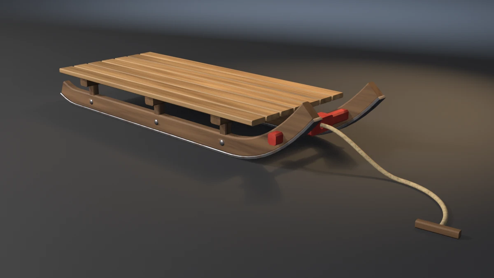

# toboggan



A traditional runner sled in the Flexible Flyer pattern (the name is the
repo's; the model is the steered runner sled, not a flat-bottom
toboggan): two steel-shod wooden runners with upturned front horns, six
posts carrying three cross bearers, a deck of seven lengthwise slats, a
painted steering bar through both horns with a drilled hub, and a hemp
rope threaded through the hub and stopped with a knot behind it, ending
in a wooden toggle on the floor. **A showcase piece, not an example** — it
witnesses no API contract. It asserts that generated geometry meets
declared asset budgets, recomputed from the finished mesh.

## What it composes

| Shipped content | Used for |
| --- | --- |
| `skills/mesh-editing-and-bmesh` | chamfered members swept along a curve, a drilled hub, lathed bolts, a parallel-transport rope, all in one `bmesh` |
| `skills/custom-properties` | face attributes (`PlankTone`, `GrainDir`) read by the wood shaders |
| `skills/procedural-materials-and-shaders` | slat pine, stained frame, worn steel, hemp lay from the rope's UVs, worn red enamel |
| `skills/bake-high-to-low` | Cycles tangent-space normal bake, high onto low |
| `skills/engine-export-presets` | Unity glTF (`export_yup=True`) |
| `skills/depsgraph-and-evaluated-data` | evaluated triangle counts for the LOD ratios |
| `snippets/decimate_to_budget.py` | LOD1 / LOD2 COLLAPSE chain |
| `snippets/convex_hull_collider.py` | four hulls per runner, one for the deck, one for the bar, merged into a compound |
| `snippets/lod_chain.py` | LOD naming and ratio pattern |
| `examples/mesh-hygiene-audit` | hygiene combinatorics (copied, not imported) |

## The budgets that matter

A sled stands on two steel shoes and is held together by tenons, rebates
and a rope through a hole. Each of those fails invisibly to an AABB:

- **Each shoe grounds by itself.** The sled's zmin is the lower of two
  shoes. Lift one 6 mm and the box still touches the floor, so only a
  per-shoe `zmin` sees it (`--float-shoe`, exit 16).
- **The deck is joined, not stacked.** Every post bites 11.5 mm into its
  runner and 13.5 mm into its bearer, and stops 21.5 mm short of the
  bearer's top; every slat is rebated 3 mm into each of the three
  bearers it crosses (21 joints).
- **The rope goes through the hole.** The hub is a block drilled along X.
  The rope's rings inside the hub are measured against the hole's radius
  read off the mesh, and a rope shifted 12 mm sits in solid wood, not in
  the hole (`--miss-hole`, exit 18).

## Budgets

Declared in the script as named constants, recomputed from the generated
mesh. Measured values are from Blender 5.2.1, the only binary run locally;
4.5 and 5.1 were not run for this piece.

| Budget | Band | Measured |
| --- | --- | --- |
| Base triangles | 4400–5000 | 4696 |
| LOD1 ratio | 0.32–0.62 | 0.5000 |
| LOD2 ratio | 0.10–0.35 | 0.2198 |
| Material slots | exactly 5, distinct | 5 |
| Slat / frame / steel / rope / paint faces | ≥ 150 / 770 / 940 / 390 / 85 | 168 / 864 / 1056 / 440 / 96 |
| UV bounds | inside 0..1 | (0.0050, 0.0050)–(0.9950, 0.9950) |
| UV AABB overlap | ≤ 1e-5 | 0.000000 |
| Outer AABB | 1.629 × 0.425 × 0.211 m ± 0.020 | 1.6293 × 0.4247 × 0.2106 |
| Collider triangles | ≤ 720 | 656 (10 hulls) |
| Normal bake | `{'FINISHED'}` with image data | `{'FINISHED'}`, `has_data=True` |
| glTF export | file written, non-empty | ~235 kB |
| Hygiene | all zero | loose 0/0, non-manifold 0, zero-area 0, doubles 0, n-gons 0, coplanar cross-shell pairs 0 |
| Grounded AABB | \|zmin\| ≤ 1e-4 | 0.00000 |
| Named shoes | 2 shoes, each zmin ≤ 1e-4 | 2 at 0.00000 |
| Post bite into runner | 6 posts, 5–16 mm | 11.5 mm |
| Post tenon into bearer | 6–18 mm; clear of the slats ≥ 12 mm | 13.5 mm; 21.5 mm |
| Bar protrusion | 2 arms, 20–45 mm past the runner's outer face | 31.5 mm |
| Slat seat | 7 slats, 21 joints, 1.5–4.5 mm | 3.0 mm |
| Shoe seat | 2 shoes, 0.5–2.5 mm up into the runner | 1.5 mm |
| Bolt seat | 6 bolts, 3–6 mm proud, 0.5–2 mm bite | 4.4 mm; 1.0 mm |
| Rope in the hole | hub 1, rope 1, clearance 0.5–6 mm | hole r 11.0 mm, clearance 5.0 mm, 30 rope vertices (three rings) inside the hub |
| Runner length | 1.15–1.25 m | 1.189 m |
| Deck | 0.90–0.98 m × 0.40–0.44 m, top 0.130–0.155 m | 0.943 × 0.417, 0.145 |
| Track (runner centre to centre) | 0.29–0.31 m | 0.300 m |
| Mirrored runners and shoes | extents mirrored through y = 0 within 0.1 mm | 0.000 mm |

Real-world size: the bands are this piece's own, chosen to match the
common retail runner sled (about 1.2 m of runner, a deck about 0.4 m
wide, standing 0.12–0.15 m off the snow). They are not taken from a
standard.

## Construction

- **Runners.** A 28 × 54 mm timber with 4 mm chamfers, swept along a
  closed-form centreline: flat under the deck, a power-law horn in front
  (170 mm rise over the last 320 mm), a short tail behind. The slope is
  analytic, so the shoe and the body are exact parallel offsets of one
  curve. The shoe is a 34 × 9 mm steel strap with its top 1.5 mm up into
  the timber (`SHOE_BITE`), and its bottom vertices sit at exactly
  z = 0 on the flat run.
- **Posts, bearers, slats.** Chamfered members, every cap a fan to a pole
  a hair past the last ring, so there are no n-gons. Bearers span 0.38 m;
  slats are 54 × 16 mm on a 60.5 mm pitch, wide enough that no two slat
  faces fall inside the coplanar-pair radius.
- **Steering bar and hub.** Two painted arms tenoned through the runner
  horns, 31.5 mm proud of the outer faces, ending 35 mm either side of
  the centre inside a hub block. The hub is a rectangle ring around a
  12-gon hole, four UV strips, genus one.
- **Rope.** A round section on a parallel-transport frame. It starts at a
  knot centre 30 mm behind the hub, runs straight through the hole, sags
  to the floor over 250 mm on a smoothstep, then curls 85° on the floor
  and ends in a toggle. The knot sphere (16.5 mm) is larger than the hole
  (11 mm), so the rope cannot pull through. The rope's lay is a diagonal
  wave on its own UVs, so the twist follows the strand.
- **Bolts.** Six domed carriage bolts, one through each runner at each
  post, lathed about Y, 1.0 mm into the runner's outer face.

## Findings the budgets forced

- **Doubled rope ring.** The first build reported `doubles=2`: the rope
  path's straight run landed exactly on the point where the sag begins,
  and the start-of-sag point was appended again. The path now appends it
  only when it is more than 0.1 mm from the last point.
- **A falsifier landing on a plane.** `--float-bolts` first lifted the
  bolts 4 mm, which put each bolt's base disc on y = 167 mm, exactly the
  plane of the steel shoe's side. The disc and the shoe's side face share
  no area, but the coplanar cross-shell count sees centres within 50 mm
  and reported 184 pairs, so the run exited 15, not 18. The displacement
  is now 3.5 mm.
- **Framing.** The first camera filled 0.459 of the frame. The rope's
  toggle then pulled the bottom margin to zero, so the curl is 85° rather
  than 110°.
- **Hero lay (inspection-only).** The rope first took the wood shader's
  per-ring grain direction and rendered as bands; it now has its own
  material.

## Conventions walked

Every convention in `showcase/README.md`, and whether it applies here.

| Convention | Applies | How |
| --- | --- | --- |
| Deterministic, budgets declared, assertions recompute | yes | no RNG; every value above is read off the mesh |
| Falsifier fails the budget it targets | yes | table below, run on 5.2.1 |
| Hygiene incl. cross-shell coplanar | yes | exit 15 |
| Named supports | yes | the two shoes (`--float-shoe`) |
| Even shaping terms and mirror symmetry | yes | one curve for both runners; mirrored runners and shoes asserted (`--skew-runner`) |
| Plumb and real-world size | yes | runner, deck and track bands (`--tall-posts`) |
| A member is tenoned into its seat | yes | posts into runner and bearer (`--short-post`), slats rebated (`--float-slats`) |
| Joint-fit budgets | yes | post and bar bands recomputed from the host shell |
| Fasteners seated | yes | bolt heads proud and bitten (`--float-bolts`) |
| Seat conformance | yes | shoe up into runner (`--lift-runners`) |
| Hung / threaded rope | yes | rope in the hole (`--miss-hole`) |
| Wrappers follow the host's profile | n/a | the shoe is a parallel offset of the same centreline, not a wrapper |
| Edge treatment: no right angles | yes, by construction | every member is a chamfered section; a 90° edge fraction of 0.024 is printed by the asset-quality gate on the render path |
| Shading is part of the model | yes | smooth along members, every edge over 40° hard (chamfers, caps) |
| One substance, one slot | yes | slat pine, frame, steel, rope, paint |
| Iron is not chrome | yes | steel metallic 0.85, roughness 0.30–0.62, rust speckle |
| Identical boards read as CG | yes | per-shell `PlankTone`; grain along each member |
| The bake cage is narrower than the nearest neighbour | yes | `CAGE_EXTRUSION` 0.01 m |
| Level on the stage; stage 60 m | yes | turned about Z only; 60 m floor and wall |
| Keep a falsifier's envelope still | yes | every displacement stays inside `BBOX_TOL`; `--tall-posts` raises the deck 40 mm but stays under the horn tips, so the AABB is unchanged |
| Masonry, vessels, scatter, roofs | no | the piece has none of these |

## Falsifiers

Each breaks one pipeline stage so a **named** budget fails. All twelve
exited their declared code on Blender 5.2.1; 4.5 and 5.1 were not run.

| Flag | Target budget | Breaks | Exit |
| --- | --- | --- | --- |
| `--skip-decimate` | LOD1 ratio | drops the DECIMATE modifiers, LOD1 ratio goes to 1.0000 | 9 |
| `--stray-vert` | mesh hygiene | adds one loose vertex under the deck | 15 |
| `--lift-z` | grounded zmin | lifts the whole mesh 50 mm | 16 |
| `--float-shoe` | named shoes | lifts the left shoe 6 mm; the right still grounds the AABB | 16 |
| `--short-post` | post bite into the runner | starts every post 4 mm above the runner's top; −2.5 mm | 17 |
| `--short-bar` | bar protrusion | ends each arm 10 mm inside the runner's outer face; −8.5 mm | 17 |
| `--float-slats` | slat seat | lifts every slat 5 mm off its bearers; −2.0 mm | 18 |
| `--lift-runners` | shoe seat | lifts both timbers 4 mm off their shoes; −2.5 mm | 18 |
| `--float-bolts` | bolt seat | moves every bolt 3.5 mm outward; bite −2.5 mm | 18 |
| `--miss-hole` | rope in the hole | lifts the rope and knot 12 mm; clearance −7.0 mm | 18 |
| `--tall-posts` | real-world deck height | raises bearers, posts and slats 40 mm; deck top 185 mm | 19 |
| `--skew-runner` | mirrored runners | moves the left runner and shoe 6 mm along X; 6.0 mm | 19 |

## Exit codes

File-local and sequential. `9` is a valid check code. `1` is the FATAL
wrapper — a crash, never a named check.

| Code | Meaning |
| --- | --- |
| 0 | Success |
| 1 | Uncaught exception (FATAL wrapper) |
| 2 | argparse / usage |
| 3 | Mesh did not build, or has no UV layer |
| 4 | Base triangle count outside band |
| 5 | Material slots, or a material's face floor |
| 6 | UVs outside 0..1 |
| 7 | UV AABB overlap above tolerance |
| 8 | Outer AABB off declared size |
| 9 | LOD1 or LOD2 ratio outside band (`--skip-decimate`) |
| 10 | Framing gate (`examples/gallery_framing.py`, render path only) |
| 11 | Collider triangles above ceiling |
| 12 | Normal bake failed or produced no image data |
| 13 | glTF export missing or empty |
| 14 | `--output` produced no file |
| 15 | Mesh hygiene (`--stray-vert`) |
| 16 | Grounded zmin, or a shoe floating (`--lift-z`, `--float-shoe`) |
| 17 | Post bite or tenon, or bar protrusion (`--short-post`, `--short-bar`) |
| 18 | Slat, shoe or bolt seat, or the rope in its hole (`--float-slats`, `--lift-runners`, `--float-bolts`, `--miss-hole`) |
| 19 | Real-world size or mirrored runners (`--tall-posts`, `--skew-runner`) |
| 24 | Asset-quality floors (`examples/gallery_asset_quality.py`, render path only; remapped from 11) |

## Run it

```bash
# Budget check, no render. About 2 s on 5.2.1.
blender --background --python toboggan.py --

# Falsifier: the rope sits in solid wood, not in the hole. Must exit 18.
blender --background --python toboggan.py -- --miss-hole

# Falsifier: one shoe leaves the floor. Must exit 16.
blender --background --python toboggan.py -- --float-shoe

# Render the gallery still (EEVEE; --engine cycles on a GPU-less host).
blender --background --python toboggan.py -- --output toboggan.webp
```

Smoke runs the check-only path. It does not pass `--output` or any falsifier.

## Cross-version measurements

Only Blender 5.2.1 was run locally. The values below are from it; a
column for 4.5 and 5.1 would be a guess, so there is none.

| Value | 5.2.1 |
| --- | --- |
| Base triangles | 4696 |
| LOD1 / LOD2 tris | 2348 / 1032 |
| Face counts (slat / frame / steel / rope / paint) | 168 / 864 / 1056 / 440 / 96 |
| Outer AABB | 1.6293 × 0.4247 × 0.2106 |
| Collider tris | 656 |
| glTF bytes | 235236 |
