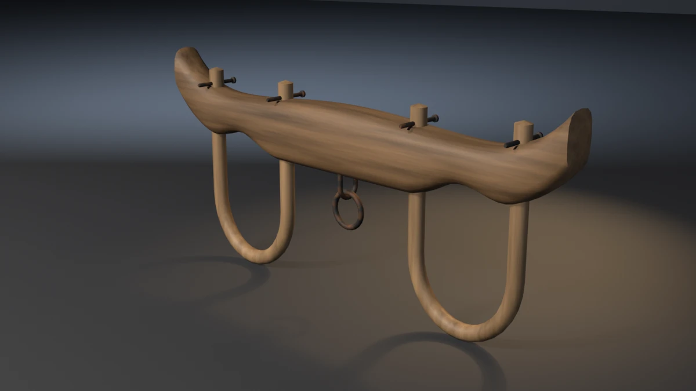

# wooden-yoke



A double ox yoke: a carved oak beam with two neck saddles and upturned
ends, two bent-hickory oxbows whose legs pass up through the beam and are
pinned above it, and a forged staple under the centre carrying a hung iron
ring. It stands on the bottoms of its two bows. **A showcase piece, not an
example** — it witnesses no API contract. It asserts that generated
geometry meets declared asset budgets, recomputed from the finished mesh.

## What it composes

| Shipped content | Used for |
| --- | --- |
| `skills/mesh-editing-and-bmesh` | lofted beam, swept bows and staple, lathed pins, torus ring, all in one `bmesh` |
| `skills/custom-properties` | face attributes (`PlankTone`, `GrainDir`) read by the wood shaders |
| `skills/procedural-materials-and-shaders` | oak and hickory with grain along each piece, rusted rough iron |
| `skills/bake-high-to-low` | Cycles tangent-space normal bake, high onto low |
| `skills/engine-export-presets` | Unity glTF (`export_yup=True`) |
| `skills/depsgraph-and-evaluated-data` | evaluated triangle counts for the LOD ratios |
| `snippets/decimate_to_budget.py` | LOD1 / LOD2 COLLAPSE chain |
| `snippets/convex_hull_collider.py` | a hull for the beam and for each bow leg and foot, merged into a compound |
| `snippets/lod_chain.py` | LOD naming and ratio pattern |
| `examples/mesh-hygiene-audit` | hygiene combinatorics (copied, not imported) |

## The budget that matters

A yoke exists to close round two necks. Each bow and the saddle above it
make an opening an ox's neck passes through. A bow bent too tight fails
its job, and nothing else notices:

- it still stands on the floor, so zmin and the named bows pass;
- its legs still pass up through the beam and stand proud of it;
- its pins still rest on the beam;
- it still fits the bounding box, because the beam sets the envelope.

The piece measures each opening off the finished mesh:

- **Width** is the gap between the inner faces of the bow's two legs,
  taken over the straight run of the legs. Band 240–300 mm; measured
  266 mm.
- **Height** runs from the bow's inner bottom up to the saddle's apex on
  the beam's underside. Band 300–400 mm; measured 370.9 mm.

`--pinch-bows` is the falsifier built for exactly this. It brings each
bow's legs 35 mm closer to its centre, so the opening closes to 196 mm
and the run exits 19. Every other budget still passes, and the AABB is
unchanged.

## Budgets

Declared in the script as named constants, recomputed from the generated
mesh. Measured values are from Blender 5.2.1; every one is byte-identical
on 4.5.11 and 5.1.2 (only the glTF file size differs, by 4 bytes, which is
exporter metadata and not a budget).

| Budget | Band | Measured |
| --- | --- | --- |
| Base triangles | 4800–5800 | 5288 |
| LOD1 ratio | 0.32–0.62 | 0.5000 |
| LOD2 ratio | 0.10–0.35 | 0.2197 |
| Material slots | exactly 3, distinct | 3 |
| Oak / hickory / iron faces | ≥ 950 / 650 / 750 | 1088 / 720 / 936 |
| UV bounds | inside 0..1 | (0.0100, 0.0100)–(0.9900, 0.9900) |
| UV AABB overlap | ≤ 1e-5 | 0.000000 |
| Outer AABB | 1.424 × 0.140 × 0.640 m ± 0.020 | 1.4240 × 0.1400 × 0.6400 |
| Collider triangles | ≤ 300 | 260 (seven hulls) |
| Normal bake | `{'FINISHED'}` with image data | `{'FINISHED'}`, `has_data=True` |
| glTF export | file written, non-empty | ~160 kB |
| Hygiene | all zero | loose 0/0, non-manifold 0, zero-area 0, doubles 0, n-gons 0, coplanar cross-shell pairs 0 |
| Grounded AABB | \|zmin\| ≤ 1e-4 | 0.00000 |
| Named bows | 2 bows, each zmin ≤ 1e-4 | 2 at 0.00000 |
| Leg protrusion | 4 legs, each 25–70 mm above the beam's top at that leg | 52.7 mm |
| Staple bite | 8–30 mm into the beam | 17.5 mm |
| Threaded ring | ring's hole axis against the staple's bar, cos ≥ cos 20° | 1.0000 |
| Pin seat | 4 pins, shank 0.5–3.0 mm into the beam's top | 1.50 mm |
| Hung ring | ring's inner edge against the bar's top, −3.0 to +0.5 mm | −1.00 mm |
| Neck opening | width 240–300 mm, height 300–400 mm | 266.0 / 370.9 mm |
| Mirrored bows | extents mirrored through x = 0 within 0.1 mm | 0.000 mm |

Real-world size: a 1.42 m beam over two 266 mm openings 0.80 m apart,
standing 0.64 m to the tips of its upturned ends. It is a pair yoke for
draught oxen.

## Construction

- **Beam.** Lofted along X through superellipse sections (exponent 3), 16
  vertices each. Every shaping term is even in x, so the two halves are
  mirror images. Each station reads four functions of x:
  - a crowned top;
  - an underside raised by a cosine saddle over each neck;
  - a sixth-power upturn at both ends;
  - a width that tapers toward the ends.

  Stations are a uniform run plus one at every leg and bow centre, so the
  top a pin is measured against, and the saddle apex, are vertices rather
  than chords. The ends close on a pole a few millimetres past the last
  ring.
- **Bows.** A 44 mm round hickory rod swept along a U:
  - Each leg rises straight up through the beam and ends a named height
    above it (`BOW_PROTRUDE`).
  - The bottom is a half-ellipse whose lowest centreline point is one
    radius off the floor.
  - A section vertex points straight down, so each bow stands on a vertex
    at exactly z = 0.
  - The section frame is fixed to the bow's plane, so there is no twist.
- **Pins.** A forged pin crosses each leg tip, its shank resting
  `PIN_SEAT` into the beam's crown. Its head hangs past the beam's edge.
  Two shank rings sit over the crown, so the seat is measured on vertices
  where the pin rests.
- **Staple and ring.** A round bar bent into a U across Y has its legs
  driven `STAPLE_BITE` up into the beam. The ring is a torus whose hole
  axis runs along the staple's bar (Y). Its inner edge rests on the bar's
  top, `RING_BITE` into it, so the bar passes through the ring's hole and
  the ring hangs clear of the floor.

## Findings the budgets forced

- **Pin seat on a span.** The pin was first a lathe with rings only at its
  two ends. No vertex sat over the beam, and the seat audit found nothing
  to measure. Two shank rings now sit over the crown.
- **A section vertex on the axis.** Ten-segment sections have no vertex
  straight down. That put the pins' seat at 1.21 mm against a designed
  1.50 mm, and the staple's bar 0.3 mm off. Pins and staple are now
  12-segment.
- **Collider.** Hulls over thinned vertex grids still came to 744–766
  triangles against a 300 ceiling. The hulls now take every eighth beam
  ring and every fifth bow ring, with every other section vertex, and the
  compound is 260 triangles.
- **Bamboo bows (inspection-only).** Grain set per face from the path's
  tangent broke the wood figure at every ring, and the bent bows rendered
  as bamboo. The bows now take one grain direction, up their legs.

## Conventions walked

Every convention in `showcase/README.md`, and whether it applies here.

| Convention | Applies | How |
| --- | --- | --- |
| Deterministic, budgets declared, assertions recompute | yes | no RNG; every value above is read off the mesh |
| Falsifier fails the budget it targets | yes | table below, proven on all three binaries |
| Hygiene incl. cross-shell coplanar | yes | exit 15 |
| Named supports | yes | the two bows (`--float-bow`) |
| Even shaping terms and mirror symmetry | yes | every beam term even in x; mirrored bows asserted (`--skew-bow`) |
| Plumb and real-world size | yes | the neck opening is the real-world size that matters (`--pinch-bows`) |
| A joint bites; touching is not joining | yes | legs through the beam (`--short-bows`), staple into it (`--short-staple`) |
| Hung ring | yes | torus hung on the bar, inner edge on its top (`--clip-ring`) |
| A ring is threaded across its hole | yes | hole axis along the bar (`--edge-on-ring`) |
| Carried parts bite their bearers | yes | pins resting into the beam's crown (`--float-pins`) |
| Rope, masonry, timber boards, roofs, vessels, scatter, paint | no | the piece has none of these |
| A bent bar is one sweep | yes | each bow and the staple is one sweep |
| Shading is part of the model | yes | beam and bows smooth (carved, bent); every edge over 40° hard (sawn beam ends, pin heads) |
| One substance, one slot | yes | oak, hickory, iron |
| Iron is not chrome | yes | near-black and rust, roughness 0.55–0.85, metallic 0.65 |
| Identical boards read as CG | yes | per-piece `PlankTone`; grain along the beam and up each bow |
| Edge treatment: no right angles | n/a | lofted and swept, no box edges; not a separate budget |
| Sort bmesh operator inputs | n/a | no set-fed operator is run |
| The bake cage is narrower than the nearest neighbour | yes | `CAGE_EXTRUSION` 0.01 m |
| Level on the stage; stage 60 m | yes | turned about Z only; 60 m floor and wall |
| Keep a falsifier's envelope still | yes | every falsifier leaves the AABB unchanged |

## Falsifiers

Each breaks one pipeline stage so a **named** budget fails. All eleven
were run on 4.5.11, 5.1.2 and 5.2.1 and exited the same declared code on
all three.

| Flag | Target budget | Breaks | Exit |
| --- | --- | --- | --- |
| `--skip-decimate` | LOD1 ratio | drops the DECIMATE modifiers, LOD1 ratio goes to 1.0000 | 9 |
| `--stray-vert` | mesh hygiene | adds one loose vertex under the beam | 15 |
| `--lift-z` | grounded zmin | lifts the whole mesh 50 mm | 16 |
| `--float-bow` | named bows | lifts the left bow 8 mm; the right still grounds the AABB | 16 |
| `--short-bows` | leg protrusion | stops every leg 10 mm under the beam's top; −2.3 mm at the tip | 17 |
| `--short-staple` | staple bite | stops the staple 5 mm under the beam; −2.6 mm | 17 |
| `--edge-on-ring` | threaded ring | turns the ring into the staple's plane; cos 0.0000 | 17 |
| `--float-pins` | pin seat | lifts every pin 5 mm off the beam; −3.5 mm | 18 |
| `--clip-ring` | hung ring | lifts the ring 6 mm off its bar; +5.0 mm | 18 |
| `--pinch-bows` | neck opening | brings each bow's legs 35 mm in; 196 mm wide | 19 |
| `--skew-bow` | mirrored bows | moves the right bow 6 mm along the beam; 6.0 mm | 19 |

## Exit codes

File-local and sequential. `9` is a valid check code. `1` is the FATAL
wrapper — a crash, never a named check.

| Code | Meaning |
| --- | --- |
| 0 | Success |
| 1 | Uncaught exception (FATAL wrapper) |
| 2 | argparse / usage |
| 3 | Mesh did not build, or has no UV layer |
| 4 | Base triangle count outside band |
| 5 | Material slots, or a material's face floor |
| 6 | UVs outside 0..1 |
| 7 | UV AABB overlap above tolerance |
| 8 | Outer AABB off declared size |
| 9 | LOD1 or LOD2 ratio outside band (`--skip-decimate`) |
| 10 | Framing gate (`examples/gallery_framing.py`, render path only) |
| 11 | Collider triangles above ceiling |
| 12 | Normal bake failed or produced no image data |
| 13 | glTF export missing or empty |
| 14 | `--output` produced no file |
| 15 | Mesh hygiene (`--stray-vert`) |
| 16 | Grounded zmin, or a bow floating (`--lift-z`, `--float-bow`) |
| 17 | Leg protrusion, staple bite or threaded ring (`--short-bows`, `--short-staple`, `--edge-on-ring`) |
| 18 | Pin seat or hung ring (`--float-pins`, `--clip-ring`) |
| 19 | Neck opening or mirrored bows (`--pinch-bows`, `--skew-bow`) |

## Run it

```bash
# Budget check, no render. ~2.5 s on 4.5, ~4.6 s on 5.2.
blender --background --python wooden_yoke.py --

# Falsifier: the bows close too tight for a neck. Must exit 19.
blender --background --python wooden_yoke.py -- --pinch-bows

# Falsifier: the ring turns into the staple's plane. Must exit 17.
blender --background --python wooden_yoke.py -- --edge-on-ring

# Render the gallery still (EEVEE; --engine cycles on a GPU-less host).
blender --background --python wooden_yoke.py -- --output wooden_yoke.webp
```

Smoke runs the check-only path. It does not pass `--output` or any falsifier.

## Cross-version measurements

| Value | 4.5.11 | 5.1.2 | 5.2.1 |
| --- | --- | --- | --- |
| Base triangles | 5288 | 5288 | 5288 |
| LOD1 / LOD2 tris | 2644 / 1162 | same | same |
| Face counts (oak / hickory / iron) | 1088 / 720 / 936 | same | same |
| Outer AABB | 1.4240 × 0.1400 × 0.6400 | same | same |
| Collider tris | 260 | 260 | 260 |
| Neck opening | 266.0 × 370.9 mm | same | same |
| glTF bytes | 159764 | 159764 | 159760 |
